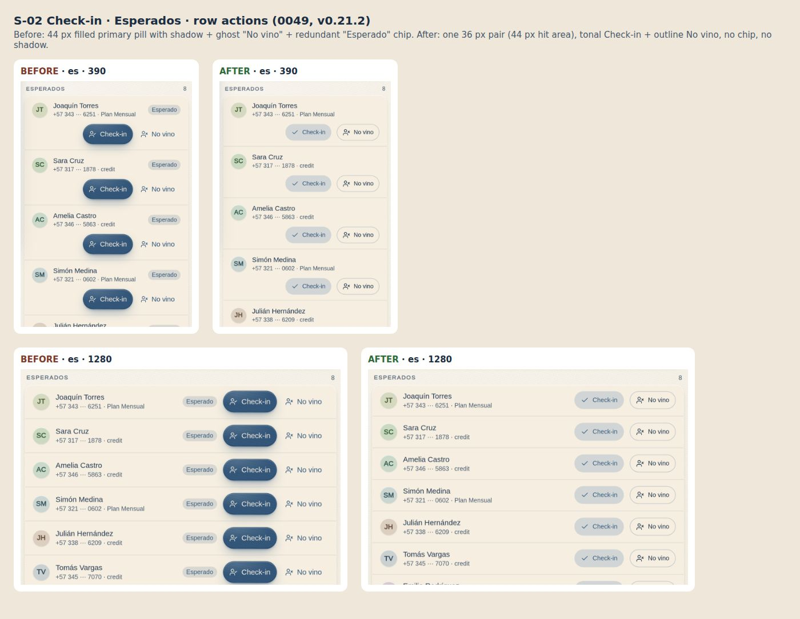

version: 0.21.2
date: 2026-09-30
prompt: docs/prompts/0049-checkin-row-actions.md
intent: Justin: "the button height for check in seems obnoxiously large, and novino isnt clear its a button , or maybe this is a switch? or what? those buttons are just not clear." — every S-02 roster row carried a 44 px filled primary pill with the accent shadow next to a bare ghost "No vino" and an "Esperado" chip the section header already said; ten rows read as a column of heavy pills with a link beside each.
decision: A compact pair of one height in a new `RowActions` slot. Main action `Button variant="tonal"` (brand-blue tint, brand text, no shadow) with the `check` icon; secondary `variant="outline"` (1 px control border, default text) so "No vino" is plainly a button. Inside `RowActions` (`.is-dense`) `size="sm"` is 36 px visible (`--h-ctl-sm`, new D-01 token), `--fs-xs`, 16 px icon, no shadow, and a transparent `::before` extends the hit area to 44 px — the "dense row" exception to rule 7. The redundant status chip is hidden where the section names the state (Esperados, Lista de espera, walk-in candidates). Same pair on the S-03 attendance roster.
rejected: A segmented switch "Llegó | No vino" — rejected because no-show is a consequence confirmed after the grace period, not a toggle state, and a switch invites flipping a person to "No vino" before the class starts; a single primary pill per row (the old design, or primary check-in with a lighter no-show) — rejected because ten repeated primaries have no hierarchy and the page's real primary is the search box; shrinking every `size="sm"` button to 36 px app-wide — rejected for this pass, 222 small buttons (the customer app included) would change without being asked and the brief keeps customer rows untouched; the 36 px geometry is scoped to `RowActions`; the hairline `--color-border` (12 % alpha) for outline — rejected, it did not read as a button on the cream surface, `--color-border-strong` does; a 12 % tint of `--color-primary` for tonal — rejected after capture, the deep blue at 12 % on cream reads grey, so tonal tints the mid brand blue `--color-accent` at 24 %.
files: src/design/tokens.ts; src/design/tokens.css; src/components/atom/Button/Button.tsx; src/components/atom/Button/Button.css; src/components/atom/Button/Button.meta.ts; src/components/molecule/RowActions/RowActions.tsx; src/components/molecule/RowActions/RowActions.css; src/components/molecule/RowActions/RowActions.meta.ts; src/components/molecule/RosterRow/RosterRow.tsx; src/components/molecule/RosterRow/RosterRow.css; src/components/molecule/RosterRow/RosterRow.meta.ts; src/modules/staff/CheckinPage.tsx; src/modules/teacher/ClassPage.tsx; src/app/captureDates.ts; scripts/spacing-audit.mjs; .claude/skills/ui-spacing/SKILL.md; docs/design-system.md; docs/pages/S-02.md; docs/pages/S-03.md; docs/reference/surfaces.md; docs/kanban.md; docs/README.md; docs/prompts/0049-checkin-row-actions.md; docs/changelog/0049-checkin-row-actions.md; docs/screenshots/S-02/*; docs/screenshots/S-03/{es,en}-{390,1280}.jpg; docs/screenshots/S-03/*-class.jpg; docs/screenshots/_brand/checkin-row-actions-2026-09-30.jpg; public/hub-map.json; public/actions.json; package.json; package-lock.json
codes: S-02, S-03, D-01, D-02

Model routing: Opus 5.5 (build).

Checks: build green · tsc 0 errors · lint:spacing 61 / 61 (baseline unchanged: every new size is a token, no raw values added or removed) · manual-lint 0 · `npm run audit:spacing -- --route=/staff/checkin --as=usr_desk --widths=390,1280`: 0 targets under 44 px (one pre-existing gap note on the "Profes de hoy" card, untouched) · captures S-02 ES / EN × 390 / 1280 light + dark, S-03 ES / EN × 390 / 1280 (the unlabelled pair is the last S-03 route, as before) and a new `-class` set for `/teach/class/:id`.

## Why

Justin could not tell what "No vino" was (a link? a switch?) and the check-in pill was the heaviest thing on the page,
repeated on every row. A list of people needs one quiet main action per row and a secondary action that still looks
pressable; both the same height so the pair reads as one control group.

## What changed

- **D-01.** `--h-ctl-sm: 2.25rem` (36 px, on the 4 px scale) — the visible height of a dense-row `sm` button.
- **Button (atom).** `variant="tonal"`: `color-mix(--color-accent 24 %)` ground, `--color-primary` text, no shadow;
  hover 34 %, active 40 %. `variant="outline"`: transparent, `--color-text`, 1 px `--color-border-strong`; hover
  `--color-surface-2`, active `--color-surface-3`. Both keep the 1 px press, the global 2 px focus ring, disabled at
  50 % and the loading spinner. Dense context (`.is-dense`): `box-shadow: none` on every button; `.btn.btn-sm` is
  `--h-ctl-sm` with `--fs-xs` (the selector outranks the global `button:not(…) { min-height: var(--h-ctl) }`), and
  `::before { inset: calc((--h-ctl-sm − --h-ctl) / 2) 0 }` keeps the 44 px hit area.
- **RowActions (new molecule).** `
`, `gap: --gap-control`, stops click propagation
  (moved from RosterRow). Meta: the front-desk pair, single undo / promote, disabled and loading.
- **RosterRow.** Actions render in `RowActions`; `showStatus` prop (default true) hides the status chip; the state
  column only renders when it has content. Meta usages updated (tonal / outline pair, outline undo, tonal promote, a
  no-chip section).
- **S-02.** Esperados: tonal `check` "Check-in" + outline `user-x` "No vino", no chip. Llegaron: outline "Deshacer".
  No vinieron: tonal "Check-in". Lista de espera: tonal "Dar cupo" (disabled when full, as before), no "En espera"
  chip, `#n` stays. Walk-in candidates: tonal "Entrar", no chip (they were labelled "Esperado" but are not booked).
  Handlers, permissions, loading states and string keys unchanged.
- **S-03 `/teach/class/:id`.** Presente tonal `check` + Ausente outline `user-x`; Deshacer outline. Chips stay.
- **Audit script.** The target check adds a transparent absolutely positioned `::before` with negative insets to the
  measured box, so dense-row buttons report their 44 px hit area.

## Deviations from the brief

- Numbered 0049 / v0.21.2, not 0039 / 0.14.1: those were taken long ago, and 0048 / v0.21.1 landed during the build.
- `size="sm"` is 36 px only inside `RowActions`; elsewhere it stays 44 px (see rejected).
- Tonal uses `--color-accent` at 24 % (not ~12 % of `--color-primary`), outline uses `--color-border-strong` (not
  `--color-border`) — both after looking at the capture; values still come from D-01.
- Button gap in the pair is `--gap-control` (12, rule for controls in a row).
- S-01 and S-04 unchanged: neither has roster rows with actions.

## Before / after

