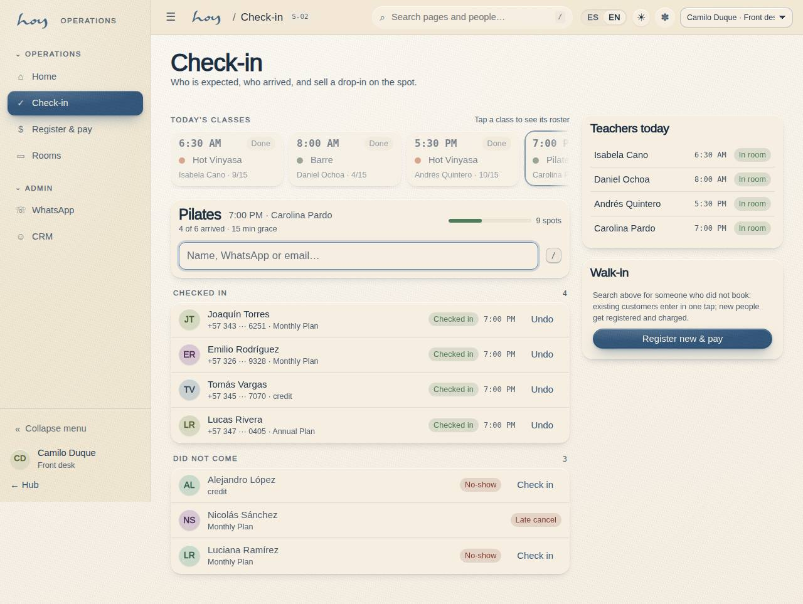

# Operations manual — HOY

This is the only document about how we run the studio. If something you do here isn't written down, or
is written down and isn't done that way, one of the two has to change: tell coordination.

## 1. What it is for
1. It is the single source for how we operate, and its numbers are not typed by hand: the manual reads
   them from the system.
2. Every procedure says what to do, what to say and on which HoyOS screen it happens (code + name,
   e.g. "S-02 Front desk check-in"), with a real capture of that screen.
3. Policies (cancellation window, waitlist claim, late grace, fees) are read live from **M-08 Studio
   settings & policies**; change them on the screen and this manual changes with them.

{{tenant:capacity}}

## 2. How to use it
1. Read Part I. Everything else rests on who we are and how we speak.
2. Find your role in the table below, or use "Start here" on the manual cover: three chapters per role
   and you can work your first day.
3. The blocks captioned **"Live from the system"** are not text — they are the current value. Don't
   copy them into another document; link the chapter.
4. Anything the studio has not defined yet is marked `> DECISION NEEDED:`. Do not invent the answer;
   ask the owner. The full list is on **Decisions pending** (K-04).
5. Version 0.7: the structure is settled, the content keeps growing. Propose improvements to
   coordination; changes are logged in K-01.

## 3. The seven parts
| Part | What it holds | For |
|---|---|---|
| I · HOY | Who we are, the philosophy, the classes and the value model | everyone |
| II · Daily operations | Door, classes, teachers, room, incidents | front desk, teachers, maintenance |
| III · Customers and plans | Sales, pauses, gifts, space rental, CRM | front desk, coordination |
| IV · Money | Till, DIAN invoicing, payroll and payouts | finance, owner |
| V · Content and brand | CMS, web and social, media, voice and tone | coordination |
| VI · Legal and policies | Policies in force, legal documents, data protection | owner, admin |
| VII · System | Roles, data, integrations, glossary | admin, everyone |

## 4. Who reads what
| Chapter | Owner | Admin | Coord. | Front desk | Finance | Teachers | Maintenance |
|---|---|---|---|---|---|---|---|
| 01 Who we are and our philosophy | ● | ● | ● | ● | ● | ● | ● |
| 02 Our classes | ● | ○ | ● | ● | – | ● | ○ |
| 03 Value model | ● | ● | ● | ● | ● | ○ | – |
| 04 Front desk and check-in | ○ | ● | ● | ● | ○ | ○ | – |
| 05 Classes and schedule | ○ | ● | ● | ○ | – | ○ | – |
| 06 Teachers | ○ | ○ | ● | ○ | – | ● | – |
| 07 Room, heat and maintenance | ○ | ○ | ● | ● | – | ● | ● |
| 08 Incidents and emergencies | ● | ● | ● | ● | ● | ● | ● |
| 09 Training checklists | ● | ● | ● | ● | ● | ● | ● |
| 10 Sales and plans | ○ | ● | ● | ● | ● | – | – |
| 11 Pauses and gifts | ○ | ● | ● | ● | ○ | – | – |
| 12 Space (B2B rental) | ● | ○ | ● | ○ | ○ | – | ○ |
| 13 CRM and WhatsApp | ○ | ● | ● | ● | – | ○ | – |
| 14 Payments and the till | ● | ● | ○ | ● | ● | – | – |
| 15 Invoicing and DIAN | ● | ● | – | – | ● | – | – |
| 16 Payroll and payouts | ● | ● | ○ | – | ● | ○ | – |
| 17 Content in the CMS | ○ | ● | ● | ○ | – | ○ | – |
| 18 Web and social | ● | ○ | ● | ○ | – | – | – |
| 19 Media and artwork | ○ | ○ | ● | ○ | – | ○ | – |
| 20 Voice and tone | ● | ● | ● | ● | ● | ● | ● |
| 21 Policies | ● | ● | ● | ● | ● | ○ | – |
| 22 Legal documents | ● | ● | ○ | ○ | ● | ○ | – |
| 23 Personal data | ● | ● | ● | ● | ● | ● | ● |
| 24 Roles and permissions | ● | ● | ● | ● | ● | ● | ● |
| 25 Data and tables | ○ | ● | ○ | – | ○ | – | – |
| 26 Integrations | ● | ● | ○ | – | ○ | – | – |
| 27 Glossary | ● | ● | ● | ● | ● | ● | ● |

● required · ○ recommended · – not applicable

## 5. Quick map of screens
These are the team's screens. The full list per surface is in chapter `25`.

{{routes:staff}}

