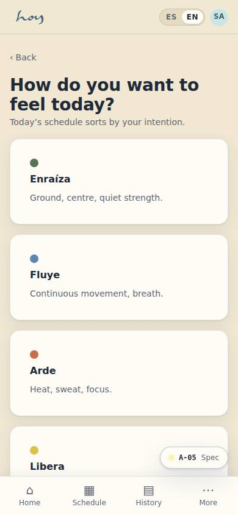

# Who we are and our philosophy

> NOTE: this chapter is the source for the site's "About HOY" page (W-02) and the CMS "about" articles
> (M-02). When it changes here, it gets updated there — not the other way round.

## 1. About HOY
HOY starts from a simple idea: life is happening now. In the middle of the city's daily rhythm — the
traffic, the work, the to-do list — HOY makes a space to stop, breathe, move, feel and come back to
yourself.

We are not asking you to escape your routine. We are asking you to inhabit it differently: with more
presence, more awareness and more connection. That is why HOY is not one more gym, and not the kind of
yoga studio you already know: it is an urban sanctuary, built so that wellbeing stops being a distant
goal and becomes part of your day.

There is no single right way to arrive. We live this moment with attention, without rushing ahead of
what's coming or staying in what has already passed, and we invite you to do the same: all you need is
to show up, with no previous experience and no wellness journey already under way. Our teachers meet
you there, with the closeness of people who understand that real progress starts by accepting where
you are today.

If you have never practised, if you have practised all your life, or if you just need fifteen minutes
between meetings to slow down: HOY is for you. You don't have to change your life to come. You only
have to come back to this moment. Because everything starts HOY.

Getting to know HOY is only the first step. The next one is feeling it: a trial class, no
complications, so the person decides with their body and not only with their head.

> DECISION NEEDED: the studio's street address and contact details. Since 0.7.0 **they are typed in M-08a · Settings → General** (address, city, WhatsApp, email, Instagram, map coordinates and link) and marked **"Details confirmed"**: while the switch is off, the site, Contact, the legal documents, the email footer, the app and this manual show the values with the *pending* label (today `El Poblado, Medellín (to be confirmed)`, `+57 300 000 0000`, `hola@example.com`). The city itself is settled — **Medellín**, following the brand PDF headed "Medellín · 2026" — and the timezone stays `America/Bogota`. `src/tenant/tenant.ts` remains the default for every empty field.

## 2. Our philosophy
Between what was and what hasn't arrived yet, there is this moment. That is the starting point for
everything we do at HOY: a space to stop, breathe, move, feel and come back to yourself — not as a
luxury set apart from your life, but as something lived in the everyday.

We are not asking you to escape your routine, but to learn to inhabit it differently. HOY is movement,
and it is also pause. It is energy and balance. It is body, mind and connection. You don't always have
to go faster, do more or get further: sometimes you simply have to come back.

Our purpose is to make movement and breath a way back to ourselves and into the present. So we built a
space where wellbeing folds naturally into your life: every experience at HOY is a chance to connect
with your body, breathe with intention, share in community and return to yourself.

You can see it in every detail of HOY. In how we receive each person exactly as they arrive, without
asking for a perfect version of themselves. In how we speak, with the calm of people who are in no
hurry to impress. And in how we care for every small gesture, because wellbeing is not announced: it
is felt.

## 3. Small on purpose
We are a wellness club that is small on purpose. Scarcity is part of the care, not a limitation we
apologise for: that is why we never sell more spots than the room holds, and why one person takes one
class a day.

{{tenant:capacity}}

The product's central question is "¿Cómo quieres sentirte hoy?" — how do you want to feel today
(screen A-05). Everything we do in the studio answers it: the person arrives wanting to feel a certain
way, and we make the path easy.

## 4. Conscious controls
We promise four things and we keep them. They are not slogans: they are values stored in M-08 and the
software enforces them.

{{policy}}

1. **Membership pause** up to the cap the policy sets, done by the person themselves in C-22, with no
   phone call.
2. **Leaving without mazes**: cancelling keeps access until the end of the paid period, and there is no
   retention screen.
3. **A kind cancellation window**: inside the window the credit comes straight back.
4. **Notice before every charge**, with the number of days the policy sets.

## 5. What we never do
1. We do not blame the person ("you didn't cancel in time"). We explain the rule and what they can still do.
2. We do not promise what policy does not allow; the current value is M-08's, not memory's.
3. We do not send non-urgent messages during quiet hours.
4. We do not comment on anyone's body, weight or level.
5. We do not sell a spot that doesn't exist: if the class is full, it is full.

The brand voice — human, close, direct, present — lives in chapter `20`, with the yes-and-no table.
