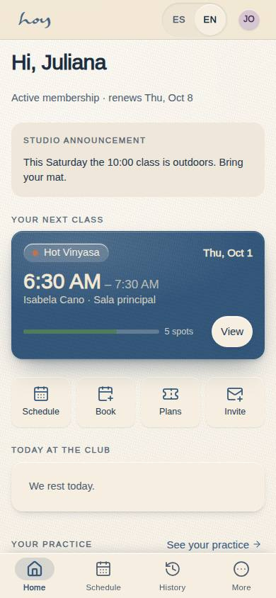

# Who we are and our philosophy

Read this chapter before any other. Everything we do at the door, in the room and on WhatsApp comes from here.

{{audience:01-quienes-somos-y-filosofia}}

## 1. About HOY
This is the official text, as it appears on the website. Lean on it when someone asks you "what is HOY?". The
Spanish is the original; this English is a written translation.

HOY grew out of a simple idea: life is happening now. In the middle of Medellín's everyday rhythm — the traffic,
the work, the to-do list — HOY makes a space to stop, breathe, move, feel and come back to yourself.

We are not here to help you escape your routine. We want you to inhabit it differently: with more presence, more
awareness, more connection. That is why HOY is not one more gym, and not a yoga studio like the ones you already
know — it is an urban sanctuary, built so wellbeing stops being a distant goal and becomes part of your ordinary
day.

There is no single way to arrive. We live this moment with attention, without running ahead to what is coming or
staying behind in what is already gone — and we invite you to do the same. All you need is to show up, with no
previous experience and no wellness path already walked. Our teachers meet you right there, with the closeness of
people who understand that real progress starts by accepting where you are today.

If you have never practised, if you have practised all your life, or if you just need fifteen minutes between
meetings to slow down: HOY is for you. You do not have to change your life to come here. You only have to come
back to this moment. Because everything starts HOY.

Getting to know HOY is only the first step. The next one is feeling it: a trial class, no complications, so you
decide with your body and not only with your head. Look through our plans and find the way in that suits you
best.

**In one line, for the door:** "It's a place to move, breathe and slow down. You don't need any experience: just
show up."

These are the studio's contact details. The WhatsApp number and the address are confirmed:

{{tenant:contact}}

> DECISION NEEDED: the studio's email, Instagram handle and tax ID (NIT). Until the owner confirms them, the website, the app, the emails and this manual show them as pending.

> IN HOYOS: M-08a Settings → General → email, Instagram → "Details confirmed" · M-08c Settings → Payments → NIT.

## 2. Our philosophy
Between what was and what has not yet arrived, there is this moment. That is the starting point of everything we
do at HOY: a space to stop, breathe, move, feel and come back to yourself — not as a luxury set apart from your
life, but as something you live in the ordinary day.

We are not asking you to escape your routine, but to learn to inhabit it differently. HOY is movement, and it is
also pause. It is energy and balance. It is body, mind and connection. You do not always have to go faster, do
more or get further: sometimes you simply have to come back.

Our purpose is to make movement and breath a way back to ourselves and into the present. So we built a place
where wellbeing folds naturally into your life: every experience at HOY is a chance to connect with your body,
breathe with intention, share in community and return to yourself.

You can feel it in every detail of HOY. In how we welcome each person exactly as they arrive, without asking for a
perfect version of themselves. In how we speak, with the calm of people in no hurry to impress. And in how we look
after every small gesture, because wellbeing is not announced: it is felt.

The manifesto, the mission and the brand's personality are in [Voice and tone](20-voz-y-tono.md).

## 3. The brand documents
These two documents are the source of this chapter. If the website and this text disagree, the document wins.

The full website content: About HOY, philosophy and classes.

{{source:contenido-completo}}

The 2026 brand manual: manifesto, purpose, mission, personality, logo, colours and type.

{{source:manual-de-marca}}

## 4. Small on purpose
We are a wellness club that is small on purpose. Looking after a few people well is part of the experience, not a
limitation.

1. We never sell more spots than the room holds.
2. Each person takes one class a day, on any plan.
3. If a class is full, it is full: we offer the next one or the waitlist.

This is the studio's capacity:

{{tenant:capacity}}

## 5. Four promises we keep
We promise every member four things. They are not slogans: they are rules the system applies on its own.

1. **Pause the membership** without calling anyone, from their app, up to the maximum the policy allows.
2. **Leave without a maze.** If they cancel, they keep access until the end of what they paid for. We do not push.
3. **Cancelling in time costs nothing.** Inside the window, the credit comes back straight away.
4. **Notice before every charge**, with the number of days the policy sets.

These are the values in force:

{{policy}}

## 6. What we never do
{{editable:owner}}

1. We never blame the person. Instead of "you didn't cancel in time", we explain the rule and what they can do.
2. We never promise what the policy does not allow. The value that counts is the one in Settings, not the one we
   remember.
3. We never send non-urgent messages during quiet hours.
4. We never comment on anyone's body, weight or level.
5. We never sell a spot that does not exist.

How all of this sounds in practice, with do and don't examples, is in [Voice and tone](20-voz-y-tono.md).
