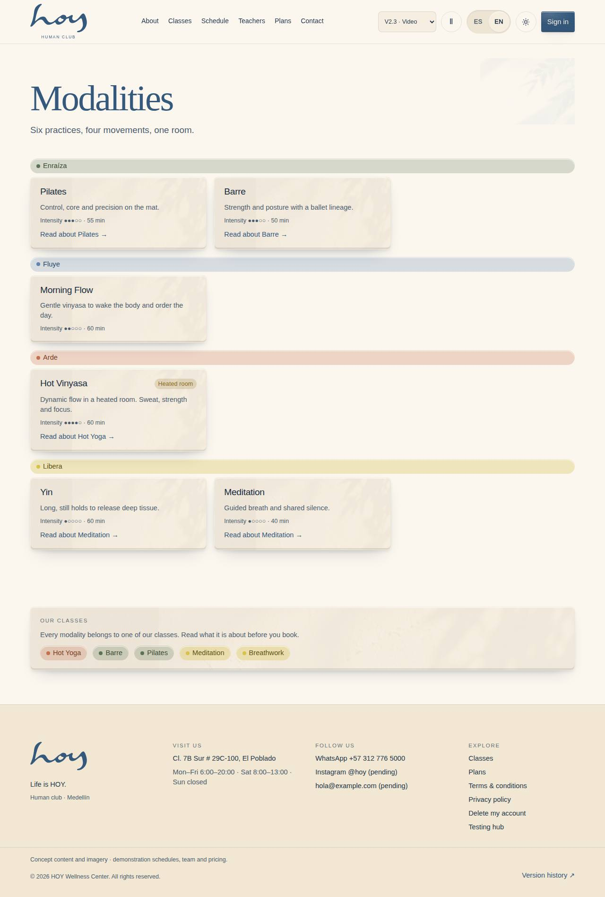

# Our classes

HOY has five ways to move and to be: hot yoga, barre, pilates, meditation and breathwork. This chapter tells you
what each one is and what to say when someone asks.

{{audience:02-nuestras-clases}}

## 1. How we talk about the classes
This is how the website puts it:

> At HOY you will find several ways to move and to be, under one roof: hot yoga, barre, pilates, meditation and
> breathwork. They are not isolated disciplines, or categories with levels and labels: they are different paths to
> the same place — your body, your breath, your present.

1. With customers we always use **the name of the discipline**: "the 7 o'clock hot yoga", "barre at 9:30".
2. We do not talk about levels. No class is "for advanced people": every class adapts to whoever arrives.
3. Nobody has to pick "the right one" on day one. They can try them all, stay with one or alternate.

**What to say if they can't choose:** "Any of them works for a first time. If you want to sweat, hot yoga or
barre. If you want something calmer, pilates or meditation."

> IN HOYOS: M-08f Settings → Content → public class naming = disciplines.

## 2. Hot Yoga
> Something happens when the body moves in heat: the mind stops resisting and starts to give. At HOY, hot yoga is
> practised in a room where the temperature rises on purpose — not to punish you, but to get you sooner to the
> place where the body opens. It is not a class to "sweat more": it is a class to feel more.

1. The room is hot on purpose. The teacher shows people when to ease off, when to drink and when to stay still in
   child's pose.
2. No previous experience needed.
3. Check they have water and a towel, or know where to get them.

**What to say at the door:** "It's in the heated room. Bring water and a towel. If it gets to be too much at any
point, just stay still for a moment. Nobody is watching."

How the heated room is prepared: [Room, heat and maintenance](07-sala-calor-y-mantenimiento.md).

## 3. Barre
> Barre at HOY brings together the best of three worlds: the precision of pilates, the elegance of ballet and the
> energy of functional training. The result is a high-intensity, low-impact class where you work every major
> muscle group without a single jarring jump or knock to the joints.

1. It is intense but has no jumping. The work is small, controlled movements to the beat of the music.
2. Our barre teachers train specifically for this discipline.
3. It adapts to any level.

**What to say at the door:** "It's low impact but intense. If it's your first time, the teacher will adjust your
posture. If you'd rather not be touched, just say so and they'll respect it."

## 4. Pilates
> Pilates starts in one place: the centre. That is where the strength that later holds every movement, every
> posture, every gesture of the whole body switches on. At HOY, this discipline teaches you to move with more
> control, more awareness and more precision.

1. It looks slow but it demands a lot: it strengthens the core and improves posture.
2. The teacher works from the detail: the spine, the breath, the small adjustment.
3. It does not promise quick change. It promises something that lasts.

**What to say at the door:** "It's a class about control and posture. It feels simple and asks more of you than it
looks. It works for someone who has never practised."

## 5. Meditation
> In the middle of constant noise, meditating is an almost radical act: stopping, even for a few minutes, with no
> need to produce, answer or resolve anything.

1. They are guided sessions, inside the regular schedule.
2. Nobody has to be perfectly silent or "do it right".

**What to say at the door:** "It's guided. You don't need to know how to meditate: just sit and follow the voice."

## 6. Breathwork
> It is not about mastering a complex technique, but about reconnecting with something you already know how to do.
> That is why it is present in our guided classes too: a short, effortless pause that stays with you long after you
> leave the studio.

1. Breathwork is **present in our guided classes**, as a short pause inside them.
2. If it shows up on the schedule as a class of its own, it is because the studio switched that on in Settings.

**What to say at the door:** "Breathwork is part of every guided class. It's a short pause: you don't need to
practise beforehand."

> IN HOYOS: M-08f Settings → Content → "Breathwork is its own class" (on or off).

## 7. The four movements (internal use)
Internally, the team shapes the day with four **movements**: Enraíza, Fluye, Arde and Libera. They give the
schedule its colours and help spread the classes across the day. They are an internal label: to the customer we
say the name of the discipline.

| Movement | Feels like | Usually |
|---|---|---|
| Enraíza (ground) | settling, holding, landing | pilates, breathwork |
| Fluye (flow) | letting go, linking, long breaths | gentle yoga, mobility |
| Arde (burn) | raising the pulse, shaking, sweating | barre, hot yoga |
| Libera (release) | loosening, staying still, closing | meditation, restorative |

## 8. The class list in the system
Name, description, intensity, length and whether the room is heated: this is how the system keeps them, and how
they appear on the website and in the app. Coordination edits them.

{{table:modalities}}

> IN HOYOS: M-02 Content → Modalities → edit → Publish.
