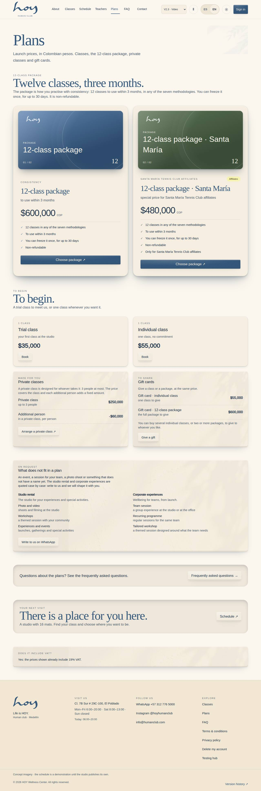

# Value model

HOY sells classes, never credits. At launch there are four things you can buy (the trial class, the
individual class, the 12-class package and the private class), gift cards at the same price and two services
quoted case by case: the studio rental and corporate experiences. At the desk you don't need to know the
margins, but you do need to know why each option exists: that way you offer the right thing without
improvising.

{{audience:03-modelo-de-valor}}

No price in this chapter is typed by hand. The price blocks are the current ones: when a price changes, it changes
here, on the website and at the desk at the same time.

## 1. The capacity rule
One studio and one rule that protects the experience:

1. Every class has a fixed number of mats.
2. Each person takes **one class a day**.
3. We never sell more spots than fit.

This is the capacity in force:

{{tenant:capacity}}

That is the whole inventory for the day. The business is not about selling more spots, but about offering the
right spot to the right person, and charging for what does not take up a mat: gifts, private classes, space.

## 2. The options
| Option | Its job | How we know it works |
|---|---|---|
| First visit | The trial class and the individual class: come in with no commitment | how many trials end in a package |
| 12-class package | Consistency: 12 classes to use within 3 months | packages sold and how many renew |
| Private classes | A class made to measure, for 1 to 3 people | private classes per month |
| Gift cards | Bringing new people in through someone who already knows us | cards redeemed |
| Space | Renting the studio for experiences and special activities | requests quoted and closed |
| Corporate experiences | Wellbeing for work teams | proposals sent and closed |

At launch there is **no monthly or yearly membership, no credits and no short pauses**. The previous value
model (Membership, Pauses, 3- and 10-class packs) was retired on 1 October 2026.

## 3. First visit — the trial class and the individual class
The way in. A low price and no lock-in, so the person decides with their body.

{{pricing:bienvenida}}

1. The **trial class** is one per person.
2. The **individual class** is for whoever comes now and then or has not decided yet.

**What to offer:** the first time, the trial class. If the person comes back, the 12-class package.

## 4. The 12-class package — the heart of the business
Twelve classes to use within three months, in any of the seven classes on the schedule.

{{pricing:paquetes}}

1. The 12 classes are used within **3 months** of the purchase.
2. The package can be **frozen once, for up to 30 days**. The expiry date moves by the same days. While it
   is frozen, nothing can be booked with it.
3. **It is non-refundable.**
4. **Santa María Tennis Club affiliates** get a special price on the package. It is the only benefit between
   the club and the studio. The front desk checks the affiliation.

**What to say if they ask why the package:** "It's 12 classes to use within three months, in whichever class
you like. If you travel or get sick, you freeze it once for up to 30 days."

This is the freeze rule in force:

{{policy:freeze_max_days}}

How to freeze and how to resume: [Frozen packages and gifts](11-pausas-y-regalos.md).

## 5. Private classes — made for you
A class designed for whoever takes it: **3 people at most**. The price covers the class and each additional
person adds a fixed amount.

{{pricing:privadas}}

Private classes are arranged on WhatsApp: the person writes, coordination proposes a time and a teacher, and
the front desk charges it in "Register and charge" with the number of people.

## 6. Gift cards — to share
There are two gift cards, at the same price as the classes: an individual class or a 12-class package. One
person can buy several individual classes, or two or more packages, to give to whoever they like.

{{pricing:regalos}}

Whoever receives it redeems it at the front desk. How to sell and redeem it: [Frozen packages and gifts](11-pausas-y-regalos.md).

## 7. Space — renting the studio
HOY rents the space for experiences and special activities. Each request is reviewed on its own and its price
depends on what each case needs. There is no published price and no online payment.

{{pricing:espacio}}

How it is quoted, scheduled and charged: [Space — B2B rental](12-espacio-b2b.md).

## 8. Corporate experiences
Taking HOY to work teams: movement and breathing as part of the company's culture.

It has three formats:

1. **Team session:** a group experience, at the studio or at the office.
2. **Recurring programme:** regular sessions for the same team.
3. **Tailored workshop:** a themed session, designed around what the team needs.

{{pricing:corporativo}}

**What to say if a company asks:** "We build each proposal with the company. Leave me your details and
coordination will write to you." Pass the contact to coordination the same day. Don't give prices or dates.

> DECISION NEEDED: the price of corporate experiences and whether a session at the company's office counts against the studio's capacity.

## 9. All together
The full catalogue, as it stands today:

{{pricing}}

## 10. How to read the month
{{for:super_admin,admin,finance}}
| Indicator | What to look at |
|---|---|
| Monthly revenue | sales already paid, against the same month last year |
| Mix | how much comes from packages, single classes and private classes |
| Occupancy | people who came over spots offered |
| Trial conversion | trials that later bought a package |
{{/for}}

This is occupancy right now:

{{kpi:occupancy}}

> IN HOYOS: M-01 Dashboard (revenue, occupancy) · M-09 Finance (mix by product) · M-06 CRM → segments (conversion).
