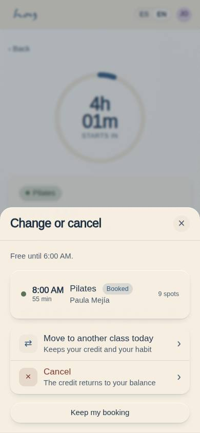
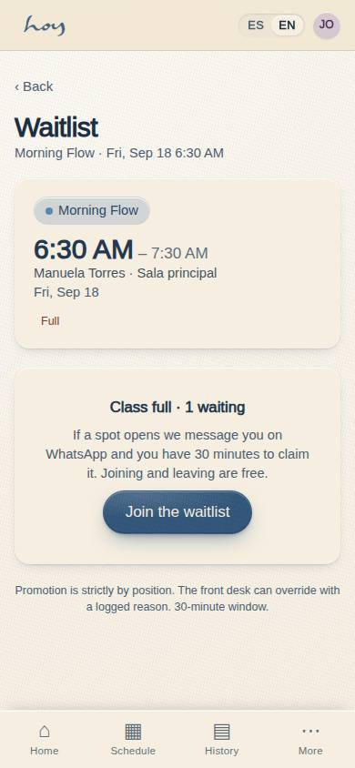

# Front desk and check-in

Your home screen is **S-02 Front desk check-in**. From there you search members, see the Now / Next /
Later strip, today's teachers and the desk actions. Every action is logged with your name.

## 1. Opening (45 min before the first class)
1. Turn on lights, climate and reception music; check the room is set up per `07`.
2. Sign in to HoyOS with your user → **S-01 Role home** → Front desk.
3. In **S-02** confirm the day's classes, the capacity and that each teacher shows as "Expected".
4. Review each class's waitlist and yesterday's pending payments (unconfirmed transfers).
5. Open the **Message inbox (S-06)** and answer what came in overnight: unread threads come first and the top-bar bell says how many there are. How to reply is in `13`.
6. Count the cash float and write it on the closing sheet (`14`).

## 2. Greeting
1. Look at the person, smile, name if you know it: "Hola, Camila. Here for the 7?"
2. New person: "Hola, welcome to HOY. First time? I'll register you in a minute."
3. Before class, one useful question only: "Do you need a mat or did you bring yours?"

The full tone — what we say and what we don't — is in chapter `20`.

## 3. Check-in
1. In **S-02** pick the class in the selector; the list shows Expected, Checked in and Waitlist.
2. Search by name, phone, email or ID; tap the person → **Checked in**.
3. If it says "already checked in", do not duplicate: same person, or the teacher already marked attendance.
4. Discreet health marker: do not say it aloud; the teacher sees it on the roster.
5. Once the grace minutes have passed, anyone who hasn't arrived is a no-show: confirm it in S-02 so
   the waitlist promotes.

**Steps in HoyOS:** S-02 Front desk check-in → class selector → Find a member → Checked in.
Cancel or move: action "Cancel or move a booking" (opens C-08b on the member's behalf).

## 4. Walk-ins
1. No room in the class they want: offer the next class of the day or the waitlist. One person, one
   class a day.
2. Prices are read in S-04 from the value model; never type them and never negotiate them. The
   catalogue and what each family is for is in chapter `03`; the sales procedure is in `10`.

## 5. Cancellations, late arrivals and no-shows
The rules are M-08 values, not memory. These are the ones in force:

{{policy:cancellation_window_hours}}

| Situation | Rule | What you say |
|---|---|---|
| Cancels inside the window | Credit returns immediately | "Done, your credit is already back." |
| Cancels outside the window | Credit is spent | "Since we're inside the window, this class counts. Shall I move you to another one today?" |
| Move | Cancel + rebook in one action; no fee inside the window | "I'll move you to the 9:30, same credit." |
| Arrives late | Grace per M-08 | "Come in quietly; the teacher has started." |
| No-show | Confirmed in S-02; credit is spent | The WhatsApp template goes out, no scolding |

> DECISION NEEDED: late-arrival grace minutes and the no-show fee ("Late check-in grace" and "No-show fee" fields in M-08).

## 6. Waitlist
1. Strict promotion by position; the released spot is offered over WhatsApp for the claim window
   (ignoring quiet hours) and then passes to the next person.
2. You may skip the order only with a logged reason (e.g. the person is already at the door).

{{policy:waitlist_claim_minutes}}

**Steps in HoyOS:** S-02 → Waitlist section → Promote (reason). Member view: C-20.

## 7. Lost and found
1. Label with date, class and description; keep in the lost-and-found box; note in M-06 if you know
   whose it is.
2. Kept 30 days, then donated. Say so when handing items back.

## 8. Incidents
1. The person's safety first (`08`). Then record it: note in **M-06** with category, time and what you
   did; tell coordination the same day.

## 9. Handoffs
1. Front desk → Coordination: incidents, complaints, pause requests outside the rule, repeated
   no-shows. Note in **M-06** with a category and a heads-up in the internal group.
2. Front desk → Finance: daily cash close, pending payments (unconfirmed transfers), refund requests (`14`).
3. Anyone → Admin: access, permissions, anything HoyOS will not let you do.

## 10. Closing
Counting cash, pending transfers and the closing sheet are in chapter `14`. The physical closing
checklist for the space is in `07`.
