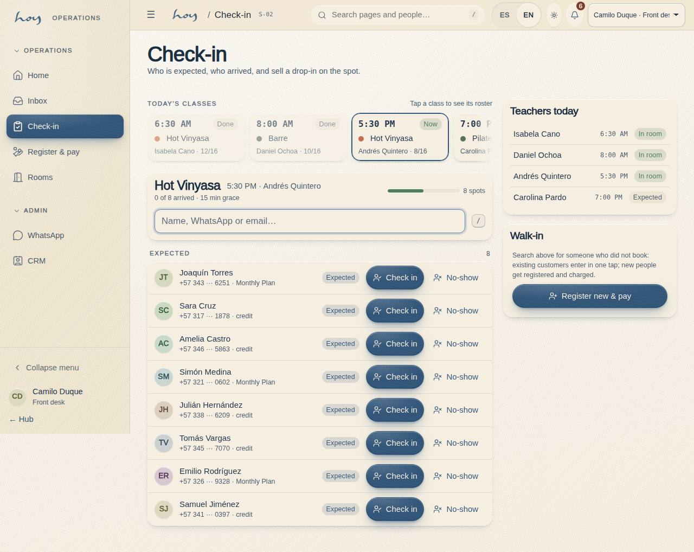
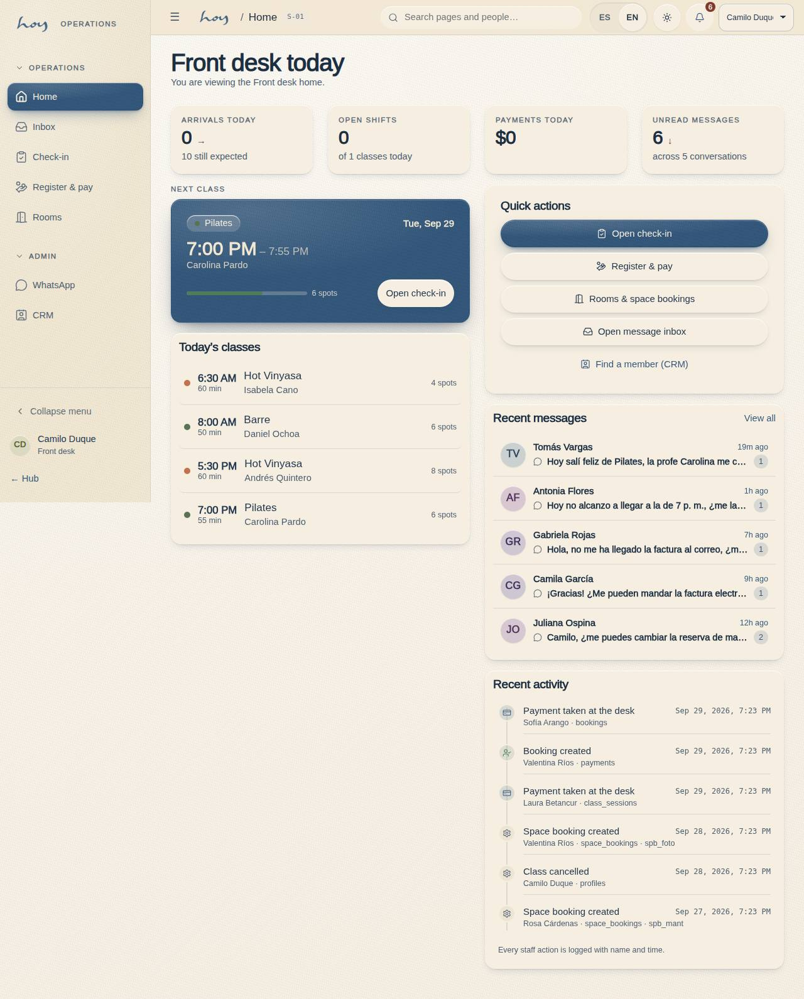
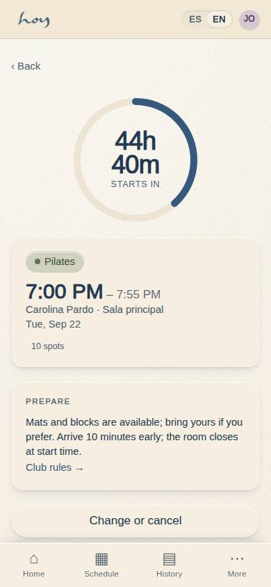
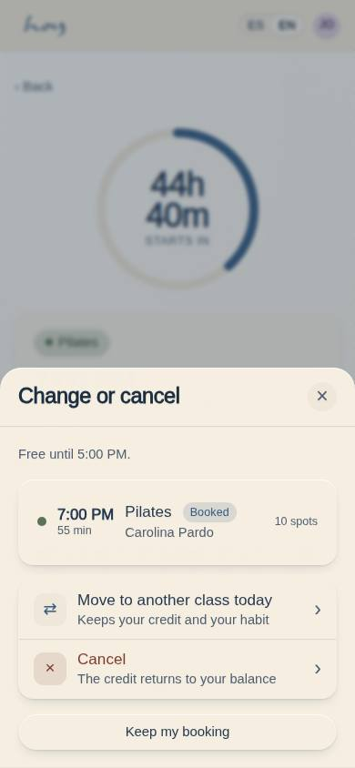
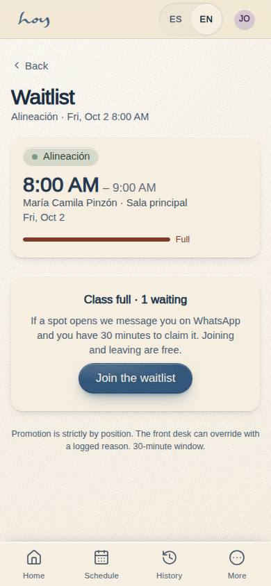

# Front desk and check-in

Your working screen is **Check-in**: from there you look people up, see which class is on, which one is next and
which teachers have arrived. Everything you do is recorded under your name.

{{audience:04-recepcion-y-check-in}}

## 1. Opening
{{editable:coordinator}}

Arrive before the first class, with this much time to spare:

{{studio:opening_lead_minutes}}

1. Turn on the lights, the climate control and the front-desk music. Check the room is set up (see
   [Room, heat and maintenance](07-sala-calor-y-mantenimiento.md)).
2. Sign in to HoyOS with your own user.
3. In Check-in, go over today's classes, the free spots and that every teacher shows as "Expected".
4. Check each class's waitlist and yesterday's payments that are still pending (unconfirmed transfers).
5. Open the Inbox and answer what came in overnight. Unread messages come first. How to reply:
   [CRM, WhatsApp and email](13-crm-y-whatsapp.md).
6. Count the cash float and write it on the closing sheet.

> IN HOYOS: S-01 Home → S-02 Check-in (classes and teachers) → S-06 Inbox.

## 2. Greeting
{{editable:owner}}

1. Look at the person, smile and use their name if you know it: "Hi, Camila. Here for the 7 o'clock?"
2. If they are new, use the house greeting (below) and register them.
3. Before class, one useful question: "Do you need a mat, or did you bring yours?"

The greeting for someone coming for the first time:

{{studio:greeting_line}}

What we say and what we don't: [Voice and tone](20-voz-y-tono.md).

## 3. Checking people in
1. Pick the class. You will see three groups: Expected, Checked in and Waitlist.
2. Look the person up by name, phone, email or ID. Tap them and mark **Checked in**.
3. If it says "already checked in", don't do it again: it is the same person, or the teacher already marked them.
4. If you see a health marker, do not mention it out loud. The teacher sees it on their list too.
5. Once the late-arrival grace has passed, anyone who didn't come is a no-show. Confirm it so the spot goes to the
   waitlist.

If the person wants to cancel or change class, use "Cancel or move booking": you make the change for them, just as
they would in their app.

> IN HOYOS: S-02 Check-in → class picker → Find member → Checked in. Changes: "Cancel or move booking" (opens C-08b).

## 4. Walk-ins
1. If there is room, check them in and take payment (see [Sales and plans](10-ventas-y-planes.md)).
2. If there is no room, offer the next class of the day or the waitlist.
3. Remember the rule: one person, one class a day.
4. Prices are never typed or negotiated: you pick them in Register & pay.

**What to say:** "That one's full. There's room at 9:30 — shall I hold it for you? Or I can put you on the
waitlist."

## 5. Cancellations, late arrivals and no-shows
The rules are the ones in Settings, not the ones we remember. This is the cancellation window in force:

{{policy:cancellation_window_hours}}

| Situation | What happens | What you say |
|---|---|---|
| Cancels inside the window | The credit comes back straight away | "Done, your credit is back." |
| Cancels outside the window | The credit is used | "It's too close to the class now, so this one counts. Shall I move you to another one today?" |
| Wants to switch class | Cancel and book in one step; free inside the window | "I'll move you to the 9:30, same credit." |
| Arrives late | Comes in if inside the grace period | "Go on in quietly; the teacher has started." |
| Didn't come | The no-show is confirmed and the credit is used | They get a WhatsApp from the template, with no reproach |

> DECISION NEEDED: how many minutes of grace for arriving late, and whether a no-show also costs money.

> IN HOYOS: M-08a Settings → "Late-arrival grace" and "No-show fee".

## 6. Waitlist
1. A freed spot is offered in order. The person gets a WhatsApp and has a set time to take it; if they don't, it
   goes to the next one.
2. You may only skip the order with a written reason (for example, the person is already at the door).

This is how long each person has to take the spot:

{{policy:waitlist_claim_minutes}}

> IN HOYOS: S-02 → Waitlist section → Promote (with a reason). The member sees it in C-20.

## 7. Lost and found
{{editable:coordinator}}

1. Label it with the date, the class and what it is.
2. Put it in the lost-and-found box.
3. If you know whose it is, message them and leave a note on their record.

How long we keep them:

{{studio:lost_items_days}}

## 8. If something happens
The person first, the record second. What to do in each case:
[Incidents and emergencies](08-incidencias-y-emergencias.md). Afterwards, leave a note on the member's record with
what happened, when and what you did, and tell coordination the same day.

## 9. What goes to whom
| To whom | What |
|---|---|
| Coordination | incidents, complaints, pause requests outside the rule, repeat no-shows |
| Finance | the day's till closing, pending transfers, refund requests |
| Admin | access, permissions, anything HoyOS won't let you do |

Always leave a note on the record and flag it in the team group.

> IN HOYOS: M-06 CRM → member record → Note.

## 10. Closing
Counting the cash and the closing sheet: [Payments and the till](14-pagos-y-caja.md). Closing the space itself:
[Room, heat and maintenance](07-sala-calor-y-mantenimiento.md).
