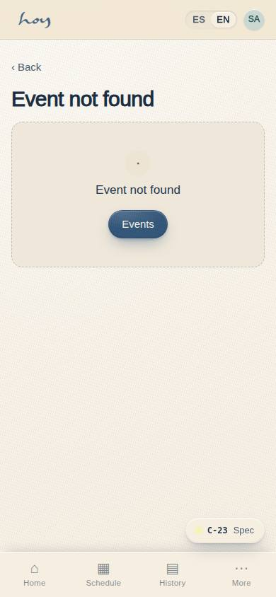

# Classes and schedule

Your hub is **M-02 Content (CMS)**: classes, teachers, schedule and content, all with ES/EN fields and
a draft → review → published flow.

## 1. Building the schedule
1. The fixed rule, the same every day:

{{tenant:capacity}}

2. Spread the four movements (Enraíza, Fluye, Arde, Libera) across the day so "How do you want to feel
   today?" always has an answer. What each movement is: chapter `02`.
3. Create the class as recurring in **M-02 → Schedule** (class type, teacher, room, time, recurrence).
   It appears in C-02, S-02 and S-03 on publish.
4. Always publish in Spanish; English falls back to Spanish when missing.
5. Schedule changes with at least 7 days' notice; policy changes never affect bookings already made.

**Steps in HoyOS:** M-02 → Schedule tab → New recurring class → Publish. Verify in C-02 Class schedule
(day and week views).

> DECISION NEEDED: exact times of the 4 classes and operating days (6 or 7?).

## 2. Staffing teachers
1. Each teacher has availability on their profile (M-02 → Teachers). Assign without overlapping the
   same teacher's classes.
2. Substitutions: confirm the change in M-02 → Schedule the day it is agreed; the student sees the
   right name in C-02 and C-18.
3. Attendance outside the window: you edit it in S-03 with a reason. The teacher's window is in `06`.

## 3. Cancelling a studio class
1. M-02 → Schedule → occurrence → Cancel (reason). The system returns credits, sends WhatsApp and email
   immediately (ignoring quiet hours) and proposes same-day alternatives (E-03).
2. Tell the owner in the internal group. It counts against nobody.

**Steps in HoyOS:** M-02 Schedule → Cancel occurrence → confirm. Check delivery in M-05 → Log.

## 4. The class on the member's screen
What the customer sees before booking comes from M-02: name, description, teacher, intensity, duration
and whether the room is heated.

The table that stores each session of the schedule:

{{table:class_sessions}}

## 5. Events and workshops
1. Created as events with their own price, capacity and guest rule (C-23). Espacio prices (workshops,
   private sessions, photo/video, shoots, pop-ups) are "from" prices and end in a WhatsApp
   conversation, not a checkout: chapter `12`.
2. An event does not replace the day's classes unless the owner approves.

**Steps in HoyOS:** M-02 → Content → Event → publish; see C-23 Event detail & RSVP.

## 6. The coordination week
| Day | Task |
|---|---|
| Monday | Last week's occupancy (M-01), pending substitutions |
| Wednesday | Content review queue, CRM "At risk" segment (M-06) |
| Friday | Next week's schedule confirmed with teachers; automations error-free in M-05 |
