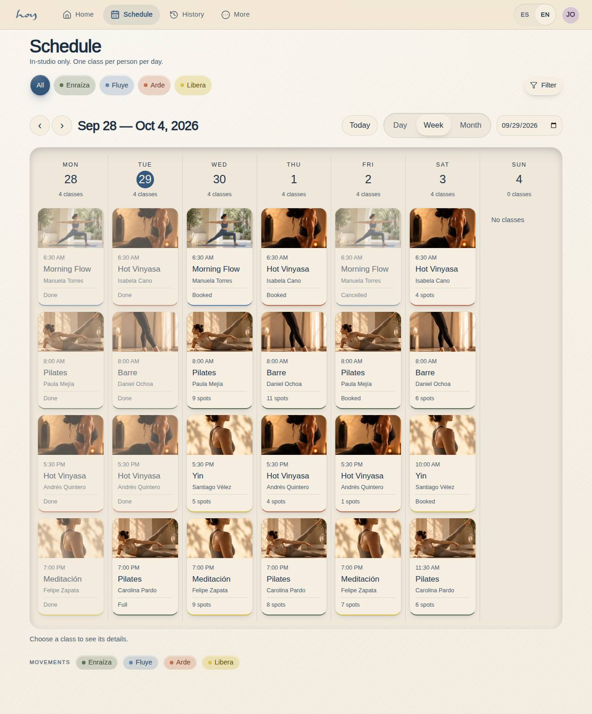
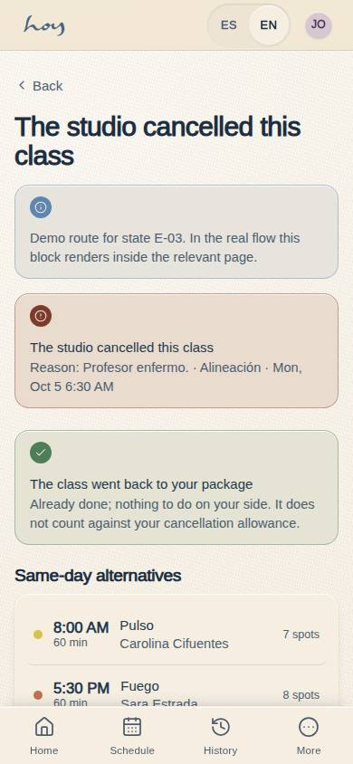
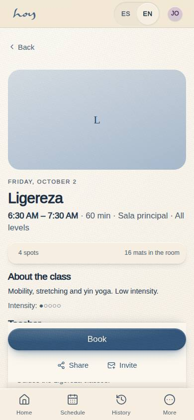

# Classes and schedule

Coordination builds the schedule, assigns the teachers and publishes the classes. It all happens in Content: every
text in Spanish and English, and every change goes through draft, review and published.

{{audience:05-clases-y-horarios}}

## 1. Building the schedule
1. The rule is the same every day:

{{tenant:capacity}}

2. Spread the four movements (Enraíza, Fluye, Arde, Libera) across the day, so there is always something intense
   and something calm. What each one is: [Our classes](02-nuestras-clases.md).
3. Create the class as recurring: discipline, teacher, room, time and how often it repeats.
4. Always publish in Spanish. If the English is missing, the app shows the Spanish.
5. Announce schedule changes ahead of time (see below). A change never affects bookings that already exist.
6. Check the result in the app's schedule, in day and week view.

How far ahead a schedule change is announced:

{{studio:schedule_change_notice_days}}

> DECISION NEEDED: the exact times of the four daily classes and how many days a week the studio opens (six or seven).

> IN HOYOS: M-02 → Schedule → New recurring class → Publish. Check it in C-02 Schedule.

## 2. Assigning teachers
1. Each teacher has their availability on their profile. Never give one teacher two classes at the same time.
2. If there is a substitute, change it in the schedule on the day it is agreed. That way the member sees the right
   name.
3. If a teacher missed the window to mark attendance, you correct it, with a reason. How teachers work:
   [Teachers](06-maestros.md).

> IN HOYOS: M-02 → Teachers (availability) · M-02 → Schedule → occurrence → change teacher.

## 3. Cancelling a studio class
1. Open the class in the schedule and choose **Cancel**, with the reason.
2. The system gives the credits back, sends WhatsApp and email straight away (even at night) and suggests other
   classes the same day.
3. Tell the owner in the team group.
4. A class the studio cancels never counts against anyone.

> IN HOYOS: M-02 Schedule → Cancel occurrence → confirm. Check the send in M-05 → Log.

## 4. What the member sees
What a customer reads before booking comes from what you publish: name, description, teacher, intensity, length
and whether the room is heated. If something is wrong there, fix it in Content.

This is how the system keeps each class on the schedule:

{{table:class_sessions}}

## 5. Events and workshops
1. An event has its own price, capacity and guest rule.
2. Space rentals (outside workshops, private sessions, photo and video, shoots, pop-ups) are not sold online: they
   end in a conversation. See [Space — B2B rental](12-espacio-b2b.md).
3. An event never replaces the day's classes without the owner's approval.

> IN HOYOS: M-02 → Content → Event → Publish. The member sees it in C-23.

## 6. Coordination's week
{{editable:coordinator}}

| Day | What you review |
|---|---|
| Monday | How full the classes were last week and any pending substitutions |
| Wednesday | Content waiting for review and the "At risk" members |
| Friday | Next week's schedule confirmed with the teachers; automated messages running without errors |
