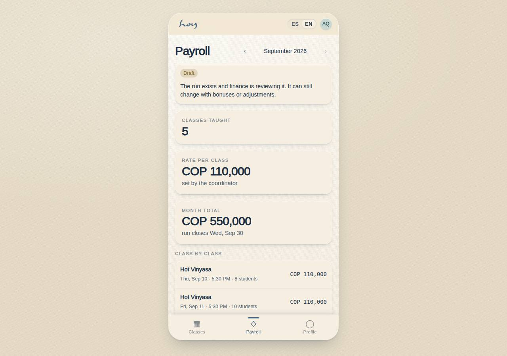

# Teachers

Your tool is **S-03 Teacher app**: next class, roster, schedule, descriptions, reviews and payroll.

## 1. Before class
1. Arrive at least 15 minutes early. Front desk marks you "Arrived" in S-02; no teacher in the room,
   no students in.
2. Open **S-03 → Next class → Roster**: see how many are coming, who is new and the health markers. Do
   not mention the marker aloud; adapt.
3. Check the room with the `07` checklist: temperature, mats, props, music, light.
4. Greet by name whoever you can; ask new people if there is anything you should know.

{{tenant:capacity}}

## 2. During class
1. Start on time. One class per person per day means this is "their" class today: give it in full.
2. Mark attendance from the mat: **S-03 → Roster → marks**. The window is T−15 min to T+2 h; after that
   only coordination can edit it.
3. Late arrivals enter per the grace defined in M-08; receive them silently, with a gesture.
4. No phone for anything but the roster or the music.

## 3. After class
1. Close attendance before leaving the room; it feeds the waitlist, payroll and the CRM.
2. Leave the room as you found it (props in place, studio mats cleaned).
3. Reviews: see them in **S-03 → Reviews** (the aggregate plus named ones the student did not mark
   anonymous). Read them; do not reply from the app.

**Steps in HoyOS:** S-03 → Next class → Roster → mark attendance → close. Schedule: S-03 → My
schedule. Profile: S-03 → Profile (goes to coordination review before publishing).

## 4. Substitutions
1. Find the replacement yourself within the team and tell coordination at least 24 h ahead;
   coordination confirms the change in **M-02 Schedule** and the student sees the right name in C-02.
2. Under 24 h or no replacement: call coordination immediately. If the class is cancelled, the system
   returns credits and notifies (E-03); you do not message students on your own.

## 5. Cancellations
1. Never cancel a class from the WhatsApp group; only coordination cancels, in M-02.
2. Fewer students than expected: the class still happens.

> DECISION NEEDED: minimum students to run a class (if any) and the substitution rate.

## 6. Your payroll
1. **S-03 → Payroll history** shows classes taught, rate, substitutions and adjustments. The amount is
   read-only.
2. The run closes on the 15th each month; review before then and report differences to coordination
   with the class and date. The full finance-side process is in `16`.

The per-class rate and the pay date are not defined yet: that decision is flagged in chapter `16`, on
the finance side. Until it is settled, what you see in your history is a calculation.

## 7. Code of conduct
1. Informal "tú", calm speech, no comments on bodies or levels.
2. Physical adjustments only with explicit consent, announced at the start.
3. Confidentiality: what you learn about a student (health, personal life) stays in the studio; never
   on social media, never outside. The legal obligations are in `23`.
4. Punctuality, clean presentation, no strong perfume in the heated room.
5. Any incident or injury: the person first (`08`), then notify coordination and a note in M-06 via
   front desk.
