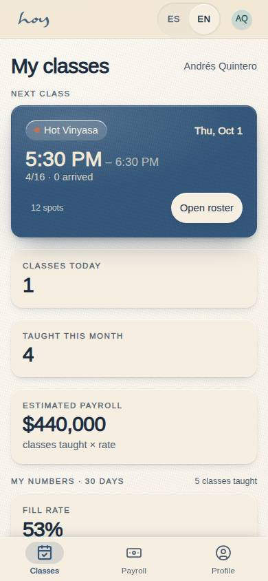
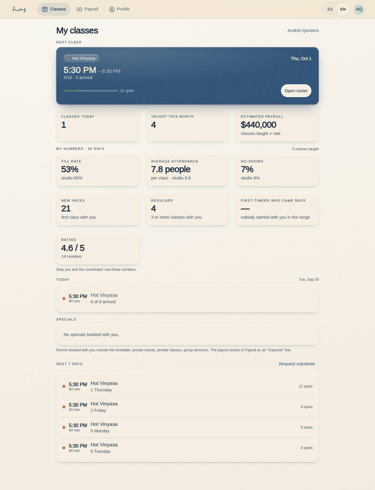
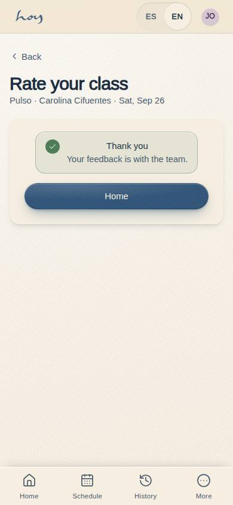
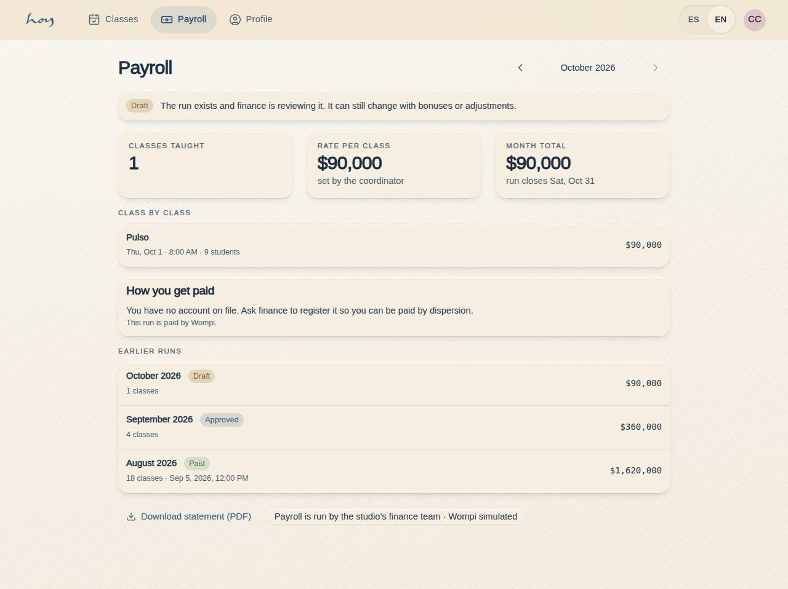

# Teachers

Your tool is the **teacher app**: your next class, the list of who is coming, your schedule, your reviews and your
pay.

{{audience:06-maestros}}

## 1. Before class
1. Arrive in good time (see below). The front desk marks you "Arrived". Without a teacher in the room, no students
   go in.
2. Open your next class and look at the list: how many are coming, who is new and whether there are health
   markers. Never mention a health marker out loud: adapt the class.
3. Check the room: temperature, mats, props, music and light (see
   [Room, heat and maintenance](07-sala-calor-y-mantenimiento.md)).
4. Greet whoever you can by name. Ask new people if there is anything you should know.

How early you arrive before class:

{{studio:teacher_arrival_minutes}}

This is the room's capacity:

{{tenant:capacity}}

**What to say to someone new:** "Welcome. Any injury or anything I should know? If at any point you need to stop,
stop. Nobody has anything to prove here."

## 2. During class
1. Start on time. For that person, this is their class of the day: give all of it.
2. Mark attendance from your mat. You can do it from 15 minutes before until 2 hours after the start; after that,
   only coordination can change it.
3. Anyone arriving late comes in if they are inside the grace period. Welcome them quietly, with a gesture.
4. Your phone is only for the list and the music.

## 3. After class
1. Close attendance before you leave the room. The waitlist, your pay and the member's history all come from it.
2. Leave the room as you found it: props back in place and the studio's mats clean.
3. You see your reviews in the app: the average and the named comments the student did not mark as anonymous. You
   read them; you don't reply from the app.

> IN HOYOS: S-03 → Next class → List → mark attendance → Close. Schedule: S-03 → My schedule. Profile: S-03 → Profile (coordination reviews it before it goes live).

## 4. Substitutions
1. If you can't teach a class, find the substitute in the team yourself and tell coordination with the notice
   below.
2. Coordination makes the change in the schedule. The student sees the right name.
3. With less notice, or with no substitute, call coordination straight away.
4. If the class is cancelled, the system returns the credits and tells the students. You don't message them
   yourself.

The minimum notice to ask for a substitute:

{{studio:substitution_notice_hours}}

## 5. Cancellations
1. Never cancel a class in the WhatsApp group. Only coordination cancels.
2. If fewer students come than expected, the class still goes ahead.

> DECISION NEEDED: whether there is a minimum number of students to run a class, and what a substitution pays.

## 6. Your pay
1. In the app you see your statement: classes taught, rate, substitutions and adjustments. It is read-only.
2. Check it before the period closes. If something doesn't add up, tell coordination with the class and the date.
3. Until finance generates the period's pay, what you see is an **estimate**.

How it works on the finance side: [Teacher payroll](16-nomina-y-payouts.md).

> IN HOYOS: S-03 → Payroll.

## 7. Code of conduct
{{editable:owner}}

1. We speak informally and calmly. No comments on bodies or levels.
2. Hands-on adjustments only with clear permission, which you ask for at the start of class.
3. What you know about a student (health, personal life) stays in the studio. Never on social media or outside.
   See [Personal data](23-habeas-data.md).
4. Punctuality, a clean appearance and no strong perfume in the heated room.
5. If there is an injury or an incident: the person first (see
   [Incidents and emergencies](08-incidencias-y-emergencias.md)), then tell coordination, and the front desk leaves
   the note.
