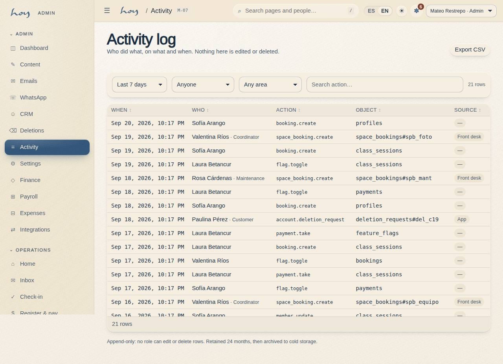

# Incidents and emergencies

The rule never changes: **the person first, the record second**. Never the other way round.

{{audience:08-incidencias-y-emergencias}}

## 1. Medical emergency
1. If it happens in the room, stop the class. Whoever is closest stays with the person.
2. The front desk calls the emergency line and tells coordination.
3. Look up the member's emergency contact and any health marker on their record.
4. Call the emergency contact only if the person can't do it themselves.
5. Use the first-aid kit. Do not give medication.
6. Afterwards, leave a note on the record with the category "Injury / health": the time, what happened and what
   was done. Coordination tells the owner the same day.

**What to say to the person:** "I'm here with you. We've called for help. Breathe slowly."

> IN HOYOS: S-02 → Member profile (opens M-06) → emergency contact. Note: M-06 → Notes → Add note.

## 2. Heat: dizziness, nausea, heat stroke
In the heated room this is the most likely incident. It almost always resolves if you act early.

1. Signs: paleness, dizziness, nausea, stops sweating, speaks oddly. The teacher sees it from the front.
2. Take the person out of the room and sit them down. Do not lay them down suddenly.
3. Give them water in sips, not in one go.
4. If they don't improve within a few minutes, or there is confusion or vomiting, it is a medical emergency:
   follow section 1.
5. The person does not go back into the room that class, even if they say they are fine.
6. Always record it, even if it sorted itself out: a note on the record with the time and the class.

Three heat cases in the same time slot are a room problem, not a people problem: tell coordination (see
[Room, heat and maintenance](07-sala-calor-y-mantenimiento.md)).

## 3. Evacuation
1. The signal is the teacher's or the front desk's voice.
2. Everyone leaves by the evacuation route to the meeting point (see section 4).
3. The front desk leaves with the day's list on their phone and confirms everyone checked in is outside.
4. Nobody goes back for belongings. The front desk calls emergency services and coordination.

{{for:front_desk}}
You are the one who carries the list. Before you leave, open Check-in on your phone with the class that is running.
{{/for}}

## 4. Who to call
{{editable:owner}}

| Contact | Where it is |
|---|---|
| Emergency services | see below |
| Coordination | in the team group |
| Owner | in the team group |
| The member's emergency contact | at the top of their record |
| Reference clinic | see below |
| Evacuation route and meeting point | see below |

The emergency number:

{{studio:emergency_number}}

The clinic we take someone to:

{{studio:reference_clinic}}

Where we go out and where we gather:

{{studio:evacuation_route}}

These are the studio's contact details:

{{tenant:contact}}

> DECISION NEEDED: the emergency number we use, the evacuation route, the meeting point and the reference clinic.

## 5. Incidents that are not medical
A theft, damage, a conflict between people, someone who doesn't respect a boundary, a teacher who doesn't turn up.

1. Stop the situation. If there is a risk, get the person out of the space.
2. Leave a note on the record: category, time, who was there and what was done.
3. Tell coordination the same day. Tell the owner if there was damage, money or an outsider involved.
4. Nothing is ever posted or discussed with other members.

## 6. What gets recorded
Everything you do in HoyOS —even opening a member's record— is recorded with your name and the time. That protects
the person and it protects you too.

This is what that record looks like:

{{table:audit_log}}

> IN HOYOS: M-07 Activity → filter by date, person or action.
