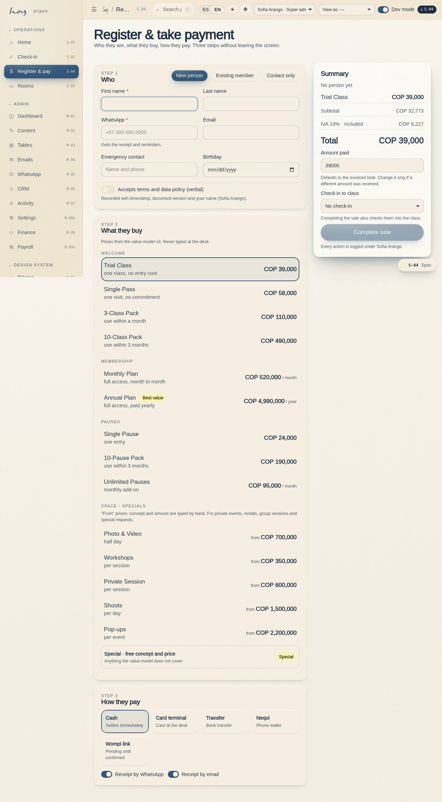
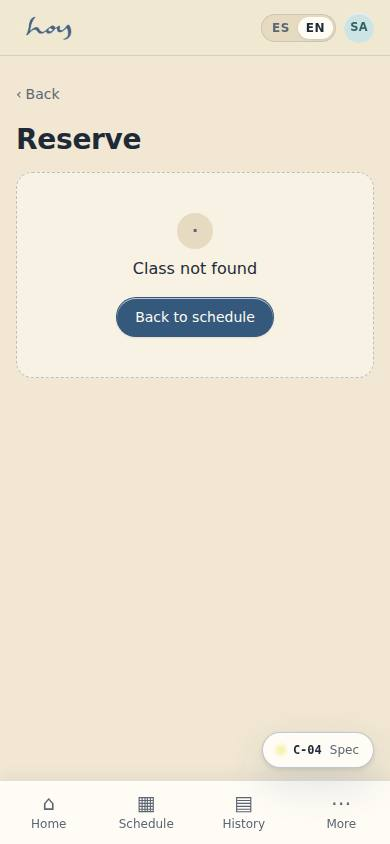
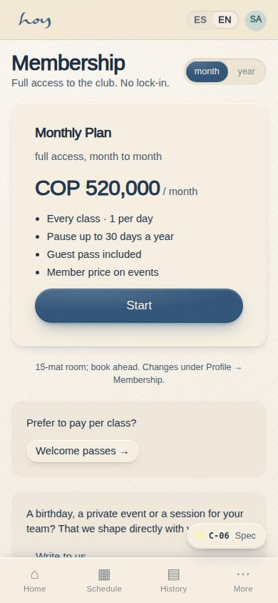
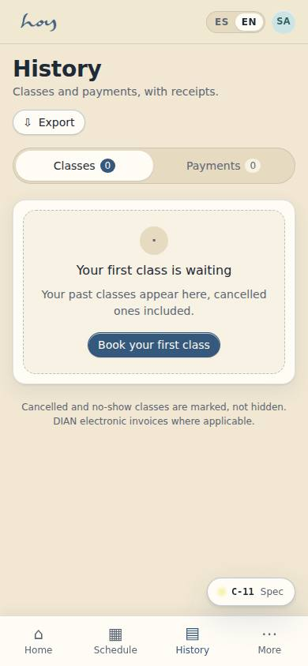

# Sales and plans

Everything we sell comes from the value model (`03`). At the desk you don't invent prices or
validities: you pick them.

## 1. Register and take payment (S-04)
1. **S-04 Register & take payment**, section **Who**: New / Existing. New: name, WhatsApp, email,
   emergency contact, birthday and consent (the person agrees verbally; you record it — it is stored
   with time, your name and the policy version, see `23`).
2. Section **What**: pick the Bienvenida pass or the plan. Below them, the **Space · Specials** family is
   for what has no button: concept and price by hand, a teacher with their payout and a room with its
   window, all in the same sale (`12` §7).
3. Section **How they pay**:
   - **Wompi (link)**: send the link by WhatsApp; the order stays pending until the gateway confirms.
   - **Card terminal**: charge; the order stays pending until confirmation.
   - **Cash**: settles immediately; put the money in the till and hand over the receipt.
   - **Transfer / Nequi**: ask to see the proof on screen, leave the order pending and note it for finance.
4. **Complete and check in**: the sale auto-checks the person into the class they bought. Receipt by
   WhatsApp and email.
5. Payment declined: the order stays pending with the reason; offer another method, do not blindly retry.

**Steps in HoyOS:** S-04 → Who → What → How they pay → Complete and check in. Look it up later: M-06
CRM → Payments tab.

> DECISION NEEDED: whether published prices include IVA or the S-04 rail adds it separately.

The IVA the rail applies today:

{{policy:iva_pct}}

## 2. What to offer whom
| Who is in front of you | What to offer | Why |
|---|---|---|
| First time, unsure if they'll like it | Trial Class | they decide with the body, not the head |
| Came back and asked about prices | 3-Class Pack | short commitment, no monthly plan |
| Comes 2–3 times a week | Monthly Membership | better for them, steadier for us |
| Already knows they're staying the year | Annual Membership | best price per month |
| Comes between meetings, 20 minutes | Pausas | doesn't occupy a class mat |
| Wants to give a gift | Gift voucher | it is our referral channel |
| Wants the space for their event, a birthday or a session for their team | **Especial** in S-04: the "from" price as reference, concept and amount by hand | not a checkout; the conversation ends at the desk (`12` §7) |

Current prices, read from the system:

{{pricing:bienvenida}}

{{pricing:membresia}}

## 3. What the member can do alone
Almost everything — and it is better when front desk doesn't do it for them:

| They want to | Screen |
|---|---|
| See and book classes | C-02 Schedule |
| See passes and credits | C-07 / C-07b |
| Buy a plan | C-06 Plans → C-04 Checkout |
| Change or cancel a booking | C-08 / C-08b |
| Pause or cancel a membership | C-22 Manage membership |
| See payments and receipts | C-11 History |
| Change their details and language | C-19 Profile |
| Save a payment method | C-05 Payment methods |

## 4. Credits and validity
1. A Bienvenida pass gives credits with an expiry date; Membership gives no credits, it gives access.
2. A credit returned by a cancellation inside the window comes back with its original validity — it is
   not extended.
3. Courtesies are **credit, not money**, and coordination approves them (`14`).

{{table:credits}}

## 5. Receipts
Every settled sale produces a receipt by WhatsApp and email, carrying the electronic invoice reference
once invoicing is switched on (`15`).

