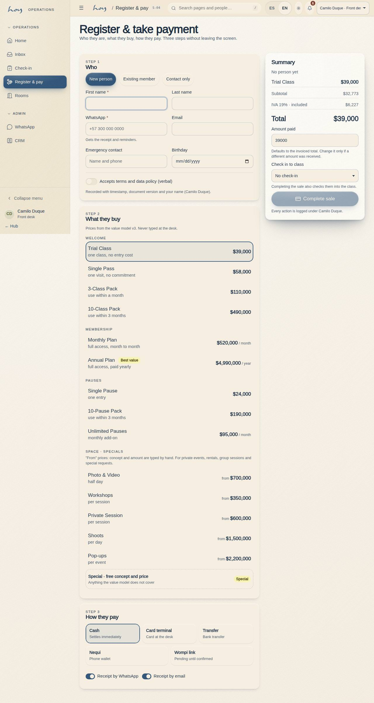
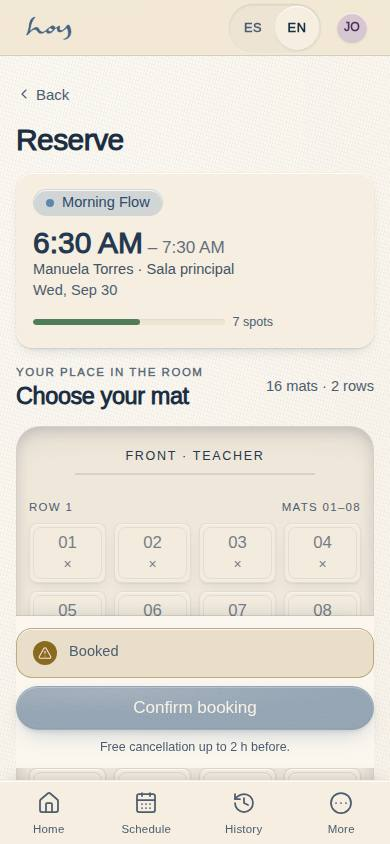
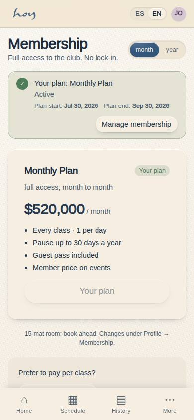
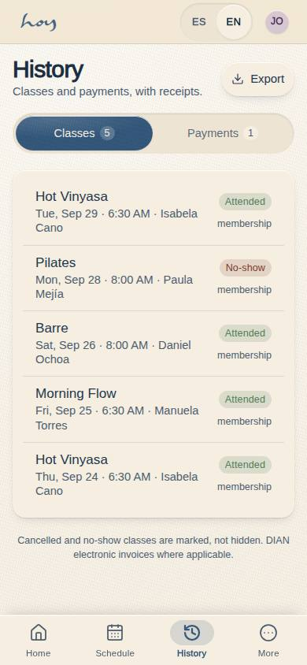

# Sales and plans

Everything we sell comes from the [value model](03-modelo-de-valor.md). At the desk nobody invents prices or
validity periods: you pick them.

{{audience:10-ventas-y-planes}}

## 1. Register and take payment
1. **Who.** Choose whether it is a new person or an existing member. If they are new, ask for name, WhatsApp,
   email, emergency contact and birthday.
2. **Data consent.** Ask whether they agree to the processing of their data. They say yes out loud and you tick
   it. It is saved with the time, your name and the policy version (see [Personal data](23-habeas-data.md)).
3. **What they buy.** Pick the pass or the plan. For anything without a button (a birthday, a team session, a
   rental with extras) there is **Space · Specials**: concept and price typed by hand (see
   [Space — B2B rental](12-espacio-b2b.md)).
4. **How they pay:**
   - **Wompi link:** send the link by WhatsApp. The sale stays pending until the payment is confirmed.
   - **Card terminal:** take the payment. The sale stays pending until it is confirmed.
   - **Cash:** paid straight away. Put the money in the till and hand over the receipt.
   - **Transfer or Nequi:** ask to see the proof, leave the sale pending and note it for finance.
5. **Complete.** When you complete the sale, the person is checked in to the class they bought. The receipt goes
   out by WhatsApp and email.
6. **If the payment fails:** the sale stays pending with the reason. Offer another method. Never retry the charge
   blindly.

**What to say when you take payment:** "All set, you're in the 7 o'clock. The receipt is on its way to your
WhatsApp."

This is the VAT applied today:

{{policy:iva_pct}}

> DECISION NEEDED: whether the published prices already include VAT (IVA) or whether it is added on top at the desk. This also decides how prices are written on the website.

> IN HOYOS: S-04 Register & pay → Who → What → How they pay → Complete and check in. Afterwards: M-06 CRM → Payments tab.

## 2. What to offer each person
| Who is in front of you | What you offer | Why |
|---|---|---|
| First time, not sure they'll like it | Trial Class | they decide with their body, not their head |
| Came back and is asking about prices | 3-Class Pack | a short commitment, no monthly plan |
| Comes 2 or 3 times a week | Monthly membership | better value for them, stability for us |
| Knows they're staying all year | Annual membership | the best price per month |
| Comes between meetings, for 20 minutes | Pauses | doesn't take a class mat |
| Wants to give a gift | Gift Voucher | it's how new people arrive |
| Wants the space for an event, a birthday or their team | A Special, using the "from" price as a reference | agreed in conversation and charged at the desk |

These are the prices in force:

{{pricing:bienvenida}}

{{pricing:membresia}}

## 3. What members can do on their own
Almost everything. It is better if they do it from their app: they learn how, and they don't depend on the desk.

| They want to | Where, in their app |
|---|---|
| See and book classes | Schedule |
| See their passes and credits | My passes |
| Buy a plan | Plans → pay |
| Change or cancel a booking | My bookings |
| Pause or cancel the membership | Manage membership |
| See their payments and receipts | History |
| Change their details or language | Profile |
| Save a payment method | Payment methods |

**What to say:** "You can do that yourself in the app, under My bookings. Want me to show you?"

> IN HOYOS: C-02 Schedule · C-07 Passes · C-06 Plans → C-04 Checkout · C-08 Bookings · C-22 Membership · C-11 History · C-19 Profile · C-05 Payment methods.

## 4. Credits and validity
1. A Welcome pass gives **credits** with an expiry date. A Membership gives access, not credits.
2. If the person cancels inside the window, the credit comes back with its original date. It is not extended.
3. A courtesy is given as **credit, not money**, and coordination approves it (see
   [Payments and the till](14-pagos-y-caja.md)).

This is how the system keeps credits:

{{table:credits}}

## 5. Receipts
Every paid sale produces a receipt by WhatsApp and email. Once electronic invoicing is switched on, the receipt
will also carry the invoice reference (see [Invoicing](15-facturacion-y-dian.md)).

