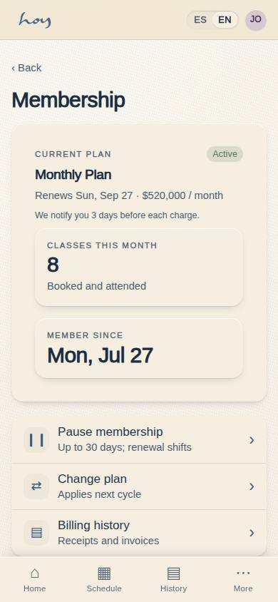
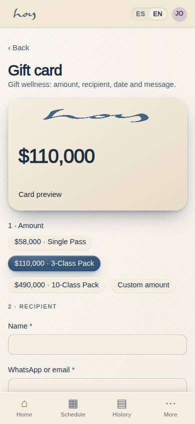

# Pauses and gifts

Two different things with similar names. **Pausas** are micro-sessions we sell; **pausing** is freezing
a membership. This chapter covers both, plus gifts.

## 1. Pausing a membership
1. The person can freeze their membership from **C-22 Manage membership**, without calling anyone. If
   they ask at the desk, you do it from M-06 and leave a note.
2. The limits are policy, not judgement:

{{policy:pause_days_per_year}}

3. They always get notice before every charge. If they ask "when am I charged?", the date is in M-06 →
   Payments tab and in C-22.
4. Cancelling: access continues until the end of the paid period. No mazes: do not push back, record
   the reason.

> DECISION NEEDED: notice days for a pause (C-22 proposes 15 days' notice; the brief does not fix it).

## 2. Pausas (the product)
Micro-sessions of 15 to 30 minutes: breathwork, meditation, a pause between meetings. Their job in the
business is **frequency** (`03`): making the person come more often, not pay more per visit.

{{pricing:pausas}}

At the door: a Pausa needs no class mat and no full room setup; they come in and out. If the person has
already taken their class for the day, a Pausa is not "another class" — but that still has to be decided.

> DECISION NEEDED: whether "Unlimited Pauses" stacks with Membership or replaces it, and whether a Pausa uses up the one-class-per-person-per-day limit.

## 3. Gift vouchers
1. Bought in **C-17 Gift**, with a design and a message; delivered by WhatsApp or email.
2. A voucher is prepaid money with a code: it is redeemed in S-04 by choosing "voucher" as the method,
   and the system deducts the balance.
3. A voucher does not expire at the desk's discretion: its validity is whatever the system shows.

{{pricing:regalos}}

## 4. Guests
1. A Membership member may bring a guest; the guest takes a real place in the room, so they are booked
   like anyone else.
2. The guest is registered: name, WhatsApp, consent. They do not come in "as a companion" without a
   record, because in an emergency we wouldn't know who to call (`08`).
3. A guest who comes back is the best customer there is: if they ask about prices, offer the Trial
   Class, not an invented discount.

> DECISION NEEDED: how many guests a Membership member may bring per month, and whether the guest takes one of the 15 mats or sits above capacity.

## 5. Referrals
1. Every member has a referral code in **C-16 Invite**. When someone joins with that code, the member
   gets a credit.
2. The reward is granted by the system, not by the desk: if a member claims a reward that never
   arrived, check it in M-06 and escalate to admin.

{{table:invites}}
