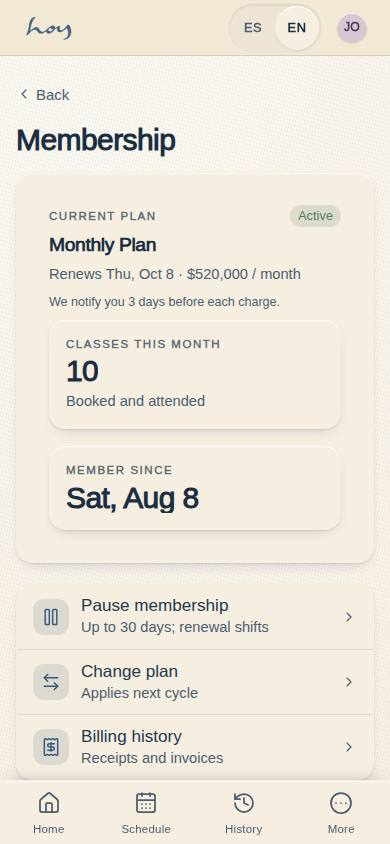
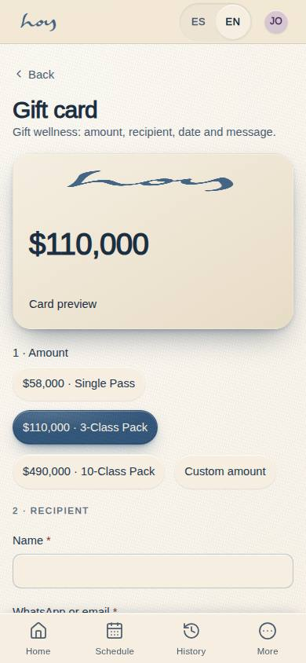
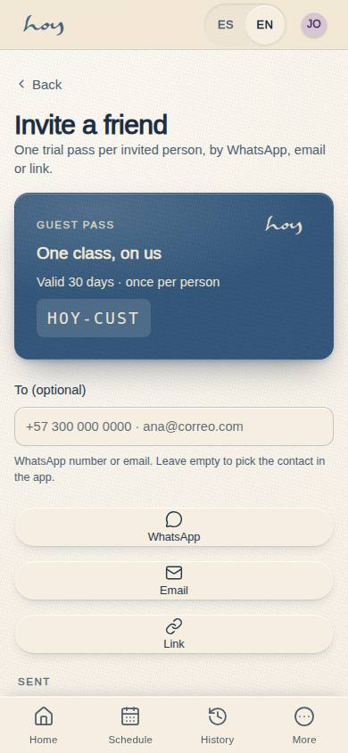

# Pauses and gifts

Two things with similar names. **Pauses** are short sessions we sell. **Pausing** means freezing a membership.
This chapter covers both, and gifts as well.

{{audience:11-pausas-y-regalos}}

## 1. Pausing a membership
1. A member can freeze their membership from their app, without calling anyone.
2. If they ask you at the desk, you do it from their record and leave a note.
3. The limits come from the policy, not from whoever is at the desk:

{{policy:pause_days_per_year}}

4. They always get a notice before every charge. If they ask "when will I be charged?", the date is on their
   record under Payments, and in their app.
5. If they want to cancel, they keep access until the end of what they paid for. Don't push. Note the reason.

**What to say if they want to cancel:** "Of course. You have access until [date]. Would you tell me why, so we
can do better?"

> DECISION NEEDED: how many days ahead a pause has to be requested (the app suggests 15 days).

> IN HOYOS: C-22 Manage membership (the member) · M-06 CRM → record → Membership (the desk).

## 2. Pauses (the product)
15 to 30-minute sessions: breathwork, meditation, a pause between meetings. They are there so people come more
often (see [Value model](03-modelo-de-valor.md)).

{{pricing:pausas}}

1. A Pause needs no class mat and no full set-up: the person comes in and goes.
2. **Unlimited Pauses** is a monthly add-on: it stacks with Membership, it does not replace it.

**What to say:** "It's a short session, 15 to 30 minutes. If you already have a membership, the unlimited ones add
on to your plan."

> DECISION NEEDED: whether a Pause counts as the class of the day (the one-class-per-person-per-day limit) or sits outside it.

## 3. Gift vouchers
1. They are bought in the app, under Gift, with a design and a message. They are delivered by WhatsApp or email.
2. A voucher is prepaid money with a code. It is used at the desk by choosing "voucher" as the payment method, and
   the system takes it off the balance.
3. The voucher's validity is the one the system shows. It is not changed at the desk.

{{pricing:regalos}}

> IN HOYOS: C-17 Gift (buying) · S-04 → How they pay → Voucher (redeeming).

## 4. Guests
{{editable:owner}}

1. The guest is **included** for Membership members: there is no charge.
2. The guest takes a real place in the room, so they are booked like anyone else.
3. The guest is registered: name, WhatsApp and data consent. Nobody comes in "as a plus-one" without registering:
   in an emergency we wouldn't know who to call.
4. If the guest asks about prices, offer the Trial Class. Never an invented discount.

The guest rule in force at the studio today:

{{studio:guest_allowance_note}}

**What to say to the guest:** "Welcome. I'll register you in a minute — name and WhatsApp, so you're on the class
list."

> DECISION NEEDED: how many guests a Membership member may bring each month, and whether a guest takes one of the class's mats or comes in above capacity. Until the owner confirms it, the studio rule above applies.

## 5. Referrals
1. Every member has their code in the app, under Invite. When someone joins with that code, the member gets a
   credit.
2. The reward is given by the system, not by the desk. If a member says it never arrived, check their record and
   pass it to admin.

This is how the system keeps invitations:

{{table:invites}}
