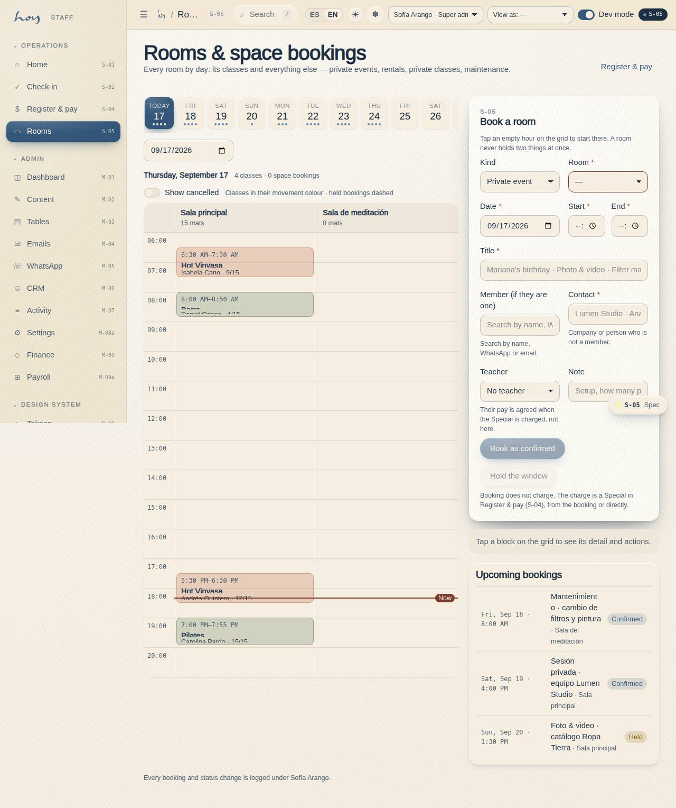

# Space — B2B rental

The fifth revenue line. The studio is a beautiful space that sits empty for many hours a day: that is
what we sell. It is not a customer plan and **it does not go through checkout**: these are "from"
prices that end in a conversation.

{{pricing:espacio}}

## 1. What we rent and what we don't
| Yes | No |
|---|---|
| Third-party workshops, with their teacher or ours | Anything that displaces a scheduled class without the owner's approval |
| Private sessions (one person or a closed group) | Events with alcohol, or more people than there are mats |
| Photo and video, half day | Use of the wordmark or the brand without approval (`19`) |
| Shoots, per day | Subletting: whoever rents does not resell the space |
| Pop-ups and brand activations | Peak hours, unless the owner makes an exception |

## 2. How we quote
1. It arrives by WhatsApp, Instagram or the site form (W-06 Contact). Front desk does not quote: pass
   the contact to coordination the same day.
2. Coordination asks five things: **what** it is, **how many people**, **which day and time**, **what
   they need from the space** (sound, light, heat, chairs) and **whether there will be cameras**.
3. We quote from the "from" price of the Espacio family, plus whatever the extras cost (staff in the
   room, deep clean, hours outside opening times).
4. The quote goes out in writing and is stored as a note in M-06 on the company or person, with the
   amount and the conditions. Nothing is agreed by voice alone.

{{tenant:hours}}

> DECISION NEEDED: which hours count as "off-peak" for rentals, and whether a rental may displace a published class (and with how much notice).

## 3. How we book it
1. The block is created in **S-05 · Rooms & space bookings** (`/staff/rooms`): kind (private event,
   rental, private class, maintenance or a block), room, date, start and end time, title, contact or
   member, teacher if there is one, note. The room is taken and nobody schedules a class on top of it.
2. **A room never holds two things at once.** The form checks the window against the published classes
   and the other bookings of that room and, if anything overlaps by even a minute, it lists it and will
   not book. Change the time or the room; moving a published class is the owner's call (§2).
3. If the rental is a workshop open to the public, it goes in as an **event** (C-23) with its own price
   and capacity — there, there is a checkout.
4. Front desk sees the block on the S-05 calendar next to the day's classes, with the contact's name;
   the teacher sees it on their S-03 home under **Specials**.

## 4. Deposit and payment
1. A rental is confirmed with a deposit; without a deposit the date is not held.
2. The balance is charged before use, not after. Methods: the same as S-04 (`10`), usually a Wompi link
   or a transfer.
3. For a company: capture the NIT and legal name **before** issuing, because an invoice is not redone (`15`).

> DECISION NEEDED: deposit percentage, the rental cancellation policy (how much is refunded and until when) and whether a damage deposit is taken.

## 5. The day itself
1. Setup as agreed, not to the class standard (`07`). Whatever gets moved gets written down.
2. Someone from the team is present the whole time: the space is never handed over on a key to a third party.
3. Rules said at the door: where the exits are, what does not get moved, no street shoes in the room,
   and what time everyone has to be out.
4. If there are cameras: members who did not come for that are not filmed. If it overlaps a class, the
   attendees are told before they walk in.

## 6. Close and damages
1. Joint walk-through at the end: floor, mirrors, props, bathrooms, sound and lighting.
2. Anything missing or broken is photographed there and then and written into the M-06 note.
3. Deep clean before the next class; if the rental ends late, the first class of the next day gets an
   early check.
4. Coordination closes the case in M-06 and finance reconciles the payment (`14`).

## 7. Especiales — the manual charge
An **Especial** (Special) is the sale whose concept and price are typed by hand at the desk. It exists for
what the value model does not cover with a button: a birthday with a teacher, a session for a team, a
rental with extras, an odd request. It is the operational answer to the question of a group-session
product for celebrations (ROADMAP §E 34): the mechanics are here; the commercial product, if it is ever
standardised, is Lore's call.

1. **Book** (optional, S-05): the room and the window, as in §3. It may stay **held** while there is no
   deposit — drawn with a dashed border — or go straight to **confirmed**.
2. **Charge** (S-04 Register & take payment): under **What they buy**, the **Space · Specials** family lists
   the "from" prices (Private Session, Workshops, Photo & Video, Shoots, Pop-ups) and a row **Special ·
   free concept and price**. Picking one opens the **Special** card: concept (prefilled from the "from"
   item), agreed amount, teacher and their payout, room and window, note. If the booking already exists in
   S-05, its **Charge** button opens S-04 with everything loaded and, on completion, confirms and links it.
3. **Who**: existing member, new person or **Contact only** (a company or someone who is not a member:
   name only, no customer is created). IVA, **Amount paid** and **Note** work exactly as in any sale (`10`).
4. **Complete sale** writes the payment and the invoice, the `special_charges` row and, with a room, the
   confirmed `space_bookings` row — one sale, and all of it in M-07 under whoever charged.
5. **The teacher's pay** is agreed here, not in payroll: the value typed under "Teacher payout" enters the
   period's draft as a line **"Especial: <concept>"** (`16`). No teacher or no value, no line.

**Booking statuses:** held → confirmed → done; cancelled at any point frees the room and, if there was a
teacher, drops their line from the payroll draft. A done booking is never edited.

{{table:special_charges}}

## 8. What to watch each month
| Indicator | Where |
|---|---|
| Hours rented | S-05 calendar + M-06 notes |
| Specials charged and their teacher payouts | `special_charges` (M-03) + "Especial" lines in M-09b |
| Espacio family revenue | M-09 Finance |
| Incidents or damage from rentals | M-07 + M-06 notes |
| Quotes sent vs closed | M-06 notes |

