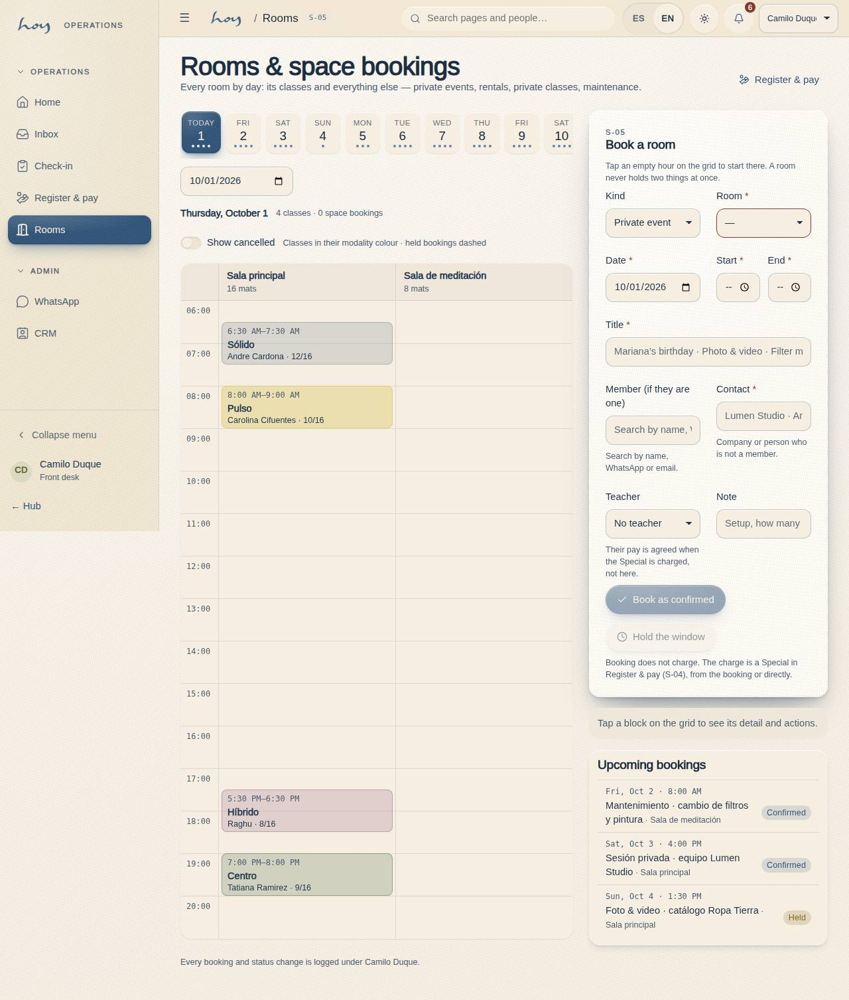

# Space — B2B rental

The studio is a beautiful space that sits empty for many hours a day, and that sells too. A rental is not a
customer plan and **is not paid online**: they are "from" prices that end in a conversation.

{{audience:12-espacio-b2b}}

These are the reference prices:

{{pricing:espacio}}

## 1. What we rent and what we don't
{{editable:owner}}

| Yes | No |
|---|---|
| Other people's workshops, with their teacher or one of ours | Anything that removes a class from the schedule without the owner's approval |
| Private sessions (one person or a closed group) | Events with alcohol, or with more people than there are mats |
| Photo and video, by the half day | Using the logo or the brand without approval (see [Media](19-medios-y-artwork.md)) |
| Shoots, by the day | Subletting: whoever rents does not resell the space |
| Pop-ups and brand activations | Peak hours, unless the owner makes an exception |

If a **company** asks for a wellbeing programme for its team, that is the Corporate Experiences line, which is
still in preparation (see [Value model](03-modelo-de-valor.md)). A one-off session for a team can already be charged
today as a Special.

## 2. How to quote
1. The request arrives by WhatsApp, Instagram or the website's contact form. The front desk does not quote: pass the
   contact to coordination the same day.
2. Coordination asks five things: **what** it is, **how many people**, **what day and time**, **what they need**
   from the space (sound, light, heat, chairs) and **whether there will be cameras**.
3. The quote is built on the "from" price, plus extras: staff in the room, deep cleaning, hours outside opening
   times.
4. The quote is sent in writing and saved as a note on the person's or company's record, with the amount and the
   terms. Nothing is agreed by word of mouth alone.

**What to say when a request comes in:** "Lovely! I'll pass you to coordination — they'll write to you today with
a proposal."

These are the studio's hours:

{{tenant:hours}}

> DECISION NEEDED: which hours count as "off-peak" for rentals, and whether a rental may move a class that is already published (and with how much notice).

## 3. How to book the room
1. Create the block in **Rooms**: type (private event, rental, private class, maintenance or block), room, date,
   start and end time, title, contact, teacher if there is one, and a note.
2. **The room never takes two things at once.** If the time overlaps a published class or another booking, even by a
   minute, the screen shows it and won't let you book. Change the time or the room.
3. If it is a workshop open to the public, it is published as an **event**, with its own price and capacity: that
   one is paid online.
4. The front desk sees the block on the calendar next to the day's classes. The teacher sees it in their app,
   under "Specials".

> IN HOYOS: S-05 Rooms and space bookings → New booking → type, room, window → Save.

## 4. Deposit and payment
{{editable:owner}}

1. A rental is confirmed with a deposit (see the rule below).
2. The balance is paid before the rental, not after. The methods are the desk's usual ones; normally a Wompi link or
   a transfer.
3. If it is a company, ask for the tax ID (NIT) and the legal name **before** invoicing. An invoice can't be redone
   (see [Invoicing](15-facturacion-y-dian.md)).

The deposit terms:

{{studio:b2b_deposit_note}}

> DECISION NEEDED: the deposit percentage, how much is refunded if a rental is cancelled and until when, and whether a damage deposit is taken.

## 5. On the day
{{editable:coordinator}}

1. Set the room up as agreed, not as a class. Note anything that gets moved.
2. Someone from the team is there the whole time. The keys are never handed to a third party.
3. When they arrive, go over the rules: where the exits are, what must not be moved, no street shoes in the room,
   and what time they have to leave.
4. If there are cameras, members who didn't come for that are not filmed. If it overlaps a class, the students are
   told before they go in.

## 6. Closing and damage
1. Check everything with the renter: floor, mirrors, props, bathrooms, sound and light.
2. Anything missing or broken is photographed on the spot and noted on their record.
3. Deep clean before the next class. If the rental ends late, the next morning's first class gets an early check.
4. Coordination closes the case and finance reconciles the payment (see [Payments and the till](14-pagos-y-caja.md)).

## 7. Specials: charging by hand
A **Special** is a sale whose concept and price are typed by hand. It is for anything without a button: a birthday
with a teacher, a session for a team, a rental with extras, an unusual request.

1. **Book the room** (if needed): as in section 3. It can stay **on hold** until there is a deposit (it shows with a
   dotted border) or be **confirmed**.
2. **Charge:** in Register & pay, pick **Space · Specials**. Choose a "from" price or "Special · manual concept and
   price". Fill in: concept, agreed amount, teacher and their pay, room and time, note. If the booking already
   exists, its **Charge** button opens the sale with everything filled in.
3. **Who pays:** a member, a new person, or **contact only** (a company or someone who isn't a member: just the
   name). VAT and notes work as in any sale.
4. **Completing the sale** saves the payment, the invoice and the confirmed booking together, under your name.
5. **The teacher's pay** is agreed here, not in payroll. The amount you type goes into the period's pay as a line
   "Special: <concept>" (see [Payroll](16-nomina-y-payouts.md)).

**Booking states:** on hold → confirmed → done. If it is cancelled, the room is freed and the teacher's line leaves
the pay run. A booking that is done can no longer be edited.

This is how each Special is saved:

{{table:special_charges}}

> IN HOYOS: S-04 Register & pay → What → Space · Specials → Special card → Complete sale.

## 8. What to look at each month
{{for:super_admin,admin,coordinator,finance}}
| What | Where you see it |
|---|---|
| Hours rented | the Rooms calendar and each client's notes |
| Specials charged and what teachers were paid | the Specials table and the "Special" lines in teacher pay |
| Revenue from the Space line | Finance |
| Damage or incidents during rentals | the activity log and the notes |
| Quotes sent and closed | each client's notes |
{{/for}}

