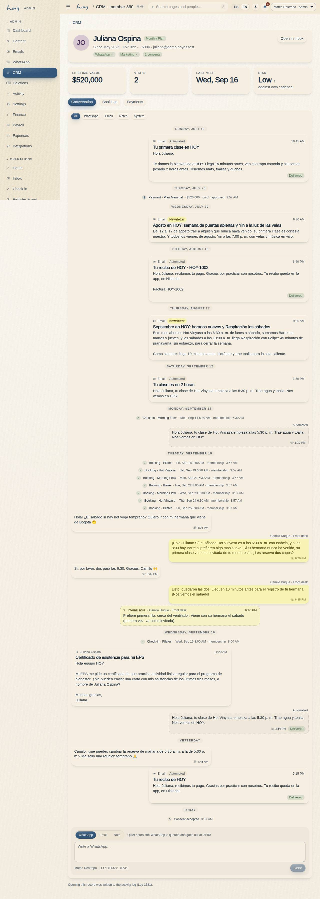
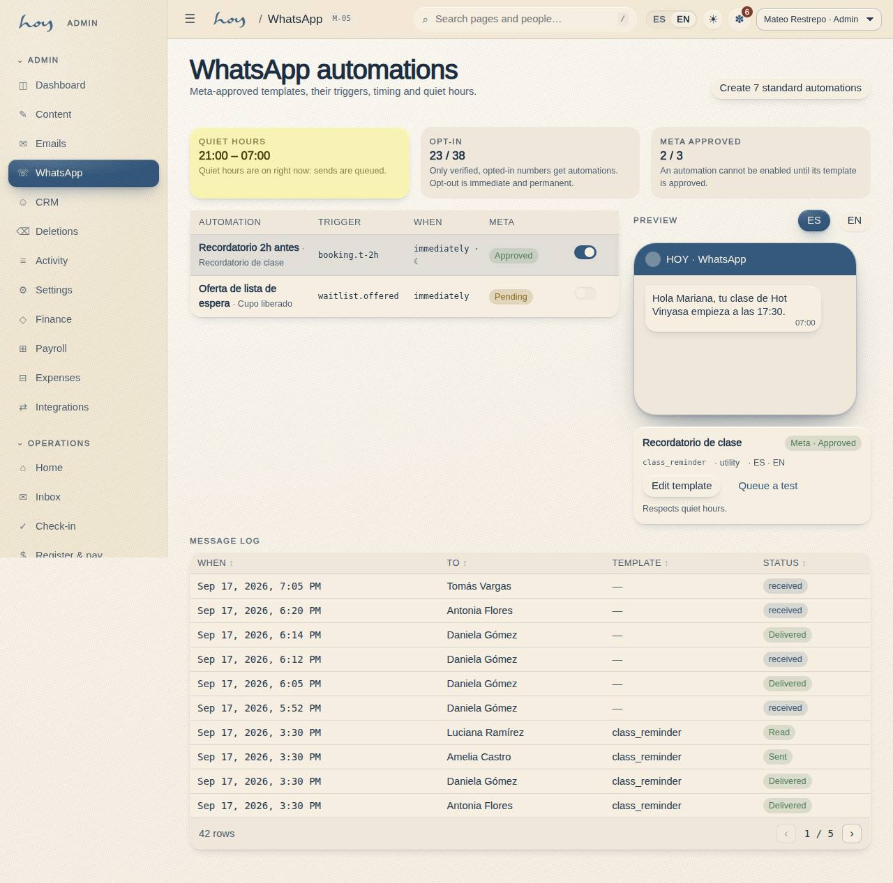
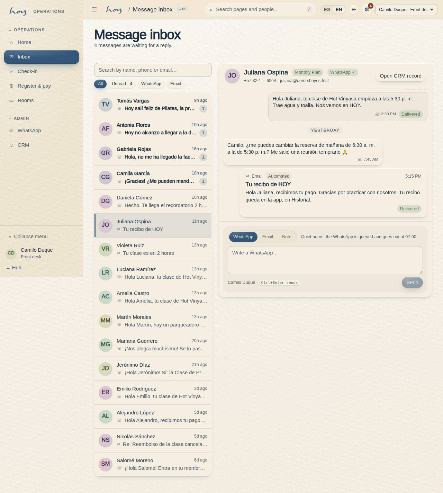

# CRM, WhatsApp and email

WhatsApp is the main channel. Everything the studio sends or receives — automated or by hand, WhatsApp or
email — and every note the team writes about a person lands in **one conversation** per person. That
conversation is read from two places: the member record in **M-06 CRM** and the front desk's **Message
inbox S-06**. Same information; what changes is who is looking and why.

## 1. The member 360 and its conversation
1. **M-06** is the file: header with contact, plan and emergency contact; tiles for value, visits and
   risk; and three tabs: **Conversation**, **Bookings** and **Payments**.
2. The **Conversation** tab opens first. It is a WhatsApp-style thread, oldest message at the top and newest
   at the bottom, with day separators:
   - what **the person wrote** (WhatsApp or email) sits on the left;
   - what **the studio sent** sits on the right: yellow if someone on the team wrote it, with their name and
     role underneath; dashed grey if an automation sent it (class reminder, receipt);
   - **emails** are cards with a subject line and a badge saying where they came from: **Newsletter**,
     **Automated** or **Manual** (real correspondence);
   - **internal notes** are the dashed yellow card with the pencil. The person never receives or sees them;
     the team reads them, the owner reads them and, if someone asks under data-protection law, so does the
     person (`23`);
   - **system events** — booking, check-in, payment, consent — appear as a centred grey line between
     messages, so you know what happened between one message and the next.
3. The chips at the top filter the thread: **All · WhatsApp · Email · Notes · System**. "System" shows only
   the events and hides the reply box.
4. An inbound message nobody on the team has read carries a **blue ring**. Opening the tab marks it read for
   the whole team; that is the "we've seen it" that clears the bell and the S-01 counter.
5. List segments: "Active", "At risk", "New". The "At risk" segment is reviewed on Wednesdays (`05`).
6. Front desk and coordination see and write the conversation; finance sees it but does not write, and does
   not see health notes (`24`). Opening a record is written to the activity log (Ley 1581).

## 2. Channel rules
| Rule | Detail |
|---|---|
| One number | The studio's WhatsApp Business; never from personal phones |
| Opt-in | Only opt-in numbers receive automations (captured in A-03 or S-04) |
| Opt-out | "Stop" or "no more messages" is honoured immediately and permanently; recorded as a note in the conversation |
| Quiet hours | Nothing non-urgent is sent; automated and manual WhatsApps queue until morning |
| Exceptions | Class cancelled by the studio and a released waitlist spot always go out |
| Response | During desk hours, under 15 min; outside hours, first thing in the morning |
| Email | Confirmations, receipts with the DIAN reference, cancellations, newsletters; a backup to WhatsApp, not a replacement |

The quiet hours in force:

{{policy:quiet_hours}}

> DECISION NEEDED: official WhatsApp service hours and the legal opt-in wording.

## 3. Automated templates (M-05 / M-04)
| Template | Trigger | Timing |
|---|---|---|
| Booking confirmed | booking created | immediate |
| Class reminder | T−2 h | respects quiet hours |
| Class cancelled | studio cancellation | immediate, always |
| Waitlist released | spot released | immediate, always; the claim window to take it |
| Receipt / invoice | payment settled | immediate |
| Membership expiring / charge notice | per the M-08 charge notice | 8:00 AM |
| Ask for feedback | class attended | same day |
| Happy birthday | date | 8:00 AM |
| Guest invitation | member invites | immediate |
| Payment failed | gateway decline | immediate |

Each template needs Meta approval per language; its status shows in M-05. Every automated send also appears
in the person's conversation, dashed grey, so the desk knows what already reached them before replying.

**Steps in HoyOS:** M-05 → automation → preview → Meta status → delivery log. M-04 → template → Send a test.

## 4. Writing from the record or from the inbox
The box under the conversation is the same in M-06 and S-06. It has three tabs:

| Tab | What it does | When you use it |
|---|---|---|
| **WhatsApp** | Sends from the studio number; lands on the right with your name | The normal reply |
| **Email** | Asks for a subject and text; lands as a "Manual" card | Certificates, invoices, anything the person needs to keep |
| **Note** | Saved in yellow; the person never sees it | Preferences, injuries, agreements, the summary of a call |

1. Message structure: name + fact on the first line; the action on the second; at most one 🌿.
2. Examples:
   - "Hola, <name>. The 7:00 is full; I've put you on the waitlist and I'll tell you if a spot opens 🌿"
   - "Hola, <name>. We got your transfer, your 3-Class Pack is active. See you soon."
   - "Hola, <name>. Your membership renews on <date>. If you want to pause it, tell me and we'll do it."
3. **Quiet hours**: if you write a WhatsApp at night, the box tells you it is **queued** and goes out when
   quiet hours end. Email always goes out; nobody hears it buzz.
4. **Unverified number**: the WhatsApp tab locks and says why. Confirm the number with the person (S-04 or
   C-19) or write to them by email.
5. **Who can write**: front desk, coordination and admin. Finance reads the conversation but sees the box
   disabled. Every send and every note lands in the activity log with your name, without the text: the text
   lives in the conversation.
6. Never send photos of payment proofs, health data or another person's information (`23`).
7. Every relevant conversation by phone or in person is summarised as a **Note** on the thread, not kept in
   memory.
8. `Ctrl+Enter` sends.

## 5. Message inbox (S-06)
The front desk does not live inside a record: it lives in the **Inbox** (`/staff/inbox`), the first entry of
the staff menu after Home.

1. **Who wrote.** The left column is one row per person: avatar, name, the last message, how long ago and
   the channel. Threads with **unread messages come first** and carry the blue counter. At the top there is a
   search (name, phone or email) and the filters **All · Unread · WhatsApp · Email**.
2. **The bell.** In the top bar of every staff or admin screen, the bell shows how many inbound messages
   nobody has read. Tapping it opens a panel with the five most recent conversations with something pending;
   each row opens its thread in the inbox, and "Open inbox" opens the full list. If it says "All read", there
   is nothing to answer.
3. **From Home (S-01).** The "Recent messages" card lists the last five conversations (unread first), the
   "Unread messages" tile says how many and across how many conversations, and the quick action "Open message
   inbox" takes you to the inbox.
4. **Replying.** Tap the person: on the right you get their header (plan, WhatsApp verified or not, masked
   phone, email), the full thread and the box from §4. You can work through several conversations one after
   another without leaving the screen: the list stays on the left.
5. **What marks a message as read.** Opening the thread, in the inbox or in the record. It is the team's
   "we've seen it", not each person's: if your colleague opened the thread, it is read for you too. The record
   keeps who opened it and when.
6. **Open CRM record.** The header button opens the person's full record in M-06 — bookings, payments,
   risk — when you need more than the conversation. From the record, "Open in inbox" goes the other way.
7. A team message that is not from a customer (for example, a teacher asking for a substitute) does **not**
   appear in the inbox: coordination sees it in M-05.

## 6. What is real and what is simulated
Today everything — what you write, what "arrives", the notes, the read state — is saved in the system's
message table and shows up instantly in the record, the inbox, the bell and Home. What does **not** happen
yet is real delivery: the WhatsApp does not leave the studio number or come in from the person's phone, and
the email is neither sent nor received. The inbound messages you see are demo data.

When the dev connects the **WhatsApp Cloud API** and inbound email, people's messages will enter the same
table through a *webhook* and the statuses (sent, delivered, read, failed) will update on their own; the
record, the inbox and the bell do not change. Each integration's state is in M-10 (`26`).

{{table:message_log}}

## 7. Tone
1. Human, close, direct, present. The yes-and-no table is in `20`. Always informal.
2. Complaints get what we can do first; the rule is explained afterwards, without blame.

## 8. What the member controls
The member decides what reaches them and through which channel, in **C-24 Notifications** and **C-19
Profile**. If someone turned a channel off, you don't work around it by writing on another.

{{table:notification_prefs}}
