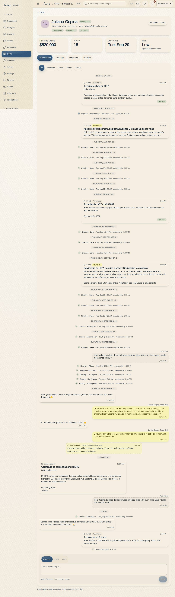
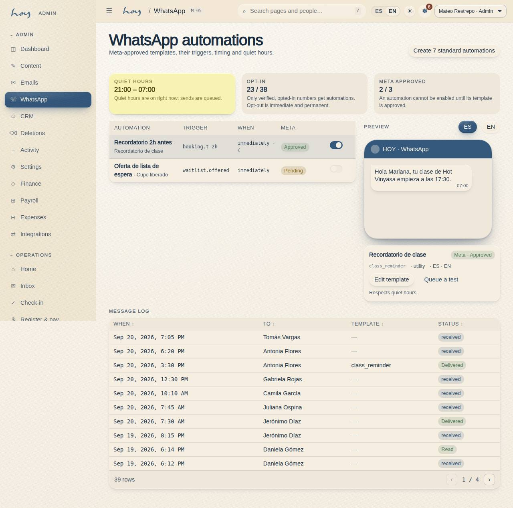
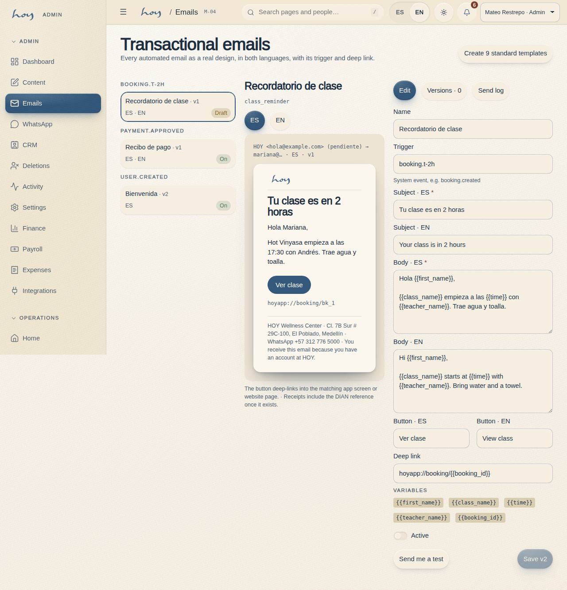
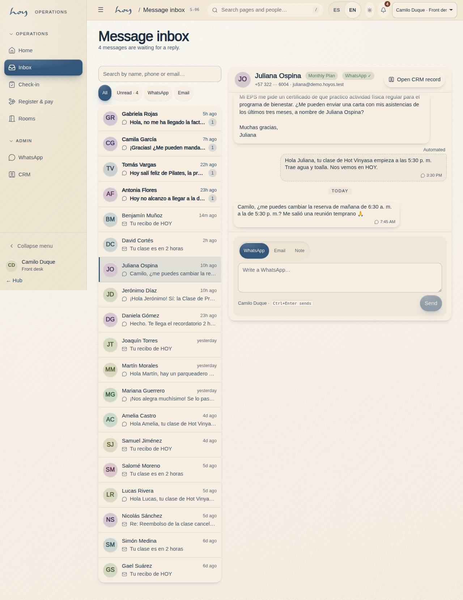
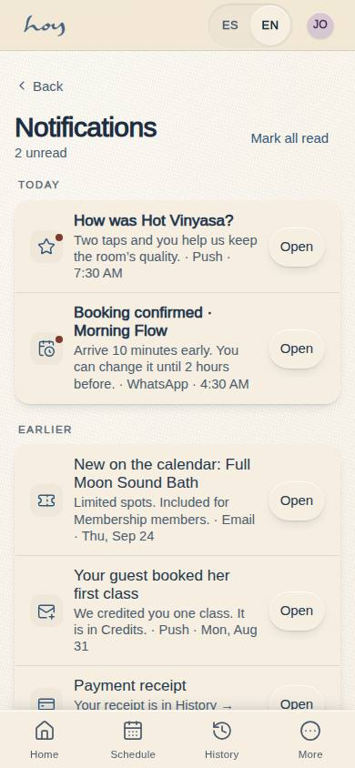

# CRM, WhatsApp and email

WhatsApp is our main channel. Everything the studio sends or receives —automatic or by hand, WhatsApp or email—
and every team note about a person lives in **one conversation** per person.

You see that conversation in two places: on the **member record** (the CRM) and in the front desk's **Inbox**. It
is the same information; what changes is why you are looking.

{{audience:13-crm-y-whatsapp}}

## 1. The member record and its conversation
1. At the top the record shows contact details, plan and emergency contact; then visits and risk indicators; and
   three tabs: **Conversation**, **Bookings** and **Payments**.
2. **Conversation** opens first. It reads like a WhatsApp chat, oldest message at the top, newest at the bottom:
   - on the left, what **the person wrote**;
   - on the right, what **the studio sent**: yellow if someone on the team wrote it (with their name); dotted grey
     if it was an automatic message (reminder, receipt);
   - **emails** are cards with a subject and a label: Newsletter, Automatic or Manual;
   - **internal notes** are dotted yellow cards with a pencil. The person never receives them;
   - **actions** (booking, arrival, payment, data consent) show as a grey line in the middle.
3. At the top you can filter: **All · WhatsApp · Email · Notes · System**.
4. A message nobody on the team has read has a **blue ring**. Opening the conversation marks it read for the whole
   team.
5. Members are grouped as "Active", "At risk" and "New". Coordination reviews "At risk" on Wednesdays.

{{for:finance}}
You can read the conversation and the payments, but not write, and you don't see health notes.
{{/for}}

> IN HOYOS: M-06 CRM → member → Conversation tab.

## 2. The channel rules
| Rule | What it means |
|---|---|
| One number | We write from the studio's WhatsApp, never from a personal phone |
| Consent | Only people who gave consent when they registered get automated messages |
| Opt-out | "Stop" or "no more messages" is respected at once and for good; leave a note |
| Quiet hours | Nothing non-urgent goes out; whatever you write waits in a queue until morning |
| Always sent | A class cancelled by the studio, and a freed waitlist spot |
| Reply time | During desk hours, as soon as possible (see below); outside them, first thing |
| Email | Confirmations, receipts, cancellations and newsletters. It backs up WhatsApp, it doesn't replace it |

The longest we take to reply during desk hours:

{{studio:whatsapp_response_minutes}}

These are the quiet hours in force, and what they mean in practice:

{{policy:quiet_hours}}

{{studio:quiet_hours_note}}

> DECISION NEEDED: the official WhatsApp service hours and the legal text with which a person agrees to receive messages.

## 3. Automated messages
| Message | When it goes out |
|---|---|
| Booking confirmed | on booking |
| Class reminder | 2 hours before, respecting quiet hours |
| Class cancelled | straight away, always |
| Waitlist spot freed | straight away, always, with time to take it |
| Receipt | on payment |
| Charge notice or membership ending | the days ahead the policy sets, at 8:00 |
| Ask for feedback | the same day as the class |
| Happy birthday | on the day, at 8:00 |
| Guest invitation | when a member invites someone |
| Failed payment | when the payment is declined |

Every template needs Meta's approval in each language. Every automated message also shows up in the person's
conversation, so you know what they received before you reply.

> IN HOYOS: M-05 WhatsApp → message → preview → Meta status → Log. M-04 Emails → template → Send test.

## 4. How to write
{{editable:coordinator}}

The reply box sits under the conversation, on the record and in the Inbox. It has three tabs:

| Tab | What for |
|---|---|
| **WhatsApp** | The normal reply. It goes from the studio's number with your name |
| **Email** | Things the person needs to keep: certificates, invoices |
| **Note** | What the team should know: preferences, injuries, agreements, a call summary. The person never sees it |

1. First line: the name and the fact. Second line: the action. One 🌿 at most.
2. Examples:
   - "Hi, Camila. The 7:00 is full; I've put you on the waitlist and I'll let you know if a spot opens up 🌿"
   - "Hi, Andrés. We got your transfer, your 3-Class Pack is active. See you soon."
   - "Hi, Mariana. Your membership renews on 3 October. If you'd like to pause it, just tell me and we'll do it."
3. If you write a WhatsApp at night, the box tells you it is queued and goes out when quiet hours end. Email always
   goes out.
4. If the number isn't verified, the WhatsApp tab locks and tells you why. Confirm the number with the person, or
   email them.
5. Never send photos of payment proofs, health details or anyone else's information (see
   [Personal data](23-habeas-data.md)).
6. If you spoke to the person by phone or face to face, sum up what matters in a **Note**.
7. Shortcut: `Ctrl+Enter` sends.

## 5. The front desk Inbox
The front desk works in the **Inbox**: it is the first thing on the menu after Home.

1. **Who wrote.** On the left there is one row per person: name, last message, how long ago and the channel. Rows
   with unread messages come first, with a blue counter. You can search by name, phone or email and filter: All ·
   Unread · WhatsApp · Email.
2. **The bell.** At the top of any team screen, the bell says how many messages nobody has read. Tap it to see the
   five most recent conversations waiting. If it says "All read", there is nothing to answer.
3. **From Home.** The "Recent messages" card shows the last five conversations and a button to open the Inbox.
4. **Replying.** Tap the person: on the right you see their details, the whole conversation and the reply box. The
   list stays on the left so you can move on to the next one.
5. **Read.** Opening a conversation marks it read for the whole team. Who opened it is saved.
6. **See the record.** The button at the top opens the full record (bookings, payments, risk) when you need more
   than the conversation.
7. A message from someone on the team (for example, a teacher asking for a substitute) doesn't reach the Inbox:
   coordination sees it.

> IN HOYOS: S-06 Inbox → person → reply. "View CRM record" opens M-06; "Open in inbox" comes back.

## 6. What really works today
1. Everything you write, the notes and "read" are really saved and show up instantly on the record, in the Inbox,
   on the bell and on Home.
2. What does **not** happen yet is real delivery: the WhatsApp doesn't leave the studio's number and the email isn't
   sent. The messages that "arrive" are demo messages.
3. When WhatsApp is connected, real messages will land in the same conversation. Nothing you learned here changes
   (see [Integrations](26-integraciones.md)).

This is how the system keeps each message:

{{table:message_log}}

## 7. Tone
1. Human, close, direct, present. Always informal. Do and don't examples: [Voice and tone](20-voz-y-tono.md).
2. To a complaint you answer first with what we can do. The rule comes after, without blame.

## 8. What the member decides
Members choose what reaches them and by which channel, in their app (Notifications and Profile). If they turned a
channel off, don't message them on another one to get around it.

This is how the system keeps those preferences:

{{table:notification_prefs}}
