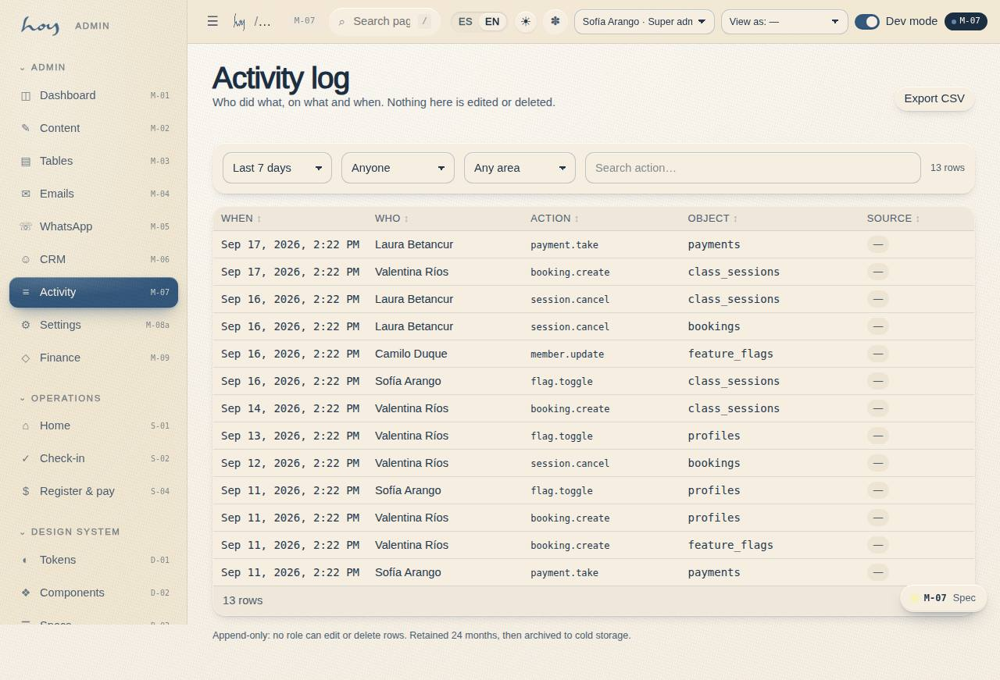
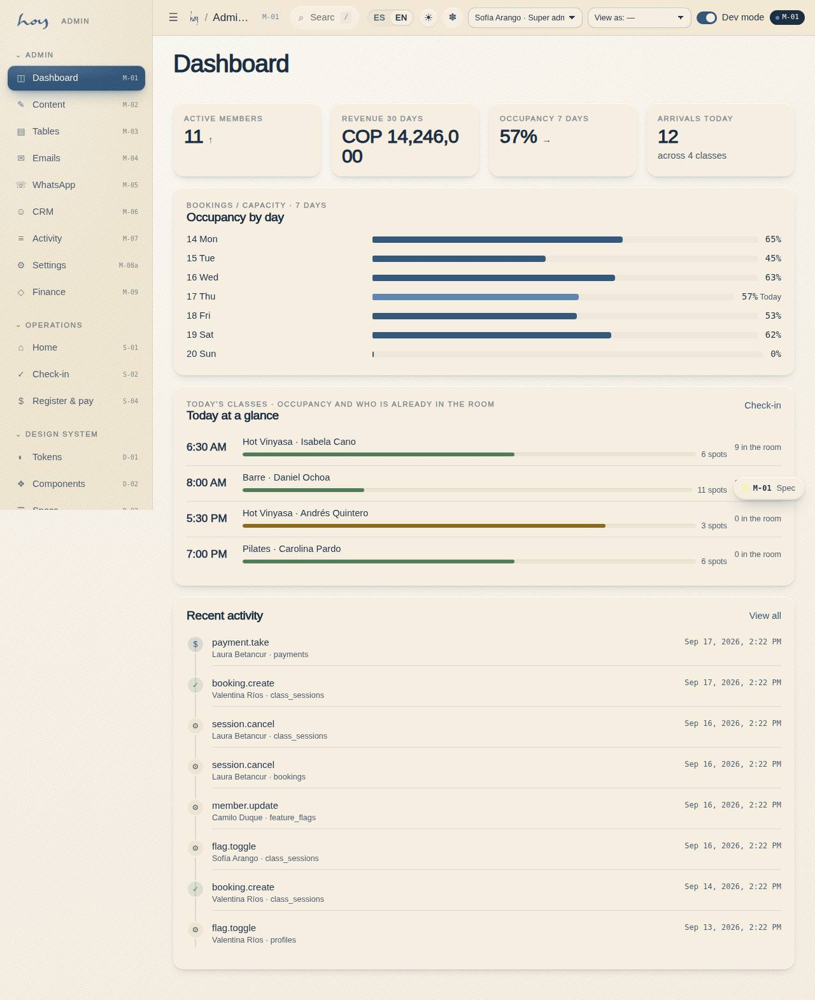

# Payments and the till

Money comes in through four routes and goes out through two. This chapter is the whole circuit, from
the desk to the bank.

## 1. The payment methods
| Method | Settles when | Who confirms |
|---|---|---|
| Cash | immediately | front desk, on receipt |
| Card terminal | when the gateway confirms | finance, against the Wompi panel |
| Wompi link | when the gateway confirms | automatic; finance reviews |
| Transfer / Nequi | when finance sees the deposit | finance, in M-06 → Payments |
| Gift voucher | immediately (deducts balance) | the system |

A pending order **is not a sale**. Until it settles it does not count in the month's revenue.

{{table:payments}}

## 2. Cash close (front desk, every day)
1. After the last class, count the cash; compare with today's "Settled cash payment" entries in
   **M-07** filtered by your name.
2. List pending transfers with their proof and send them to finance.
3. Lock the cash in the safe, sign the sheet, switch off equipment and close with the `07` checklist.

**Steps in HoyOS:** M-07 All activity log → filter today + source front desk → Export CSV.

## 3. Daily reconciliation (finance)
1. Finance receives the closing sheet and the pending transfers from front desk.
2. Cross three sources: counted cash, **M-07** filtered by "Settled cash payment", and the Wompi panel
   for links and the terminal.
3. Confirm transfers with proof in **M-06 → Payments** (the order moves from pending to settled).
4. Difference over $10,000: note on the exported M-07 and tell the owner the same day.

**Steps in HoyOS:** M-07 → date filter + action "payment" → Export CSV. M-06 → member → Payments → confirm.

## 4. Wompi
1. Payouts arrive per the Wompi contract cycle; book them against sales by transaction date, not payout date.
2. Fees and withholdings are recorded as a separate expense.
3. The destination account and the environment (sandbox / production) live in **M-08c Payments**. Keys
   are never stored there: the screen says so.

> DECISION NEEDED: the payout cycle contracted with Wompi and the destination bank account.

## 5. Refunds
| Case | What happens | Approves |
|---|---|---|
| Class cancelled by the studio | Credit returns automatically (E-03) | nobody, it is automatic |
| Duplicate charge or error | Refund to the same method from Wompi; recorded in M-06 Payments | Finance |
| Courtesy after a complaint | Credit, not money | Coordination |
| Annual membership, leaving | Prorate per terms (A-06) | Owner |

Every refund lands in M-07 with the actor and before/after values.

## 6. Dashboard and KPIs
**M-01 Admin dashboard** opens with the KPIs and the occupancy chart. What we look at every week:

| KPI | How to read it | Alert |
|---|---|---|
| Occupancy | attendees / (mats × classes taught) | under 60 % sustained |
| Revenue this month | settled sales, COP | vs the same month last year |
| Active and at-risk members | M-06 segments | "At risk" grows 2 weeks in a row |
| No-show and late cancellation | per class and slot | over 10 % |

{{kpi:occupancy}}

{{kpi:noshow}}

The feature switches (M-08b) store every change with the actor, the previous value and the time. Legal
and emergency pages cannot be switched off.

## 7. Reports
1. Weekly (Monday): occupancy by class and slot, sales by product, no-shows.
2. Monthly (5th): revenue, payroll, expenses and the month's balance (M-09), reconciled Wompi payouts,
   the "At risk" segment, membership cancellation reasons.

**Steps in HoyOS:** M-01 KPIs → M-07 export CSV → M-06 segments → M-09 Finance.

## 8. Expenses and the balance
Money goes out through two routes: teacher payroll (chapter `16`) and the studio's expenses. Expenses
live in **M-09c Expenses** (`/admin/finance/expenses`) and subtract in the **Period balance** card of
**M-09 Finance**. **Finance** records them; admin can too. Front desk and coordination do not see
them: they are studio-internal.

**Fixed and variable.** A **fixed** expense is recurring and known — rent, utilities, internet,
cleaning, software, the insurance policy — and is born from a **template** with its cadence
(**monthly** or **biweekly**, the Colombian quincena: due on the anchor day and fifteen days later)
and its due day. A **variable** expense is recorded by hand when it happens: new mats, a repair, the
month's ads, the accountant's fee.

1. **Templates.** When the studio opens, finance creates one template per fixed cost (concept,
   category, amount per due date, cadence, day, vendor). A cost that stops existing is
   **deactivated**, not deleted: history keeps its origin.
2. **Generate the period.** On the first working day of each month (or each fortnight), pick the
   period in M-09c and press **Generate the period's fixed expenses**. It creates one row per
   template and due date, in the *to pay* state. Safe to repeat: a due date that already has its row
   is skipped, never duplicated, and a paid expense is never touched.
3. **Mark paid.** When the money leaves the bank or the till, mark the row paid: the date and the
   actor land in the activity log (M-07, action `expense.pay`).
4. **Record a variable one.** Concept, category, amount, date, whether it is already paid, method
   (cash, transfer or card), vendor and note. A cash expense goes into the cash close of section 2.
5. **Correct.** Only an unpaid expense can be deleted. A paid expense recorded in error is corrected
   with a new row and a note, never by editing history.

**How to read the Balance.** In M-09, with the same period filter (7, 15, 30, 90 days or All), the
card shows four numbers: **Revenue** (approved payments in the range) − **Payroll** (every run whose
monthly period overlaps the range, at its current total: a draft counts because the classes were
taught) − **Expenses** (fixed and variable rows dated in the range, paid or not) = **Balance**, with
the margin on revenue. A negative balance over 7 or 15 days is normal when rent falls inside the
window; the number that matters is the 30-day one and the closed month's. The card's links open
payroll (M-09a) and expenses (M-09c).

{{table:expenses}}

{{stats}}
