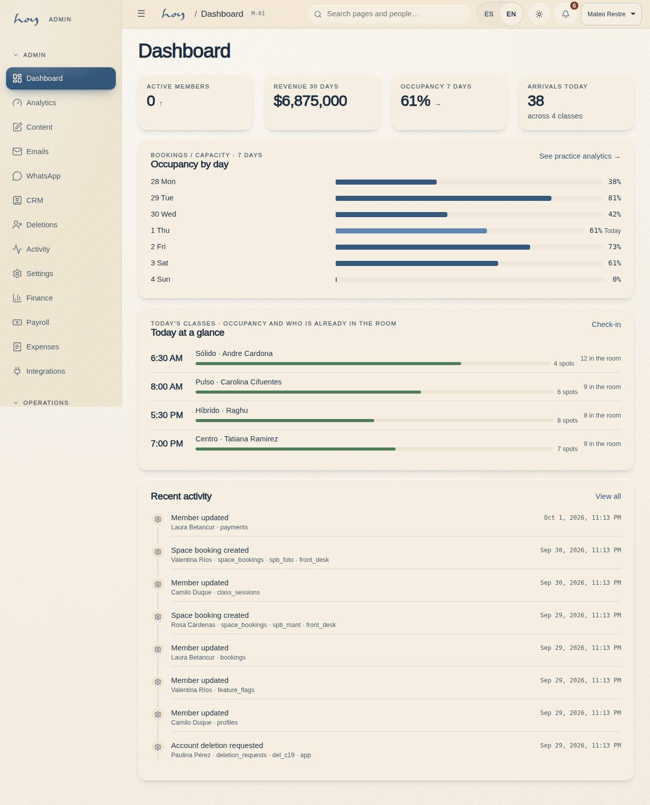
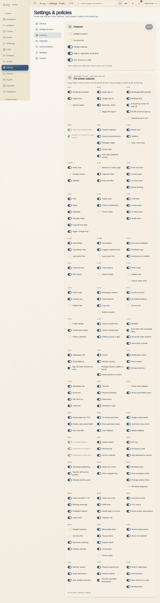
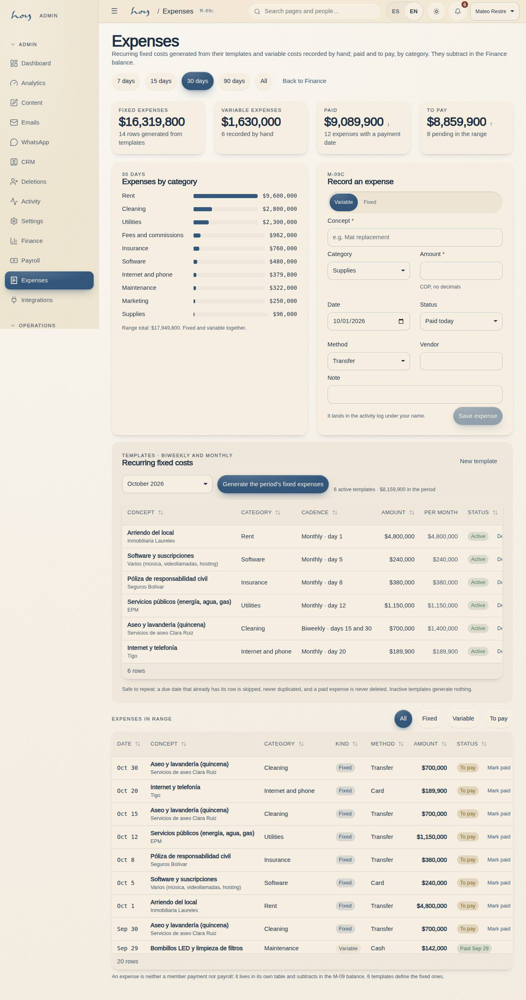

# Payments and the till

Money comes in by several routes and goes out by two. This chapter follows the whole circuit, from the desk to the
bank.

{{audience:14-pagos-y-caja}}

## 1. Payment methods
| Method | When it counts as paid | Who confirms it |
|---|---|---|
| Cash | straight away | the front desk, on receiving it |
| Card terminal | when Wompi confirms it | finance, in the Wompi dashboard |
| Wompi link | when Wompi confirms it | automatic; finance checks it |
| Transfer or Nequi | when finance sees the money in the account | finance, in the member's payments |
| Gift voucher | straight away (takes off the balance) | the system |

A pending sale **is not a sale**. Until it is paid, it doesn't count in the month's revenue.

This is how the system keeps each payment:

{{table:payments}}

## 2. Closing the till (front desk, every day)
{{editable:coordinator}}

1. After the last class, count the cash.
2. Compare it with the day's cash payments you recorded.
3. List the pending transfers, with their proof, and send it to finance.
4. Put the cash in the safe, sign the sheet, switch the equipment off and close with the checklist in
   [Room, heat and maintenance](07-sala-calor-y-mantenimiento.md).

> IN HOYOS: M-07 Activity → today + your name → "Recorded cash payment" → Export CSV.

## 3. Daily reconciliation (finance)
1. You receive the closing sheet and the pending transfers from the front desk.
2. You cross-check three things: the counted cash, the cash payments in the activity log and the Wompi dashboard
   (links and card terminal).
3. You confirm each transfer against its proof. The sale moves from pending to paid.
4. If the difference is over the limit below, note it and tell the owner the same day.

The till difference that goes to the owner:

{{studio:cash_difference_threshold}}

> IN HOYOS: M-07 → date + "payment" action → Export CSV. M-06 → member → Payments → Confirm.

## 4. Wompi
1. Wompi deposits the money on the cycle in the contract. Match it to sales by sale date, not deposit date.
2. Fees and withholdings are recorded as a separate expense.
3. The destination account and the environment (test or live) are in Settings → Payments. Secret keys are never
   stored there; the screen reminds you.

> DECISION NEEDED: how often Wompi deposits under the contract, and into which bank account.

## 5. Refunds
| Case | What we do | Who approves |
|---|---|---|
| The studio cancelled the class | The credit comes back on its own | nobody, it's automatic |
| Double charge or error | Refund to the same method from Wompi, noted in the member's payments | finance |
| Courtesy after a complaint | Credit, not money | coordination |
| Leaving an annual membership | Pro-rated as the terms say | owner |

Every refund is recorded with who did it and the before and after values.

## 6. The dashboard and the indicators
The **Dashboard** opens with the indicators and the occupancy chart. This is what we look at every week:

| Indicator | How to read it | When to worry |
|---|---|---|
| Occupancy | people who came / (mats × classes held) | under 60 % for several weeks |
| Revenue this month | paid sales | compared with the same month before |
| Active and at-risk members | the CRM's groups | "At risk" grows two weeks in a row |
| No-shows and late cancellations | by class and time slot | over 10 % |

Occupancy and no-shows right now:

{{kpi:occupancy}}

{{kpi:noshow}}

System features are switched on and off in Settings → Features, and every change is kept with who made it and when.
The legal pages and the emergency flow cannot be switched off.

## 7. Reports
{{editable:owner}}

1. **Every Monday:** occupancy by class and time slot, sales by product, no-shows.
2. **Every month (on the 5th):** revenue, payroll, expenses and the month's balance; Wompi deposits reconciled;
   "At risk" members; the reasons people cancelled their membership.

> IN HOYOS: M-01 Dashboard → M-07 Export CSV → M-06 groups → M-09 Finance.

## 8. Expenses and the balance
Money goes out by two routes: teacher pay (see [Payroll](16-nomina-y-payouts.md)) and the studio's expenses.
**Finance** records expenses (admin can too). The front desk and coordination don't see them.

**Fixed and variable.** A **fixed** expense repeats and is known: rent, utilities, internet, cleaning, software,
insurance. It comes from a **template** with its frequency (monthly or fortnightly) and its due day. A **variable**
expense is noted by hand when it happens: new mats, a repair, the month's advertising, the accountant.

1. **Templates.** When the studio opens, create one template per fixed expense: concept, category, amount,
   frequency, day and supplier. If an expense stops existing, **deactivate** it; don't delete it.
2. **Generate the period.** On the first working day of each month (or fortnight), pick the period and press
   **Generate fixed expenses for the period**. It creates one row per expense, "to pay". You can press it again
   safely: nothing is duplicated and nothing already paid is touched.
3. **Mark paid.** When the money goes out, mark the row paid. The date and your name are kept.
4. **Note a variable one.** Concept, category, amount, date, whether it is paid, how (cash, transfer or card),
   supplier and note. A cash expense goes into the till closing.
5. **Correct.** Only an unpaid expense can be deleted. An expense paid by mistake is corrected with a new row and a
   note, never by editing what happened.

**Reading the balance.** In Finance you pick the period (7, 15, 30, 90 days or everything) and the card shows:
**Revenue − Payroll − Expenses = Balance**, with the margin. A negative balance over 7 or 15 days is normal if the
rent falls in those days. The numbers that matter are the 30-day one and the closed month.

This is how the system keeps expenses, and where the studio stands right now:

{{table:expenses}}

{{stats}}

> IN HOYOS: M-09c Expenses → Templates · Generate fixed expenses for the period · Mark paid. M-09 Finance → Period balance.
