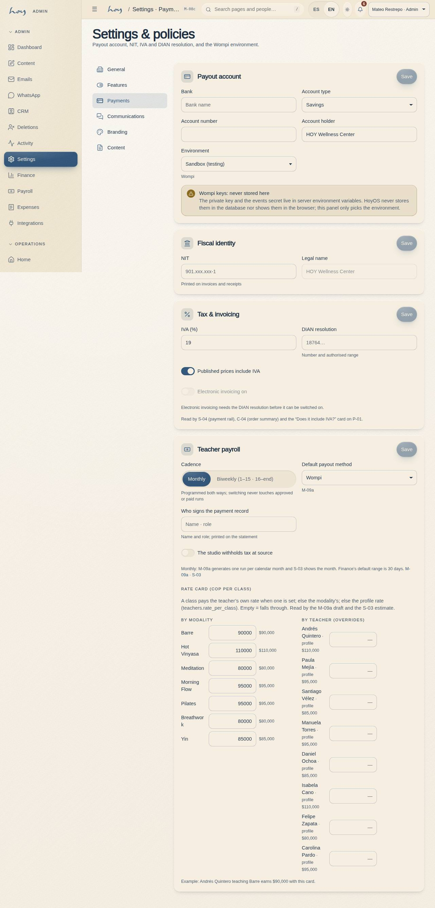
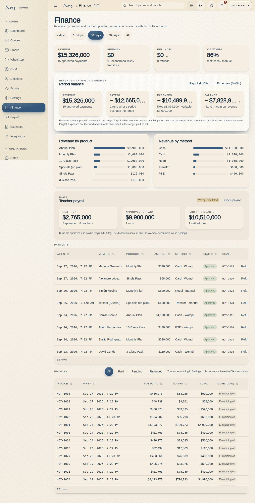

# Invoicing and DIAN

Electronic invoicing (with DIAN, Colombia's tax authority) is not switched on yet. This chapter says what is
missing, how VAT works and what to do today when someone asks for an invoice.

{{audience:15-facturacion-y-dian}}

## 1. Before switching on
Settings → Payments must hold the tax ID (NIT), the DIAN resolution and the numbering range. Without them, the
invoicing switch won't turn on.

> DECISION NEEDED: the electronic invoicing technology provider, and who the legal issuer of the invoices is.

> IN HOYOS: M-08c Settings → Payments → Tax and invoicing.

## 2. VAT
The VAT percentage and whether published prices already include it are values in Settings. When you take payment,
the summary splits VAT out of the total with these values:

{{policy:iva_pct}}

{{policy:prices_include_iva}}

Whether VAT is included or added on top is still to be decided: see [Sales and plans](10-ventas-y-planes.md).

## 3. Every receipt
1. Every receipt will carry its electronic invoice reference.
2. If the person wants the invoice in a company's name, ask for the **NIT and legal name before completing the
   sale**. It can't be changed afterwards: it has to be voided and issued again, and that takes time.

**What to say:** "Is the invoice in your name or a company's? If it's a company, I'll need the NIT and the legal
name."

Receipt times are shown in the studio's time zone:

{{tenant:hours}}

## 4. Rental invoices
A space rental almost always needs a company invoice (see [Space](12-espacio-b2b.md)). Ask for the tax details
along with the quote, not on the day of the event.

## 5. How invoices are kept
{{table:invoices}}

## 6. What is missing today
1. Invoices are saved in the right shape, but **they are not issued to DIAN yet**: the provider and the legal
   issuer are missing.
2. In Finance, an invoice without a DIAN reference shows exactly that: no reference.
3. The email receipt is designed and can be previewed, but it isn't sent yet (see
   [Integrations](26-integraciones.md)).

