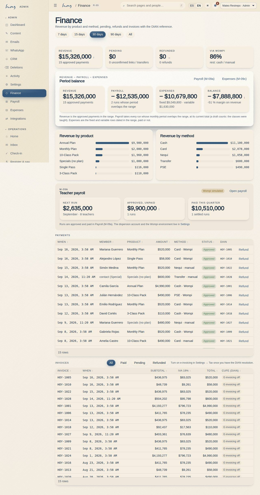

# Teacher payroll and payouts

A teacher is paid for what they taught, and what they taught is whatever attendance they closed
themselves. That is the whole chain: no closed attendance, no payroll line.

## 1. The chain
```
Attendance closed in S-03 (teacher)
   → payroll run generated as a draft (finance, 15th cut-off)
      → checked against the M-02 schedule (coordination)
         → approved (owner)
            → paid (Wompi / transfer / cash)
               → statement per teacher (visible in S-03)
```

## 2. Generating the run
1. Cut-off on the **15th of each month**. Source: attendance closed in S-03 (classes taught,
   substitutions, adjustments).
2. Finance generates the run in **M-09 Finance → Payouts**: it lands as a **draft**, one line per
   teacher with the classes × rate detail.
3. Nothing is paid from a draft. A draft can be regenerated as many times as needed.



## 3. Checking it
1. Coordination cross-checks the detail against **M-02 Schedule**: every paid class existed and was
   taught by whoever it says.
2. Differences a teacher reports (`06`) are resolved before approval, with the class and the date.
3. Substitutions are paid to whoever taught, not to whoever was scheduled.

## 4. Approving and paying
1. **The owner approves.** Approval freezes the run: from then on lines are not edited, they are
   adjusted in the next run.
2. Payment goes out by whichever method the studio has settled on: a Wompi payout, a bank transfer or
   cash against a receipt.
3. Each payment is marked on the run; the run is **paid** when no line is left.
4. All of it — generate, approve, mark paid — lands in **M-07** with the actor and the time.

> DECISION NEEDED: the payment method for teacher payroll (Wompi payout, transfer or cash), whether the studio withholds tax, and who signs off the payment record.

## 5. The teacher's statement
1. The teacher sees their run in **S-03 → Payroll history**: classes taught, rate, substitutions,
   adjustments and total. It is read-only.
2. The statement is the document that settles an argument: if it isn't there, it wasn't paid.

[screenshot: S-03 — the teacher payroll statement with classes, rate and adjustments]

## 6. The rates
The per-class rate lives on the teacher's profile, not on a separate sheet:

{{table:teachers}}

> DECISION NEEDED: pay date, per-class rates and contract type.

## 7. What is simulated today
1. The run computes classes × rate and stops there: **no money moves**. The Wompi payout is not
   connected (`26`).
2. `/teach/payroll` is read-only and its total is the calculation, not a confirmed payment.
3. When Wompi payroll exists, the approved run is what will trigger the payment; the flow in this
   chapter does not change, it just stops being manual.
