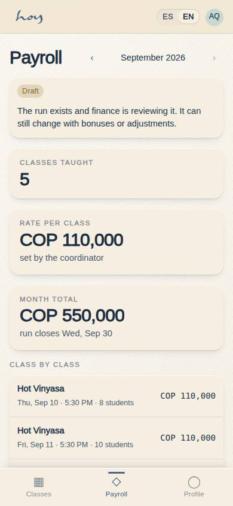

# Teacher payroll and payouts

A teacher is paid for what they taught, and what they taught is whatever attendance they closed
themselves. That is the whole chain: no closed attendance, no payroll line.

## 1. The chain
```
Attendance closed in S-03 (teacher)
   → draft run — M-09a /admin/finance/payouts (finance)
      → per-teacher detail reviewed — M-09b /admin/finance/payouts/:id (coordination)
         → approved — M-09b (owner)
            → paid per teacher (Wompi / transfer / cash) — M-09b
               → the teacher's statement — S-03 /teach/payroll
```

One arithmetic holds the whole chain together: `src/data/payrollCalc.ts`. The run finance generates
and the estimate the teacher sees come out of the same function, so the two screens cannot
contradict each other.

## 2. Generating the run
1. Finance opens **M-09a · Finance → Payouts** (`/admin/finance/payouts`): the list of runs, with the
   period, the number of teachers, the total and the status of each one.
2. The button generates the period's **draft**: one line per teacher with classes taught × rate, read
   from the completed sessions and from `teachers.rate_per_class`.
3. Generating is **idempotent**: if a draft already exists for that period its lines are deleted and
   recomputed, so pressing the button twice cannot pay twice. A run that is already approved or paid
   is refused, with the reason on screen.
4. The draft also carries the **manual lines**: every Especial (`12` §7) with a teacher and a payout
   whose service date falls in the period enters as a line **"Especial: <concept>"** with the amount the
   desk agreed. It comes out of the same function as the classes (`draftLinesFor`), so recomputing never
   duplicates it and a cancelled booking drops it.
5. Nothing is paid from a draft.

In **M-09 Finance** the **15-day** range sits next to 7 / 30 / 90 and all time: Colombian studios
settle biweekly, and that range drives both the KPI tiles and the invoice table.


## 3. Checking it
1. Opening a run lands on **M-09b** (`/admin/finance/payouts/:id`): the per-teacher statement, with
   the classes they taught, the rate, the adjustments and the total. It exports to **CSV** and prints.
2. Coordination cross-checks the detail against **M-02 Schedule**: every paid class existed and was
   taught by whoever it says.
3. Differences a teacher reports (`06`) are resolved before approval, with the class and the date.
4. Substitutions are paid to whoever taught, not to whoever was scheduled.
5. **Especial** lines are cross-checked against the S-05 booking and the charge in `special_charges`: the
   amount is what was typed at the sale; if it is wrong, fix the Especial and recompute the draft — the
   line itself is never edited.


## 4. Approving and paying
1. **The owner approves** in M-09b. Approval freezes the run: from then on lines are not edited, they
   are adjusted in the next run.
2. Once approved, the run is paid by whichever method the studio has settled on: **send via Wompi**
   (simulated today, with its rejected path), **mark paid by transfer** or **by cash**.
3. Payment can also be marked **teacher by teacher**, which is how it actually goes when one is paid
   by transfer and another comes by the desk. The run **closes itself as paid** the moment the last
   teacher is settled: nobody has to remember to close it.
4. All of it — generate, approve, send, mark paid — lands in **M-07** with the actor and the time.

> DECISION NEEDED: the payment method for teacher payroll (Wompi payout, transfer or cash), whether the studio withholds tax, and who signs off the payment record.

## 5. The teacher's statement
1. The teacher opens **S-03 · Payroll** (`/teach/payroll`). Before finance generates the run the page
   computes the period live (completed sessions × their rate) and labels it an **estimate**.
2. As soon as a run covers the period the page stops estimating and reads the `payroll_lines`: the
   teacher sees exactly what finance will pay, bonuses, adjustments and Especiales included, along with
   the run's status (draft · approved · paid).
3. It also shows the class-by-class breakdown, the history of earlier runs, the payout method on
   file, a print view and a WhatsApp link to finance with the period and the total already written.
4. The statement is the document that settles an argument: if it isn't there, it wasn't paid.



## 6. The rates
The per-class rate lives on the teacher's profile, not on a separate sheet:

{{table:teachers}}

> DECISION NEEDED: the payroll cadence (monthly with a cut-off on the 15th, or biweekly as M-09's 15-day range suggests), the pay date, the per-class rates (the seed uses 80,000–110,000 COP) and the contract type.

## 7. What is simulated today
1. Runs, lines, approvals and payment marks are **real rows** in `payroll_runs` and `payroll_lines`,
   each with its M-07 entry. What is not real is the money: `wompiPayout()` is the dispersion seam and
   both screens carry a **"Wompi simulated"** badge (`26`).
2. A payout is **not a `payments` row**. `payments` is money in from members and feeds M-09's revenue;
   money out lives on the run and its lines. That is why paying payroll does not move the revenue
   figures.
3. `/teach/payroll` is read-only: the teacher sees what finance will pay, not a button to collect it.
4. When Wompi payroll exists, the approved run is what will trigger the payment; the flow in this
   chapter does not change, it just stops being manual.
