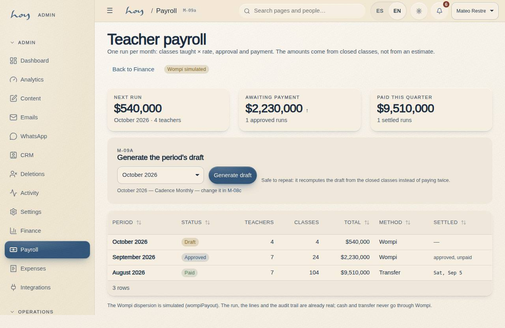
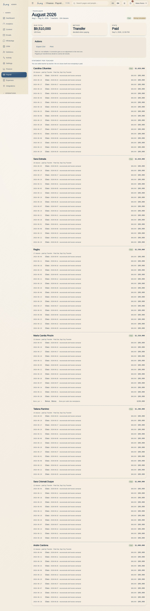
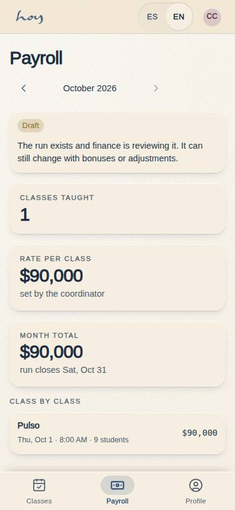

# Teacher payroll and payouts

Teachers are paid for the classes they taught, and the classes they taught are the attendance they closed
themselves. No closed attendance, no pay.

{{audience:16-nomina-y-payouts}}

## 1. The path of a payment
1. **The teacher** closes attendance for each class in their app.
2. **Finance** generates the period's draft.
3. **Coordination** reviews each teacher's detail.
4. **The owner** approves.
5. **Finance** pays each teacher (Wompi, transfer or cash).
6. **The teacher** sees the statement in the app.

Finance's draft and the estimate the teacher sees come from the same calculation, so they can never show different
numbers.

> IN HOYOS: S-03 (attendance) → M-09a Payouts (draft) → M-09b detail (review and approval) → S-03 Payroll (statement).

## 2. Generating the draft
1. In Finance → Payouts you see the list of pay runs by period: how many teachers, the total and the state.
2. The button generates the period's **draft**: one line per teacher, classes taught × rate.
3. You can generate it again safely: the draft is recalculated, nothing is ever paid twice. A run that is already
   approved or paid can't be regenerated; the screen says why.
4. The draft also brings in the **Specials**: each one with a teacher and an amount, inside the period, becomes a
   line "Special: <concept>" (see [Space](12-espacio-b2b.md)).
5. Nothing is paid in draft.

**Monthly or fortnightly.** The owner chooses in Settings → Payments whether teachers are paid every month or every
fortnight (1st–15th and 16th–end of month). Both work. With fortnightly, the same button generates two drafts, and
no class is paid twice. This is the frequency in force:

{{policy:payroll_cadence}}

## 3. Reviewing
1. Opening a run shows each teacher's statement: classes, rate, adjustments and total. You can export or print it.
2. Coordination checks it against the schedule: every paid class happened and was taught by the person it says.
3. Anything a teacher disputes is settled before approval, with the class and the date.
4. A substitution is paid to whoever taught the class, not to whoever was on the schedule.
5. A Special line is checked against its booking and its charge. If it is wrong, fix the Special and regenerate the
   draft; the line is never edited by hand.

## 4. Approving and paying
1. **The owner approves.** From then on the run is frozen: if something changes, it is adjusted in the next period.
2. It is paid by the method the studio sets: **Wompi** (simulated today), **transfer** or **cash**.
3. It can be marked paid **teacher by teacher**. When the last one is paid, the run closes itself.
4. Generating, approving, sending and marking paid are all in the activity log, with name and time.

> DECISION NEEDED: which method teachers are paid by (Wompi, transfer or cash), whether the studio withholds tax, and who signs the payment record.

## 5. The teacher's statement
{{for:teacher}}
This is what you see in your app, under Payroll.
{{/for}}

1. Before finance generates the draft, the app works out the period live (classes taught × rate) and marks it as an
   **estimate**.
2. Once the draft exists, the app shows exactly what finance will pay, with bonuses, adjustments and Specials, and
   its state: draft, approved or paid.
3. It also shows class by class, earlier runs, the payment method, a print view and a WhatsApp button to finance
   with the period and the total already written.
4. The statement settles any doubt: if it isn't there, it wasn't paid.

## 6. Rates
Rates live in Settings → Payments, on the **rate card**: one per discipline (what a hot yoga, pilates or barre class
pays) and, if needed, one per teacher that overrides the discipline rate.

1. If the teacher has their own rate, that one is used.
2. If not, the discipline's.
3. If there is neither, the one on their profile.

Changing a rate moves the teacher's estimate and the next draft. Anything already approved or paid doesn't change.
The same card sets the default payment method, who signs the record and whether the studio withholds tax.

This is the default payment method:

{{policy:payout_method}}

This is how teachers and their fallback rate are kept:

{{table:teachers}}

> DECISION NEEDED: the real rates per discipline (today they are examples, between 80,000 and 110,000 COP per class) and the pay date, which are filled in Settings; and, for the owner, the teachers' contract type and whether attendance changes the rate.

## 7. What really works today
1. Drafts, approvals and paid marks are real and recorded. What isn't real yet is the money: the Wompi payout is
   simulated and the screens say so (see [Integrations](26-integraciones.md)).
2. Paying teachers doesn't change the month's revenue: it is money going out, not coming in.
3. Teachers only see their statement. They have no button to get paid.
4. When Wompi is connected, approval will trigger the payment. The rest of this chapter stays the same.
