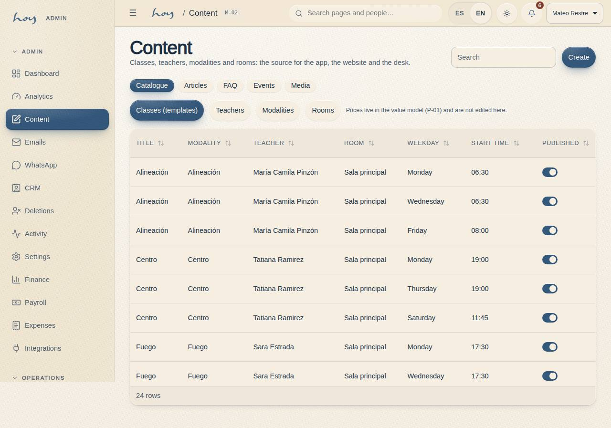
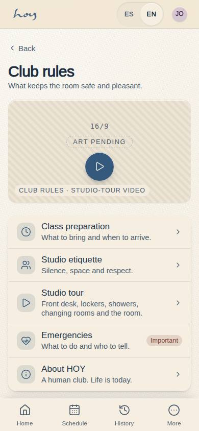
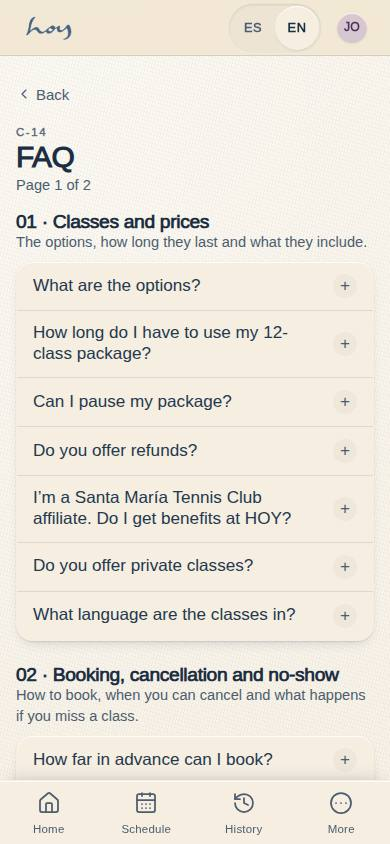

# Content in the CMS

Nothing is written twice. If a customer sees a text, it lives in **Content** and goes from there to the website, the
app and the desk.

{{audience:17-cms-y-contenido}}

## 1. What is edited in Content
| Text | Where it shows |
|---|---|
| The classes and their descriptions | the app's schedule, class detail, website |
| Teacher profiles (bio, photo, specialities) | member app, website, teacher app |
| Disciplines | website, schedule |
| Rooms and capacity | Content, Check-in |
| Club rules | member app |
| Frequently asked questions | member app |
| The "About HOY" texts | website and chapter [01](01-quienes-somos-y-filosofia.md) of this manual |

Prices are **not** in Content: they are in the [value model](03-modelo-de-valor.md).

> IN HOYOS: M-02 Content → tab (Classes, Teachers, Modalities, Rooms) → edit → Publish.

## 2. From draft to published
1. Every text goes in Spanish and English. **Spanish is required**; if the English is missing, the Spanish shows.
2. Every text goes through three states: draft → review → published. Whatever a teacher sends from their app goes to
   review.
3. Coordination approves or sends it back with a comment, within the time below. A late review is an old text on
   the website.
4. Until the real photo arrives, it is marked as provisional (see [Media](19-medios-y-artwork.md)).

How soon a teacher's submission is reviewed:

{{studio:content_review_turnaround}}

## 3. Club rules and the FAQ
{{editable:owner}}

1. The club rules are what a person accepts when they walk in: punctuality, mats, heat, hygiene, cancellation.
   Changing them changes the experience, so the owner approves them.
2. FAQs are written in people's own words, not the way a lawyer would put them.
3. If the front desk answers the same thing three times on WhatsApp, that is a new FAQ.

This is how articles and FAQs are kept:

{{table:content_articles}}

{{table:faq_entries}}

## 4. Price changes
1. Finance proposes them and the owner approves them.
2. They never change a package already bought: its classes and its expiry stay as they were.
3. The desk and the website change at the same moment, because they read the same price.

## 5. What is missing today
1. Content edits classes, teachers, disciplines and rooms. Articles and FAQs are edited in Tables for now, in a
   generic way: their own editor is still missing.
2. There is no photo library yet: a photo goes in as a link (see [Media](19-medios-y-artwork.md)).
3. Publishing can't be scheduled: it happens immediately.

> IN HOYOS: M-03 Tables → content_articles / faq_entries (until the editor arrives).
