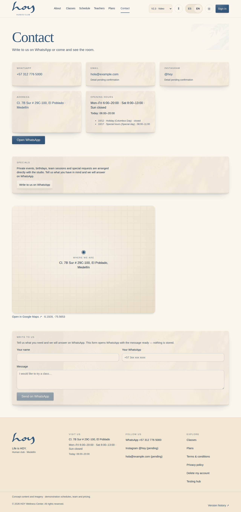

# Web and social

The website is the first thing anyone knows about HOY. It has one job: that the person understands what this is and
books a trial class.

{{audience:18-web-y-redes}}

## 1. The website's pages
{{routes:public}}

## 2. The website's official copy
The About HOY, philosophy and classes copy comes from this document. If the website has to change, it changes here
first and on the website after, never the other way round.

{{source:contenido-completo}}

1. Every section follows the same order: a small italic line ("Who we are"), the heading ("About HOY") and the
   paragraphs.
2. The call to action is always the same: a trial class, no complications, and then the plans.
3. The English is written from the Spanish, in the same tone.

## 3. Who changes what
| Change | Who makes it |
|---|---|
| A class's or a teacher's text | coordination, in Content ([17](17-cms-y-contenido.md)) |
| "About HOY" and the philosophy | the owner approves and coordination applies it |
| Prices | the owner approves ([03](03-modelo-de-valor.md)) |
| The visible schedule | coordination ([05](05-clases-y-horarios.md)) |
| Contact details, hours and address | admin, in Settings |
| The order of the home page sections | admin or design, in the layout editor |

These are the contact details the footer and the contact page show:

{{tenant:contact}}

> IN HOYOS: M-02 Content · M-08a Settings → General · D-04 Layout editor → W-01.

## 4. From the website to the app
1. Every path on the website ends in booking. "See schedule" and "See plans" ask the person to sign in and remember
   what they were doing, so they don't lose their step.
2. The website never takes payment. Payment happens in the app, with VAT worked out and the saved payment method.
3. A link shared on social media leads to a real page on the website, not to an image.

## 5. Social media
{{editable:owner}}

1. One tone, the one in [Voice and tone](20-voz-y-tono.md). What you wouldn't say at the door doesn't get posted.
2. No members' faces without written permission, no health details, no names (see
   [Personal data](23-habeas-data.md)).
3. Photos come from the approved images (see [Media](19-medios-y-artwork.md)), not from the phone of whoever is on
   shift.
4. Whatever a post promises —a price, a promotion, a time— must exist in the system before it goes out.
5. A public complaint gets a one-line public reply and is followed up in private. The case is summed up on the
   person's record.

The posting calendar:

{{studio:social_calendar_note}}

{{for:marketing}}
This section is your working base. The marketing kit (logos, templates and approved photos in one place) is coming
soon to the hub.
{{/for}}

> DECISION NEEDED: who posts on social media (now that there is a marketing role, which person holds it), on what calendar, and who approves a post that mentions prices or promotions.

## 6. The legal side of the website
The terms and the privacy policy are website pages with a version and a date. They are what a person accepts when
they create an account. See [Legal documents](22-documentos-legales.md).

