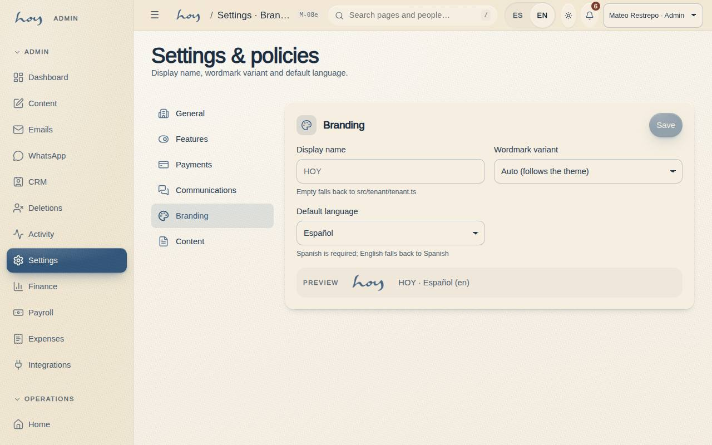
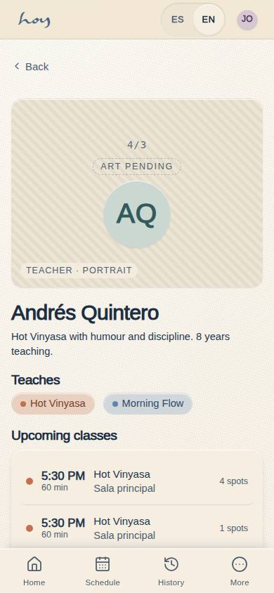
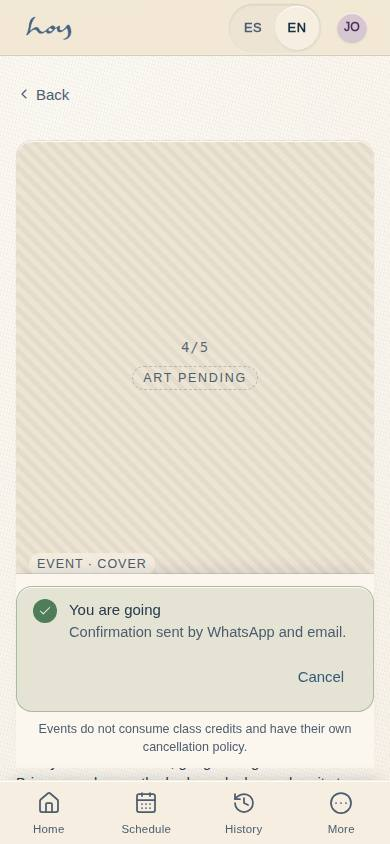

# Media library and artwork

Today the system has the slots for the photos, but not the photos. This chapter brings together the brand rules,
the formats each screen asks for and the list of what is still to be produced.

{{audience:19-medios-y-artwork}}

## 1. The brand manual
The logo, colour and type rules come from the 2026 brand manual. When in doubt, the document wins.

{{source:manual-de-marca}}

## 2. The logo
The main logo combines the handwritten word **"hoy"** with **HUMAN CLUB** in spaced capitals. The handwriting brings
personality, humanity and movement; HUMAN CLUB brings structure and clarity.

1. **Three approved versions:**
   - the round badge: HUMAN CLUB curving above and below "hoy", pale yellow on mid blue;
   - the stacked lockup: deep blue on pale yellow;
   - the single-colour version: sand on cream.
2. **Fixed proportions.** The total width is 6 units; "hoy" is 3 high and the HUMAN CLUB line is 1. It is never
   stretched or squashed.
3. **Clear space.** Around the logo, on all four sides, leave the height of the letter H in HUMAN CLUB free. No
   text, graphic or border goes there.
4. **Minimum size:** 30 mm in print and 120 px on screen.
5. It is never recoloured outside the palette and never placed on a busy photo.
6. In the app, the light theme uses the blue logo and the dark theme the cream one. The default version is chosen in
   Settings → Branding.

> DECISION NEEDED: the rules for using the logo are now in the brand manual; what remains is who approves a third party using it (shoots, pop-ups, partner brands) and whether material made in the studio must credit HOY.

> IN HOYOS: M-08e Settings → Branding → default logo version.

## 3. The colours
| Colour | Code | What it brings |
|---|---|---|
| Deep blue | #35597D | structure, depth and contrast |
| Mid blue | #5F85B1 | freshness and energy |
| Pale yellow | #F7F3B2 | light, freshness and vitality |
| Cream | #F1E7D2 | a soft, neutral base; a sense of space |

The light tones bring light and lightness; the blues bring depth and stability. The other tones you see in the app
(ink, sand, the colour of each movement) are extensions of the system, not brand colours.

## 4. The typefaces
1. **Titles and headings:** Inter (Regular, Medium, Semibold). The manual names Akzidenz-Grotesk as the main face;
   Inter is its free screen equivalent, and it is what the website and the app use.
2. **Body text:** DM Sans Regular.
3. **Emphasis:** DM Sans Italic, to lift a word or a phrase without breaking the harmony.

## 5. Library rules
{{editable:coordinator}}

1. A published image is **approved**: coordination reviewed it, the owner approved it if it is a brand image, and
   whoever appears in it signed their permission.
2. The file name describes what you see, in lower case, with no accents or spaces: `sala-caliente-manana-01.jpg`.
3. JPG for photos, PNG only for logos and graphics with transparency, SVG for icons.
4. Keep the original at full size. The system is not the photo shoot's archive.
5. No recognisable members' faces without written permission (see [Personal data](23-habeas-data.md)). People from
   behind, hands, room details: always safe.

## 6. The formats each screen asks for
| Slot | Ratio | Where it shows |
|---|---|---|
| Home page hero image | 16:9 | website home |
| Class photo | 16:9 | class detail |
| Teacher portrait | 4:3 | teachers in the app and on the website |
| Event photo | 4:5 | events |
| Studio tour video | 16:9 | club rules |
| Map or storefront | 16:9 | contact |
| Logo | PNG with transparency | the whole app |

## 7. What still has to be produced
{{editable:coordinator}}

| # | Piece | For | Status |
|---|---|---|---|
| 1 | Home image: the room in morning light | website home | to do |
| 2 | One photo per discipline (5) | classes in the app and on the website | to do |
| 3 | A portrait of every active teacher | teachers | to do |
| 4 | A short studio tour video | club rules | to do |
| 5 | Storefront and map | contact | to do |
| 6 | A detail of the heated room, no people | [02](02-nuestras-clases.md), social | to do |
| 7 | Pauses: someone for 20 minutes, in office clothes | [03](03-modelo-de-valor.md), [11](11-pausas-y-regalos.md) | to do |
| 8 | The empty space, for the rental catalogue | [12](12-espacio-b2b.md) | to do |
| 9 | The logo in its three versions, light and dark backgrounds | app, website | done |
| 10 | The gift voucher template | gift | to do |
| 11 | Short guidance photos and videos for this manual | the team | to do |

> DECISION NEEDED: who owns the rights to photos and video shot in the studio during a rental or a session paid for by a third party.

## 8. What is missing today
1. There is no photo library yet. A photo goes in as a link, and the app draws a slot with the right ratio until it
   arrives.
2. The tour video is a reserved slot.
3. So is the contact map: the map provider still has to be chosen and the address confirmed.
