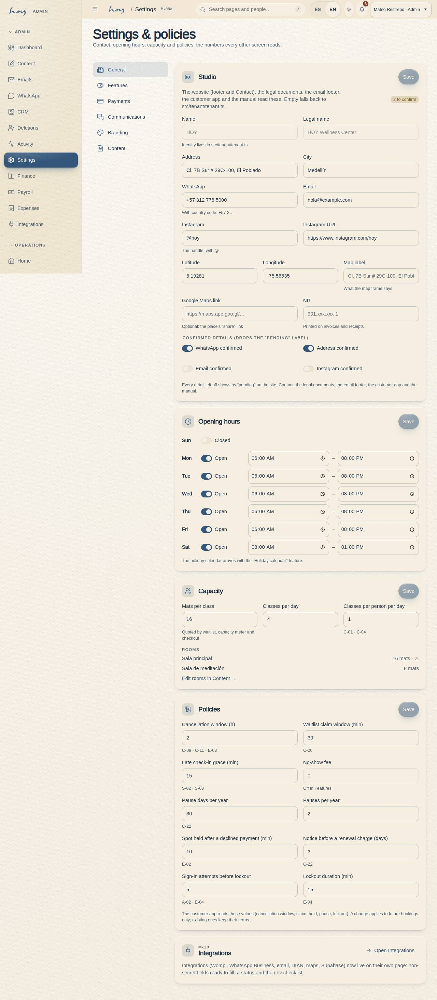

# Policies in force

At HOY a policy is a number in Settings, not a paragraph in a document. The block below is the truth: if someone
changes it in Settings, this chapter changes with it.

{{audience:21-politicas}}

These are the policies in force:

{{policy}}

> IN HOYOS: M-08a Settings and policies → edit the value → Save.

## 1. What each one controls
| Policy | What it controls | Where you notice it |
|---|---|---|
| Cancellation window | until when the credit comes back in full | bookings, Check-in ([04](04-recepcion-y-check-in.md)) |
| Time to take a waitlist spot | how long the next person has to accept it | waitlist ([04](04-recepcion-y-check-in.md)) |
| Late-arrival grace | until when someone can join a class that has started | Check-in, teachers ([06](06-maestros.md)) |
| No-show fee | whether a no-show also costs money on top of the credit | Check-in ([04](04-recepcion-y-check-in.md)) |
| Pause days per year | how long a membership can be frozen | membership ([11](11-pausas-y-regalos.md)) |
| Pauses per year | how many times it can be frozen | membership ([11](11-pausas-y-regalos.md)) |
| Spot held during payment | how long the place is kept while the person pays | payment in the app |
| Notice before each charge | how many days ahead a renewal is announced | automated messages, membership |
| Attempts and lockout | protects the account when someone gets the password wrong | sign-in |
| Quiet hours | when nothing non-urgent is sent | WhatsApp ([13](13-crm-y-whatsapp.md)) |
| VAT and whether it is included | how the total is split on the receipt | payment, invoicing ([15](15-facturacion-y-dian.md)) |

## 2. Who approves a change
{{editable:owner}}

| Change | Proposed by | Approved by |
|---|---|---|
| A policy (cancellation, waitlist, grace, fee) | coordination | owner |
| A price or a plan | admin or finance | owner |
| Switching a feature on or off | admin | owner |
| Tax details and payout account | finance | owner |
| The studio's WhatsApp number and email | coordination | admin |

Every change in Settings is recorded: who, the previous value and the time.

## 3. The change rule
1. **A change never affects what is already booked.** If someone booked with a 2-hour window, their booking keeps 2
   hours even if it is 4 today.
2. If the change makes something stricter (less grace, more notice), it is announced before it applies.
3. If the change makes something looser, it can apply straight away.
4. A policy is never negotiated at the desk. If the case deserves it, give a courtesy in credit and record it (see
   [Payments and the till](14-pagos-y-caja.md)).

## 4. What cannot be switched off
The legal pages and the emergency flow have no switch: they always exist, in both languages.

## 5. What is still to be defined
Some values are zero or provisional because the studio hasn't decided them yet. The full list is under Decisions
needed, and each decision is flagged in the chapter it belongs to.
