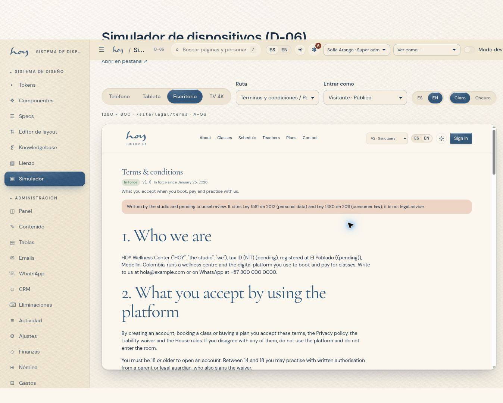

# Legal documents

Legal documents carry a version and a date. What counts in a dispute is the exact version the person accepted, not
today's text.

{{audience:22-documentos-legales}}

## 1. The documents
| Document | What it is | Where it shows |
|---|---|---|
| Terms | the conditions of the service and the plans | on the website, when creating an account |
| Privacy | how we handle personal data ([23](23-habeas-data.md)) | on the website, when creating an account |
| Waiver | the risk of physical practice | when registering at the desk |
| Policies | studio rules with contractual effect (cancellation, refunds, house rules) | club rules, website |

These are the versions that exist today:

{{table:legal_documents}}

## 2. Versions and acceptance
1. Every document has a **version, a language and a publication date**. A published document is never edited: a new
   version is published.
2. What the person accepted is saved with the exact version, the time and who recorded it.
3. At the desk, the person agrees out loud and you tick it when you register them (see
   [Sales and plans](10-ventas-y-planes.md)).

**What to say:** "To register you I need you to accept the terms and the data policy. They're on the website. Do you
accept?"

This is how acceptances are saved:

{{table:consents}}

## 3. When a document changes
1. The new version is published in both languages on the same day.
2. People who already have an account are asked to accept again only if the change affects their rights or the
   price. A change of wording doesn't.
3. The notice goes out by WhatsApp or email (see [CRM, WhatsApp and email](13-crm-y-whatsapp.md)), never during
   quiet hours.

> IN HOYOS: M-08f Settings → Content → published legal versions (a switch per version).

## 4. Contracts that are not in the app
Rental contracts ([12](12-espacio-b2b.md)), teacher contracts ([16](16-nomina-y-payouts.md)) and supplier contracts
live outside the system. What stays in the system is the note on the record with the amount, the terms and the date.

## 5. What is missing today
1. The documents exist, have a link and a version, but **the text is provisional** until the legal adviser delivers
   the final wording.
2. In the member app, legal links lead to the website's pages.

> DECISION NEEDED: the final text of the terms, privacy policy and waiver (drafted by the legal adviser), which versions are published, and who is the legal issuer who signs them.
