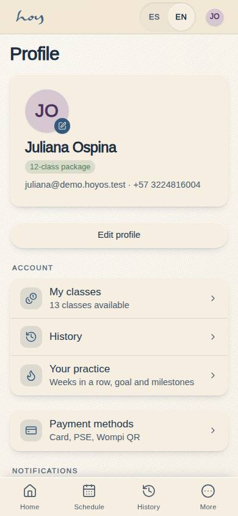
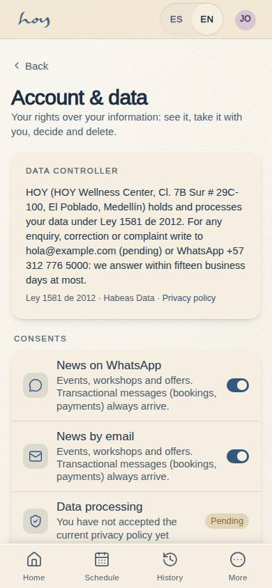
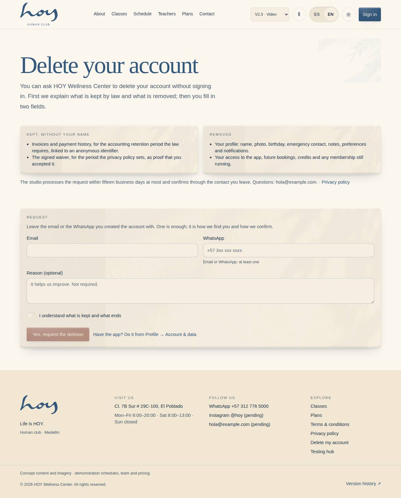
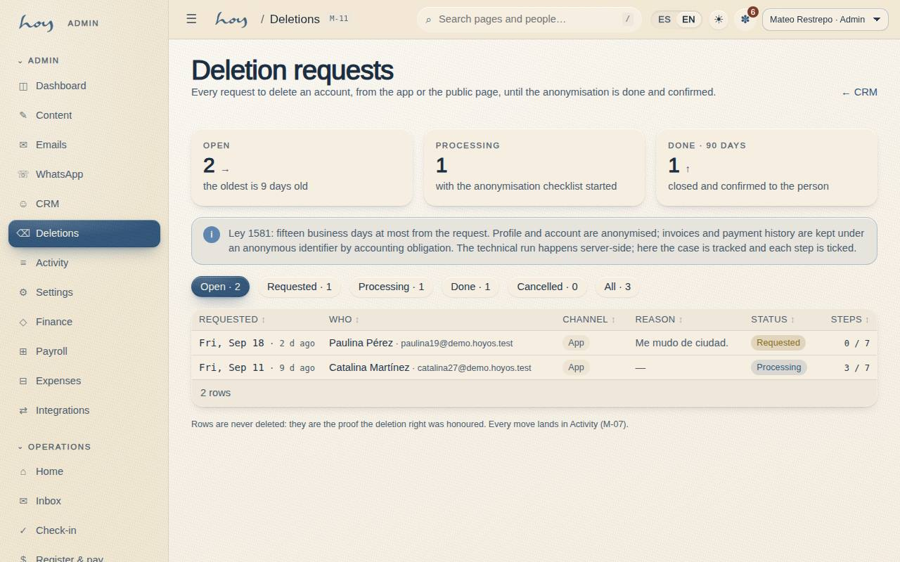

# Personal data and habeas data

In Colombia personal data is protected by Law 1581 of 2012. This chapter is not for lawyers: it is what everyone on
the team does and doesn't do, every day.

{{audience:23-habeas-data}}

## 1. The everyday rules
1. When they register, in the app or at the desk, the person accepts the data policy. It is saved with the time,
   the version and who recorded it (see [Legal documents](22-documentos-legales.md)).
2. We only ask for what we need: name, WhatsApp, email, emergency contact, birthday and consent.
   We no longer keep an "intention of the day": the app stopped asking for it.
3. **Health data is sensitive.** It is kept as a marker and an internal note. It is never read out loud, never sent
   by WhatsApp and never discussed between shifts.
4. Every time someone opens a member's record, it is recorded.
5. Never share your HoyOS session. Never take lists of people out of the system without the owner's permission.
6. A photo is personal data too: without written permission, no face is published (see [Media](19-medios-y-artwork.md)).

> DECISION NEEDED: the published privacy policy still lists the "intention of the day" among the data we collect, and the app no longer asks for it. The owner and the legal adviser should drop it in the next version of the document.

> IN HOYOS: A-06 Legal (current version) · M-06 → the person's consents · M-07 → "record viewed" filter.

## 2. Who sees what
The system doesn't rely on goodwill: each role sees only what it needs. The front desk sees a member's history but
doesn't edit payments; finance sees payments but not health notes.

{{roles}}

This is how each person's profile is kept:

{{table:profiles}}

## 3. The person's rights
| Right | What we do | Deadline |
|---|---|---|
| Access | we show them what we hold; in the app they can **download their data** | the same day, if in person |
| Correction | you correct it on their record, or they do it in their profile | straight away |
| Deletion | they ask (in the app or on the public page) or the front desk opens the case; admin carries it out | 15 working days at most |
| Stop marketing | they switch the channel off in their app, or you do it on their record | straight away |

**Money records are kept by law.** Invoices and payment history are not deleted: they stay without a name, under an
anonymous identifier, for the time the privacy policy states. The profile and the account are anonymised. The app
explains this to the person before they confirm.

## 4. Deleting an account, step by step
There are three ways to ask and one list where admin follows it up. Nobody deletes anything by hand on the spot.

1. **From the app.** Profile → Account and data → *Delete my account*. First the app explains what is kept and what
   is deleted, asks for a reason (optional) and an "I understand" tick. Then it asks to confirm. The request is
   **pending** and the person can cancel it while it stays that way.
2. **From the web, without signing in.** A public page explains the same and asks for an email or WhatsApp (one is
   enough). It is linked from the website footer and the privacy policy.
3. **In person.** The front desk confirms who they are, opens the request (or asks admin to) and notes who asked.
   Don't promise a date: the deadline is the one in the table above.
4. **Admin handles it.** In the deletions list admin sees who, which channel, the reason, how long ago and the state.
   They move it to **in progress**, tick the seven anonymisation steps and only then mark it **done**. **Cancelled**
   closes it without deleting. Requests are never deleted: they are the proof the right was honoured.

This is how each request is kept:

{{table:deletion_requests}}

> IN HOYOS: C-26 Account and data (the person) · W-09 public page · M-03 Tables → deletion_requests, channel "front desk" (in person) · M-11 CRM → Deletions (admin).

## 5. When someone asks
**"What do you do with my data?"** — "We keep your name, your WhatsApp, your email and an emergency contact so we can
look after you. If you told us anything about your health, it stays as an internal note and never leaves here. You
can see, download, correct or delete all of it in the app, under Profile → Account and data, or ask us and we'll do
it within fifteen working days."

**"If I delete my account, do my payments disappear?"** — "Invoices are kept because the law requires it, but
without your name: nobody at the studio will be able to link them back to you."

## 6. What really works today
1. Consents are really saved, with version and time. So are deletion requests, with their log.
2. Automatic deletion will arrive when the real database is connected (see [Integrations](26-integraciones.md)).
   Until then, admin does the steps by hand and ticks them on the list.
3. Real sign-in isn't connected yet: today people sign in with demo users.
4. What App Store and Google Play require is listed in the [app store guide](../../app-store-compliance.md).

> DECISION NEEDED: the final text of the data policy (drafted by the legal adviser) and who is published as the data controller.
