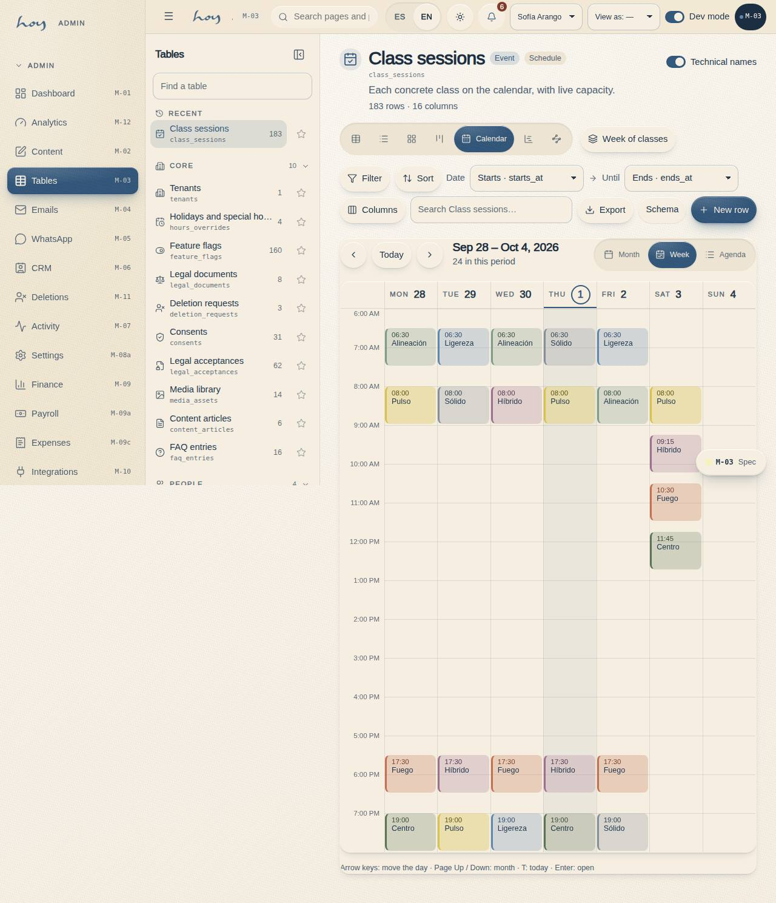

# Data and tables

Where what the studio knows lives, and who can see it.

{{audience:25-datos-y-tablas}}

## What this is for
Everything the studio knows —members, bookings, payments, messages— is kept in tables. You will hardly ever touch
them: that is what the screens are for. This chapter is for three things:

1. Knowing **where** a piece of data is when a screen doesn't show it.
2. Understanding **who can see it** and who can change it.
3. Knowing **what not to do**: fix by hand in a table something that has its own screen.

If you work at the front desk, teach or do maintenance, section 4 is all you need.

## 1. The full model
Every table has an identifier, the studio it belongs to and its created and last-changed dates. That way it is ready
for several studios and for the day the real database is connected.

{{tables}}

> IN HOYOS: M-03 Tables → pick a table → see columns, rows and access contract.

## 2. How to read a table
Every table says **who can read it and who can write to it**. That rule is what will protect the data in the real
database, so it isn't just documentation: it is the security.

For example, bookings:

{{table:bookings}}

## 3. The ones people look up most
### Bookings and waitlist
{{table:waitlist}}

### Package classes
{{table:class_ledger}}

### Messages
{{table:message_log}}

## 4. Rules for touching data
1. If something has a screen, do it on the screen. The screen records who did it; the table on its own doesn't.
2. Tables is a tool for admin and developers. Even so, every change there goes into the activity log.
3. Never take a list of people out of the system without the owner's permission (see [Personal data](23-habeas-data.md)).
4. Money is stored in pesos, with no decimals. Times are stored in universal time and shown in the studio's time.

## 5. The studio right now
{{stats}}

## 6. Every screen
The member app's and the documentation's screens:

{{routes:customer}}

{{routes:docs}}
