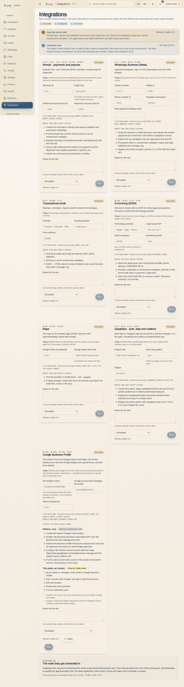

# Integrations and what is simulated

Which outside systems HOY uses, which ones already work and which ones don't yet.

{{audience:26-integraciones}}

## What this is for
This chapter exists so nobody promises something the system can't do yet. Every integration is designed, but not
every one is connected.

1. **If you work at the door or with customers:** read section 3. It tells you which sentences you can say today.
2. **If you are the owner or admin:** section 1 tells you which details you can already fill in.
3. **If you are a developer:** the whole chapter, plus the software documentation.

The rule: if an integration says **simulated**, say the sentence in the future tense.

## 1. The Integrations screen
Every outside system has a card with five parts:

1. **What it does and what is simulated today**, in one sentence you can say at the door without lying.
2. **The details that are not secret**, ready to fill in before the developer arrives: Wompi's merchant id and
   public key, the WhatsApp number and templates, the email provider and domain, the invoicing provider and legal
   issuer, the map link, the database project address.
3. **A state** that a person changes: **simulated** (it exists, but calls nobody) → **configured** (the details are
   in, connecting is pending) → **connected** (really working).
4. **What the developer has to finish**, in order, and the **secrets that exist**, named but never written: they live
   on the server, not on the screen.
5. **Notes** for the developer (which account exists, who has access) and a link to this chapter.

Every change goes into the activity log, with the before and the after.

> IN HOYOS: M-10 Integrations → card → fill in the public details → change the state → Save.

## 2. What state each one is in
| Integration | What for | Today | What is missing |
|---|---|---|---|
| Database and sign-in (Supabase) | signing in with a real user and keeping data on a server | **simulated**: data lives in the browser and people sign in with demo users | create the project, apply the schema and access rules, connect |
| Payments (Wompi) | payment link, card terminal, saved card | **simulated**: records payments and invoices and shows declines, but moves no money | merchant credentials, test environment and server confirmations |
| Teacher payouts (Wompi) | paying each teacher | **simulated**: calculated, approved and marked paid, but no money is sent ([16](16-nomina-y-payouts.md)) | payout credentials and the confirmation |
| WhatsApp Business | automated messages, the conversation and the Inbox ([13](13-crm-y-whatsapp.md)), sign-in codes | **simulated**: everything in and out is saved, but not sent | a Meta-approved number and templates per language. **Approval takes time: ask for it first** |
| Email | receipts, reports, newsletters, correspondence | **simulated**: saved, but not sent or received | a sending provider, a verified domain and inbound email |
| Electronic invoicing (DIAN) | invoicing | **simulated**: the invoice has its shape, but isn't issued ([15](15-facturacion-y-dian.md)) | technology provider and legal issuer |
| Maps | the map on the contact page | **to be chosen** | pick the provider (a free one or Google) |

This is how each one's state is kept:

{{table:integrations}}

## 3. What you can say today
1. "I'll send you the payment link" → **yes**. The link exists; finance confirms the payment (see
   [Payments and the till](14-pagos-y-caja.md)).
2. "You'll get the receipt on WhatsApp" → **not yet**. It is handed over on screen or in writing.
3. "You'll get the electronic invoice" → **not yet**. Say it will arrive once invoicing is switched on.
4. "I'll let you know if a spot opens up" → **yes**, but today a person writes it.
5. "Your card is saved" → only a reference is saved. The card number never passes through HoyOS.

## 4. The order they get connected in
{{for:super_admin,admin,developer}}
1. **Database and sign-in first**, because everything else needs a real user.
2. **Payments with Wompi** next.
3. **Invoicing and teacher payouts** after that.
4. **WhatsApp in parallel**, from the start, because Meta's approval takes time.
5. **Email and maps** once there is a provider.

The Integrations screen repeats this order at the bottom.
{{/for}}

## 5. Where to fill in what can already be filled in
| What | Where |
|---|---|
| Public details, state and notes for each integration | Integrations |
| Address, WhatsApp, email, Instagram, map and "details confirmed" | Settings → General ([01](01-quienes-somos-y-filosofia.md)) |
| Payout account, NIT, VAT, DIAN resolution, Wompi environment, payroll frequency and rates | Settings → Payments ([16](16-nomina-y-payouts.md)) |
| WhatsApp number, studio email and quiet hours | Settings → Communications |
| Map provider, legal versions | Settings → Content ([02](02-nuestras-clases.md), [22](22-documentos-legales.md)) |
| Switching a flow on or off | Settings → Features |

> IN HOYOS: M-10 Integrations · M-08a General · M-08c Payments · M-08d Communications · M-08f Content · M-08b Features.

## 6. What a simulated message leaves behind
Each row is one message in a person's conversation: the channel, whether it came in or went out, what started it,
the state and the id the provider will fill in once connected.

{{table:message_log}}
