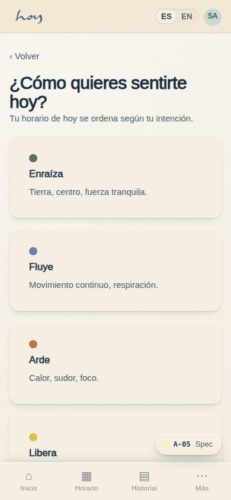

# Quiénes somos y nuestra filosofía

> NOTA: este capítulo es la fuente de la que salen la página "Sobre HOY" del sitio (W-02) y los
> artículos "about" del CMS (M-02). Si cambia aquí, se actualiza allá, no al contrario.

## 1. Sobre HOY
HOY nace de una idea simple: la vida está pasando ahora. En medio del ritmo cotidiano de la ciudad
—el tráfico, el trabajo, la lista de pendientes— HOY crea un espacio para detenerte, respirar,
moverte, sentir y volver a ti.

No buscamos que escapes de tu rutina. Buscamos que la habites de otra manera: con más presencia, más
conciencia y más conexión. Por eso HOY no es un gimnasio más ni un estudio de yoga como los que ya
conoces: es un santuario urbano, hecho para que el bienestar deje de ser una meta lejana y se vuelva
parte de tu día a día.

Aquí no hay una sola forma de llegar. Vivimos el momento con atención, sin adelantarnos a lo que
viene ni quedarnos en lo que ya pasó, y te invitamos a hacer lo mismo: solo necesitas llegar, sin
experiencia previa ni un camino de bienestar ya recorrido. Nuestros maestros te acompañan desde ahí,
con la cercanía de quien entiende que el verdadero progreso empieza por aceptar dónde estás hoy.

Si nunca has practicado, si ya lo has hecho toda tu vida, o si solo necesitas quince minutos entre
reuniones para bajar el ritmo: HOY es para ti. No tienes que cambiar tu vida para venir. Solo tienes
que volver a este momento. Porque todo empieza HOY.

Conocer HOY es solo el primer paso. El siguiente es sentirlo: una clase de prueba, sin
complicaciones, para que la persona decida con el cuerpo y no solo con la cabeza.

> DECISIÓN PENDIENTE: la dirección y los datos de contacto de la sede. Desde 0.7.0 **se escriben en M-08a · Ajustes → General** (dirección, ciudad, WhatsApp, correo, Instagram, coordenadas del mapa y su enlace) y se marca **"Datos confirmados"**: mientras el interruptor esté apagado, la web, Contacto, los documentos legales, el pie de los correos, la app y este manual muestran los valores con la etiqueta *pendiente* (hoy `El Poblado, Medellín (por confirmar)`, `+57 300 000 0000`, `hola@example.com`). La ciudad ya quedó resuelta — **Medellín**, siguiendo el PDF de marca "Medellín · 2026" — y la zona horaria sigue siendo `America/Bogota`. `src/tenant/tenant.ts` queda como el valor por defecto de cada campo vacío.

## 2. Nuestra filosofía
Entre lo que fue y lo que todavía no llega, existe este momento. Ese es el punto de partida de todo
lo que hacemos en HOY: un espacio para detenerte, respirar, moverte, sentir y volver a ti mismo, no
como un lujo aparte de tu vida, sino como algo que se vive en lo cotidiano.

No buscamos que escapes de la rutina, sino que aprendas a habitarla de otra manera. HOY es
movimiento, pero también pausa. Es energía y equilibrio. Es cuerpo, mente y conexión. No siempre hay
que ir más rápido, hacer más o llegar más lejos: a veces, simplemente hay que volver.

Nuestro propósito es hacer del movimiento y la respiración un camino para volver a nosotros mismos y
habitar el presente. Por eso creamos un espacio donde el bienestar se integra de forma natural a tu
vida: cada experiencia en HOY es una oportunidad para conectar con tu cuerpo, respirar con
intención, compartir en comunidad y volver a ti mismo.

Esto se nota en cada detalle de HOY. En cómo recibimos a cada persona tal como llega, sin pedirle una
versión perfecta de sí misma. En cómo hablamos, con la calma de quien no tiene prisa por impresionar.
Y en cómo cuidamos cada gesto pequeño, porque el bienestar no se anuncia: se siente.

## 3. Pequeño a propósito
Somos un club de bienestar pequeño a propósito. La escasez es parte del cuidado, no una limitación
que se disculpa: por eso no vendemos más cupos de los que caben en la sala, y por eso una persona
hace una clase al día.

{{tenant:capacity}}

La pregunta central del producto es "¿Cómo quieres sentirte hoy?" (pantalla A-05). Todo lo que
hacemos en el estudio responde a esa pregunta: la persona llega buscando sentirse de una manera, y
nosotros le hacemos el camino fácil.

## 4. Controles conscientes
Prometemos cuatro cosas y las cumplimos. No son eslóganes: son valores guardados en M-08 y el
software los aplica.

{{policy}}

1. **Pausa de membresía** hasta el máximo que fija la política, gestionada por la persona misma en
   C-22, sin llamar a nadie.
2. **Salir sin laberintos**: cancelar mantiene el acceso hasta el fin del período pagado y no hay
   pantalla de retención.
3. **Ventana de cancelación amable**: dentro de la ventana el crédito vuelve de inmediato.
4. **Aviso antes de cada cobro**, con los días que fija la política.

## 5. Lo que nunca hacemos
1. No culpamos a la persona ("es que no cancelaste a tiempo"). Explicamos la regla y lo que sí puede hacer.
2. No prometemos lo que la política no permite; el valor vigente es el de M-08, no el de la memoria.
3. No escribimos mensajes no urgentes en horas silenciosas.
4. No comentamos el cuerpo, el peso ni el nivel de nadie.
5. No vendemos un cupo que no existe: si la clase está llena, está llena.

La voz de marca —humana, cercana, directa, presente— vive en el capítulo `20`, con la tabla de sí y no.
