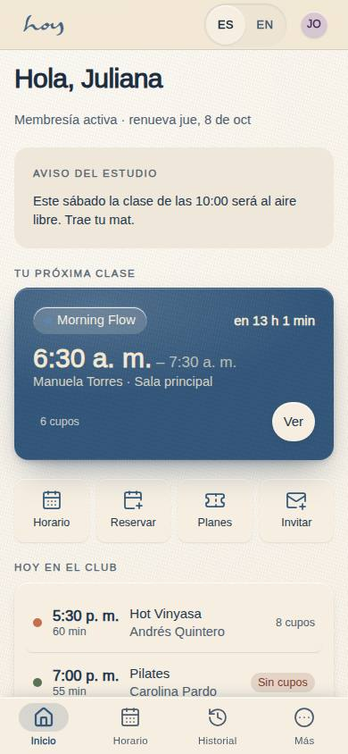

# Quiénes somos y nuestra filosofía

Lee este capítulo antes que cualquier otro. Todo lo que hacemos en la puerta, en la sala y en WhatsApp
sale de aquí.

{{audience:01-quienes-somos-y-filosofia}}

## 1. Sobre HOY
Este es el texto oficial, tal como aparece en el sitio. Úsalo como base cuando alguien te pregunte "¿qué es
HOY?".

HOY nace de una idea simple: la vida está pasando ahora. En medio del ritmo cotidiano de Medellín, el
tráfico, el trabajo, la lista de pendientes, HOY crea un espacio para detenerte, respirar, moverte, sentir y
volver a ti.

No buscamos que escapes de tu rutina. Buscamos que la habites de otra manera: con más presencia, más
conciencia y más conexión. Por eso HOY no es un gimnasio más ni un estudio de yoga como los que ya conoces,
es un santuario urbano, hecho para que el bienestar deje de ser una meta lejana y se vuelva parte de tu día a
día.

Aquí no hay una sola forma de llegar. Vivimos el momento con atención, sin adelantarnos a lo que viene ni
quedarnos en lo que ya pasó, y te invitamos a hacer lo mismo: solo necesitas llegar, sin experiencia previa
ni un camino de bienestar ya recorrido. Nuestros maestros te acompañan desde ahí, con la cercanía de quien
entiende que el verdadero progreso empieza por aceptar dónde estás hoy.

Si nunca has practicado, si ya lo has hecho toda tu vida, o si solo necesitas quince minutos entre reuniones
para bajar el ritmo: HOY es para ti. No tienes que cambiar tu vida para venir. Solo tienes que volver a este
momento. Porque todo empieza HOY.

Conocer HOY es solo el primer paso. El siguiente es sentirlo: una clase de prueba, sin complicaciones, para
que decidas con el cuerpo y no solo con la cabeza. Descubre nuestros planes y encuentra la puerta de entrada
que más te acomode.

**En una frase, para la puerta:** "Es un espacio para moverte, respirar y bajar el ritmo. No necesitas
experiencia: solo llegar."

Estos son los datos de contacto del estudio. El WhatsApp y la dirección ya están confirmados:

{{tenant:contact}}

> DECISIÓN PENDIENTE: el correo del estudio, el usuario de Instagram y el NIT. Mientras el owner no los confirme, la web, la app, los correos y este manual los muestran como pendientes.

> EN HOYOS: M-08a Ajustes → General → correo, Instagram → "Datos confirmados" · M-08c Ajustes → Pagos → NIT.

## 2. Nuestra filosofía
Entre lo que fue y lo que todavía no llega, existe este momento. Ese es el punto de partida de todo lo que
hacemos en HOY: un espacio para detenerte, respirar, moverte, sentir y volver a ti mismo, no como un lujo
aparte de tu vida, sino como algo que se vive en lo cotidiano.

No buscamos que escapes de la rutina, sino que aprendas a habitarla de otra manera. HOY es movimiento, pero
también pausa. Es energía y equilibrio. Es cuerpo, mente y conexión. No siempre hay que ir más rápido, hacer
más o llegar más lejos: a veces, simplemente hay que volver.

Nuestro propósito es hacer del movimiento y la respiración un camino para volver a nosotros mismos y habitar
el presente. Por eso creamos un espacio donde el bienestar se integra de forma natural a tu vida: cada
experiencia en HOY es una oportunidad para conectar con tu cuerpo, respirar con intención, compartir en
comunidad y volver a ti mismo.

Esto se nota en cada detalle de HOY. En cómo recibimos a cada persona tal como llega, sin pedirle una
versión perfecta de sí misma. En cómo hablamos, con la calma de quien no tiene prisa por impresionar. Y en
cómo cuidamos cada gesto pequeño, porque el bienestar no se anuncia: se siente.

El manifiesto, la misión y la personalidad de la marca están en [Voz y tono](20-voz-y-tono.md).

## 3. Los documentos de marca
Estos dos documentos son la fuente de este capítulo. Si el sitio y este texto no coinciden, manda el
documento.

El contenido completo del sitio: Sobre HOY, filosofía y clases.

{{source:contenido-completo}}

El manual de marca 2026: manifiesto, propósito, misión, personalidad, logo, colores y tipografía.

{{source:manual-de-marca}}

## 4. Pequeño a propósito
Somos un club de bienestar pequeño a propósito. Cuidar a pocas personas bien es parte de la experiencia, no
una limitación.

1. No vendemos más cupos de los que caben en la sala.
2. Cada persona toma una clase al día, en cualquier plan.
3. Si la clase está llena, está llena: ofrecemos la siguiente o la lista de espera.

Esta es la capacidad del estudio:

{{tenant:capacity}}

## 5. Cuatro promesas que cumplimos
Prometemos cuatro cosas a cada socio. No son frases bonitas: son reglas que el sistema aplica solo.

1. **Pausar la membresía** sin llamar a nadie, desde su app, hasta el máximo que fija la política.
2. **Salir sin laberintos.** Si cancela, mantiene el acceso hasta el fin de lo que pagó. No insistimos.
3. **Cancelar con tiempo no cuesta.** Si cancela dentro de la ventana, el crédito vuelve de inmediato.
4. **Avisar antes de cobrar**, con los días que fija la política.

Estos son los valores vigentes:

{{policy}}

## 6. Lo que nunca hacemos
{{editable:owner}}

1. No culpamos a la persona. En vez de "es que no cancelaste a tiempo", explicamos la regla y lo que sí
   puede hacer.
2. No prometemos lo que la política no permite. El valor que vale es el de Ajustes, no el que recordamos.
3. No escribimos mensajes que no son urgentes en horas silenciosas.
4. No comentamos el cuerpo, el peso ni el nivel de nadie.
5. No vendemos un cupo que no existe.

Cómo suena todo esto en la práctica, con ejemplos de sí y de no, está en [Voz y tono](20-voz-y-tono.md).
