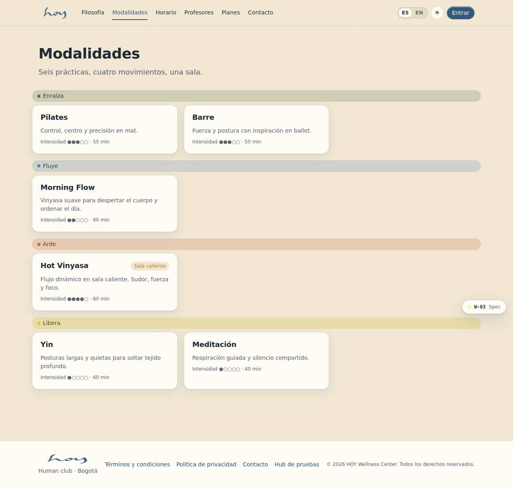
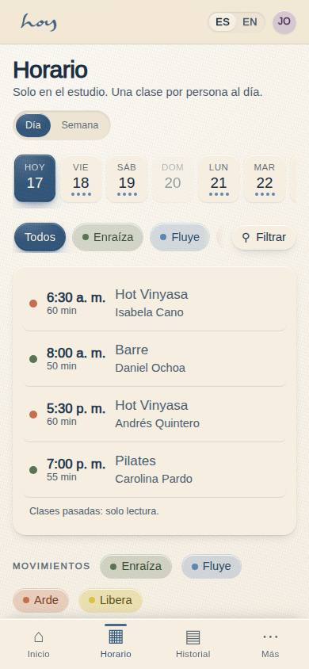

# Nuestras clases

En HOY encuentras varias formas de moverte y de estar bajo un mismo techo: hot yoga, barre, pilates,
meditación y respiración. No son disciplinas aisladas ni categorías con niveles y etiquetas: son
distintos caminos hacia el mismo lugar —tu cuerpo, tu respiración, tu presente—. Cada una tiene su
propio ritmo, pero todas comparten la misma intención: ayudarte a salir del piloto automático y
volver a sentirte en tu cuerpo.

Nadie tiene que elegir "la correcta" desde el primer día. Se puede probar todas, quedarse con la que
más acomode, o alternar según cómo se sienta cada semana. Lo único que pedimos es llegar con ganas de
estar presente; el resto lo construimos juntos, clase a clase.

## 1. Lo que dice el sistema
Las modalidades vivas —nombre, descripción, intensidad, duración y si la sala es caliente— se editan
en **M-02 Contenido** y se publican en el sitio y en la app. La tabla que las guarda es esta:

{{table:modalities}}

## 2. Hot Yoga
Hay algo que pasa cuando el cuerpo se mueve en calor: la mente deja de resistirse y empieza a ceder.
En HOY el hot yoga se practica en una sala donde la temperatura sube a propósito, no para castigar,
sino para ayudar a llegar más rápido a ese lugar donde el cuerpo se abre, los músculos responden
distinto y la respiración se vuelve el centro de todo. No es una clase para "sudar más": es una clase
para sentir más.

El calor cambia la forma de moverse. Las posturas que en frío se sienten rígidas, en calor se sienten
posibles. El cuerpo se vuelve más flexible, la circulación se activa, y con cada respiración profunda
se va soltando lo que se traía cargado desde antes de entrar: la tensión del día, el ruido de la
cabeza, la prisa de la ciudad.

No se necesita experiencia previa. El calor puede sonar intimidante al principio, pero nuestros
maestros enseñan a moverse con él, no contra él: cuándo bajar la intensidad, cuándo hidratarse,
cuándo simplemente quedarse quieto un momento en la postura del niño. Cada cuerpo encuentra su propio
ritmo dentro de la misma sala, y eso también es parte de la práctica: aprender a escucharse en vez de
compararse.

Con el tiempo, el hot yoga se vuelve menos sobre lo que se logra en la esterilla y más sobre lo que se
lleva fuera de ella: más claridad, más fuerza, más capacidad de estar presente incluso cuando las
cosas se ponen intensas.

**Qué decir en la puerta:** "Es en sala caliente. Trae agua y toalla; si en algún momento es mucho, te
quedas quieto un momento y ya. Nadie te va a mirar."
Operación de la sala caliente: capítulo `07`.

## 3. Barre
Barre en HOY combina lo mejor de tres mundos: la precisión del pilates, la elegancia del ballet y la
energía del entrenamiento funcional. El resultado es una clase de alta intensidad pero bajo impacto,
donde se trabajan todos los grupos musculares principales sin un solo salto brusco ni golpe en las
articulaciones. Es exigente, pero se siente amable con el cuerpo.

Lo que hace diferente a barre no es el tamaño del movimiento, sino su precisión. Trabajamos con
micro-movimientos, repeticiones pequeñas y controladas, sostenidas justo el tiempo suficiente para que
el músculo tiemble antes de soltar. La música marca el ritmo de cada serie, y ese pulso constante es
lo que ayuda a llegar a esas últimas diez repeticiones que al principio parecían imposibles.

Nuestros maestros de barre se preparan específicamente para esta disciplina, porque la calidad de una
clase se nota en los detalles: en la corrección justo a tiempo, en el ajuste de postura antes de que
alguien se lesione, en saber cuándo empujar un poco más y cuándo dejar descansar. No es una clase
genérica de tonificación con música de fondo: es una experiencia diseñada con intención.

**Qué decir en la puerta:** "Es bajo impacto pero intensa. Si es tu primera vez, el maestro te va a
ajustar la postura; puedes pedirle que no te toque y lo respeta."

## 4. Pilates
Pilates empieza en un solo lugar: el centro. Ahí se activa la fuerza que después sostiene cada
movimiento, cada postura, cada gesto del cuerpo entero. Esta disciplina enseña a moverse con más
control, más conciencia y más precisión, no a base de repeticiones interminables, sino de intención en
cada gesto.

Es un trabajo lento en apariencia, pero profundo en resultado: fortalece el core, mejora la postura y
enseña a alinear un cuerpo que, en el día a día, se acostumbra a encorvarse frente a una pantalla o a
cargar peso sin darse cuenta. Cada ejercicio se siente simple al principio, pero exige más de lo que
parece.

Nuestros maestros de pilates trabajan desde el detalle: la posición de la columna, la respiración que
acompaña cada movimiento, el pequeño ajuste que hace que un ejercicio pase de ser mecánico a ser
efectivo. No importa si alguien nunca ha practicado o si lleva años haciéndolo: la clase se adapta a
su cuerpo y a su ritmo, sin comparaciones ni presión por llegar a un nivel específico.

Lo que empieza como fuerza en el centro del cuerpo termina notándose en todo lo demás: en cómo
caminas, en cómo te sientas, en cómo respondes cuando algo te toma por sorpresa.

## 5. Meditación
En medio del ruido constante, meditar es un acto casi radical: detenerse, aunque sea por unos minutos,
sin la necesidad de producir, responder o resolver nada. En HOY entendemos la meditación como eso: un
espacio de quietud donde la mente encuentra permiso para simplemente estar, sin exigirle silencio
absoluto ni una versión perfecta de calma.

La incluimos porque el bienestar no vive solo en el movimiento del cuerpo: también vive en la pausa.
Practicar con regularidad ayuda a reducir el estrés acumulado, mejora la claridad mental y entrena una
capacidad cada vez más escasa, la de estar presente.

## 6. Respiración (breathwork)
Hay algo curioso en la respiración: la hacemos sin parar y casi nunca la notamos. En HOY invitamos a
hacer justo eso —notarla— y descubrir que ahí, en algo tan simple, hay más calma y más energía de la
que se imagina.

No se trata de dominar una técnica compleja, sino de reconectar con algo que ya se sabe hacer. Por eso
también está presente dentro de nuestras clases guiadas: una pausa breve, sin esfuerzo, que acompaña
mucho después de salir del estudio.

## 7. Los cuatro movimientos
El sistema organiza el horario por **movimiento**, no por disciplina: Enraíza, Fluye, Arde y Libera.
Son la respuesta a "¿cómo quieres sentirte hoy?" y son cuatro porque son las cuatro clases del día.
Cada modalidad se asigna a un movimiento en M-02; el color del horario y de la app sale de ahí.

| Movimiento | Se siente como | Suele ser |
|---|---|---|
| Enraíza | bajar, sostener, aterrizar | pilates, respiración |
| Fluye | soltar, encadenar, respirar largo | yoga suave, movilidad |
| Arde | subir el pulso, temblar, sudar | barre, hot yoga |
| Libera | aflojar, quedarse quieto, cerrar | meditación, restaurativo |

> DECISIÓN PENDIENTE: cómo se nombran las clases en público. La copia de marca habla de cinco disciplinas (hot yoga, barre, pilates, meditación, respiración) y el sistema organiza el día por cuatro movimientos (Enraíza, Fluye, Arde, Libera). Hay que decidir cuál es el nombre que ve el cliente en el horario y cuál es la etiqueta interna.

