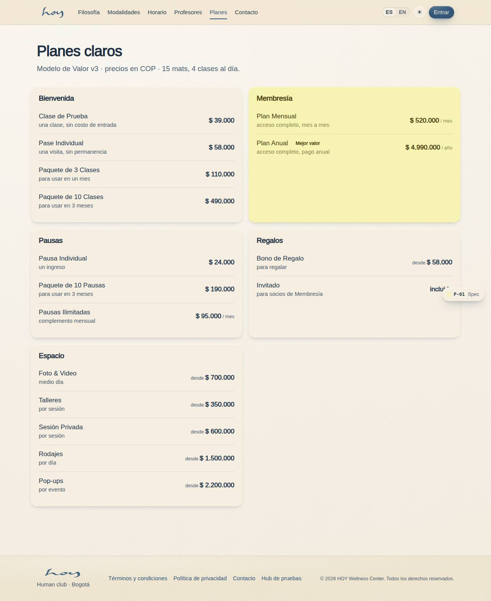

# Modelo de valor

HOY vende cinco cosas distintas y cada una tiene un trabajo diferente en el negocio. Quien está en el
mostrador no necesita saber el margen, pero sí para qué existe cada familia: así ofrece lo correcto
sin improvisar.

> NOTA: ningún precio se escribe en este manual. Todos los bloques de abajo se leen de
> `src/tenant/pricing.ts`, el único lugar del sistema donde existe un precio. Si un precio cambia
> allí, cambia aquí, en el sitio (P-01) y en el mostrador (S-04) al mismo tiempo.

## 1. La disciplina
Cinco líneas de ingreso sobre una sala que no crece.

{{tenant:capacity}}

Eso es todo el inventario del día: 15 mats × 4 clases = 60 cupos, y una persona puede tomar una clase
al día en cualquier plan. El modelo no consiste en vender más cupos, sino en vender el cupo correcto a
la persona correcta y en cobrar por lo que no ocupa un mat (pausas, regalos, espacio).

## 2. Las cinco líneas
| Familia | Su trabajo | Cómo se mide |
|---|---|---|
| Bienvenida | Adquisición: la entrada barata que alimenta la Membresía | % de pases que se convierten en Membresía a 60 días |
| Membresía | Ingreso recurrente: un solo nivel de acceso, mensual o anual | socios activos y retención mes a mes |
| Pausas | Frecuencia: micro-sesiones de 15–30 min, costo marginal casi cero | visitas por socio por semana |
| Regalos | Referido y comunidad: bonos e invitados de socios | bonos redimidos e invitados que vuelven |
| Espacio | Ingreso B2B: alquiler del estudio fuera de horas pico | horas alquiladas por mes |

## 3. Bienvenida — adquisición
La puerta de entrada. Precio bajo, sin permanencia, pensado para que la persona decida con el cuerpo.
Nadie vive de esta línea: su éxito se mide en cuántos de esos pases se vuelven Membresía.

{{pricing:bienvenida}}

En el mostrador: si la persona pregunta "¿cuál me llevo?", la respuesta por defecto es la Clase de
Prueba la primera vez y el Paquete de 3 la segunda. El Paquete de 10 es para quien ya sabe que va a
volver pero todavía no quiere mensualidad.

> DECISIÓN PENDIENTE: vigencia del Paquete de 10 (el brief dice 1 mes; P-01 Planes y precios dice 3 meses).

## 4. Membresía — ingreso recurrente
Un solo nivel de acceso: no hay "plan plus". Se paga mensual o anual, y el anual es el mismo acceso
con el mejor precio por mes.

{{pricing:membresia}}

El plan anual equivale a unos $416.000 por mes: eso es lo que se dice cuando alguien pregunta si vale
la pena. Todo lo demás de la membresía —pausa, aviso de cobro, cancelar sin laberintos— está en el
capítulo `11` y en las políticas del capítulo `21`.

## 5. Pausas — frecuencia
Micro-sesiones de 15 a 30 minutos: respiración, meditación, una pausa entre reuniones. Casi no tienen
costo marginal —no consumen un mat de clase ni un maestro de hora completa— y su trabajo es que la
persona venga más veces por semana, no que pague más por vez.

{{pricing:pausas}}

Las reglas abiertas de esta familia (si Pausas Ilimitadas se suma a la Membresía, si una Pausa consume
el límite del día) están marcadas como decisión en el capítulo `11`.

## 6. Regalos — referido y comunidad
Nuestro canal de referidos. Un bono de regalo trae a alguien que no nos conoce, con la
recomendación de quien lo compró; un invitado de Membresía trae a alguien que ya viene acompañado.

{{pricing:regalos}}

El invitado no es gratis para el negocio: ocupa un mat. Por eso la regla de cuántos invitados y cuándo
es una política, no un favor de mostrador.

Cuántos invitados y si ocupan mat es una decisión abierta, marcada en el capítulo `11`.

## 7. Espacio — ingreso B2B
El estudio se alquila fuera de horas pico: talleres, sesiones privadas, foto y video, rodajes,
pop-ups. Son precios "desde" y terminan en una conversación, no en un checkout. El detalle operativo
está en el capítulo `12`.

{{pricing:espacio}}

## 8. Todo junto
El catálogo completo, tal como lo lee el sistema:

{{pricing}}

## 9. Cómo se lee el mes
| Indicador | Dónde | Qué mirar |
|---|---|---|
| Ingresos del mes | M-01 | ventas liquidadas, COP, contra el mismo mes anterior |
| Mezcla por familia | M-09 Finanzas | cuánto viene de Membresía vs. Bienvenida |
| Ocupación | M-01 | asistentes sobre cupos ofrecidos |
| Conversión de Bienvenida | M-06 segmentos | pases que compraron Membresía después |

{{kpi:occupancy}}
