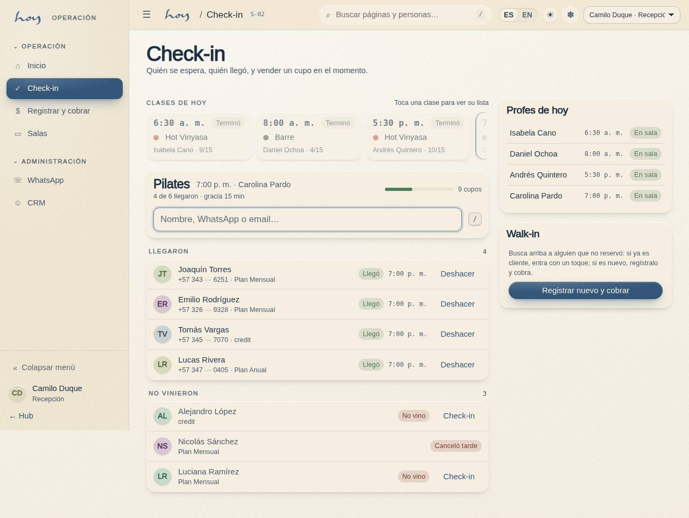
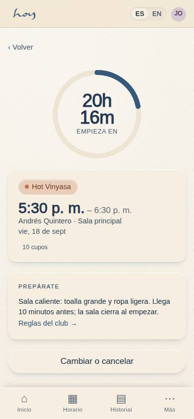
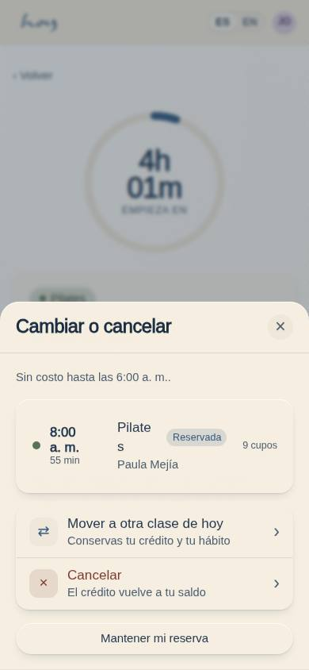
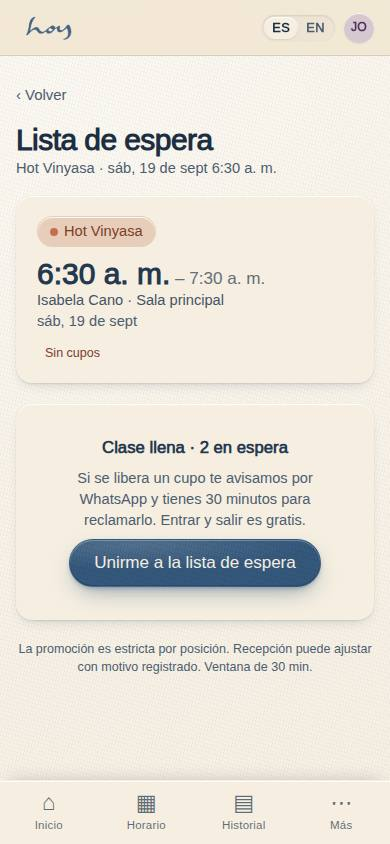

# Recepción y check-in

Tu pantalla base es **S-02 Puerta / check-in**. Desde ahí buscas socios, ves la tira Ahora / Sigue /
Más tarde, los maestros del día y las acciones de recepción. Cada acción queda en el registro con tu nombre.

## 1. Apertura (45 min antes de la primera clase)
1. Enciende luces, clima y música de recepción; revisa que la sala esté montada según `07`.
2. Entra a HoyOS con tu usuario → **S-01 Inicio por rol** → Recepción.
3. En **S-02** confirma las clases del día, los cupos y que cada maestro aparezca como "Esperado".
4. Revisa la lista de espera de cada clase y los pagos pendientes de ayer (transferencias sin confirmar).
5. Lee los mensajes de WhatsApp de la noche (llegaron en horas silenciosas; se responden al abrir).
6. Cuenta la base de caja y anótala en la planilla de cierre (`14`).

## 2. Saludo
1. Mira a la persona, sonríe, nombre si lo conoces: "Hola, Camila. ¿Vienes a la de las 7?"
2. Si es nueva: "Hola, bienvenida a HOY. ¿Es tu primera vez? Te registro en un minuto."
3. Antes de la clase, una sola pregunta útil: "¿Necesitas mat o trajiste el tuyo?"

El tono completo —qué se dice y qué no— está en el capítulo `20`.

## 3. Check-in
1. En **S-02** selecciona la clase en el selector; la lista muestra Esperados, Registrados y Lista de espera.
2. Busca por nombre, teléfono, correo o documento; toca la persona → **Registrado**.
3. Si aparece "ya registrado", no dupliques: es la misma persona o el maestro ya marcó asistencia.
4. Marcador de salud discreto: no lo comentes en voz alta; el maestro lo ve en su lista.
5. Pasados los minutos de tolerancia, quien no llegó es no-show: confírmalo en S-02 para que la lista
   de espera se promueva.

**Pasos en HoyOS:** S-02 Puerta / check-in → selector de clase → Buscar socio → Registrado.
Cancelar o mover: acción "Cancelar o mover reserva" (abre C-08b en nombre del socio).

## 4. Walk-ins
1. Sin cupo en la clase que quiere: ofrece la siguiente del día o la lista de espera. Una persona,
   una clase al día.
2. Los precios se leen en S-04 desde el modelo de valor; nunca los digites ni los negocies. El
   catálogo y para qué sirve cada familia está en el capítulo `03`; el procedimiento de venta, en `10`.

## 5. Cancelaciones, llegadas tarde y no-show
Las reglas son valores de M-08, no memoria. Estos son los vigentes:

{{policy:cancellation_window_hours}}

| Situación | Regla | Qué dices |
|---|---|---|
| Cancela dentro de la ventana | Crédito vuelve de inmediato | "Listo, tu crédito ya está de vuelta." |
| Cancela fuera de la ventana | Crédito se consume | "Como faltan menos horas que la ventana, esta clase cuenta. ¿Te muevo a otra del día?" |
| Mover | Cancelar + reservar en una acción; sin cargo dentro de la ventana | "Te paso a la de las 9:30, mismo crédito." |
| Llega tarde | Tolerancia según M-08 | "Entra con cuidado; el maestro ya empezó." |
| No-show | Se confirma en S-02; crédito se consume | Se avisa por WhatsApp con la plantilla, no con reproches |

> DECISIÓN PENDIENTE: minutos de tolerancia de llegada y cargo por inasistencia (campos "Tolerancia de llegada" y "Cargo por inasistencia" en M-08).

## 6. Lista de espera
1. Promoción estricta por orden; el cupo liberado se ofrece por WhatsApp durante la ventana de reclamo
   (ignora horas silenciosas) y luego pasa al siguiente.
2. Puedes saltar el orden solo con razón registrada (por ejemplo, la persona ya está en la puerta).

{{policy:waitlist_claim_minutes}}

**Pasos en HoyOS:** S-02 → sección Lista de espera → Promover (razón). Vista del socio: C-20.

## 7. Objetos perdidos
1. Etiqueta con fecha, clase y descripción; guarda en la caja de perdidos; nota en M-06 si sabes de
   quién es.
2. Se guardan 30 días; después se donan. Avísalo al entregar.

## 8. Incidentes
1. Seguridad de la persona primero (`08`). Después registra: nota en **M-06** con categoría, hora y
   qué hiciste; avisa a coordinación el mismo día.

## 9. Traspasos
1. Recepción → Coordinación: incidentes, quejas, solicitudes de pausa fuera de regla, no-shows
   repetidos. Nota en **M-06** con categoría y aviso en el grupo interno.
2. Recepción → Finanzas: cierre de caja diario, pagos pendientes (transferencias sin confirmar),
   solicitudes de reembolso (`14`).
3. Cualquiera → Admin: acceso, permisos, algo que HoyOS no deja hacer.

## 10. Cierre
El conteo de efectivo, las transferencias pendientes y la planilla de cierre están en el capítulo
`14`. La checklist física de cierre del espacio está en `07`.
