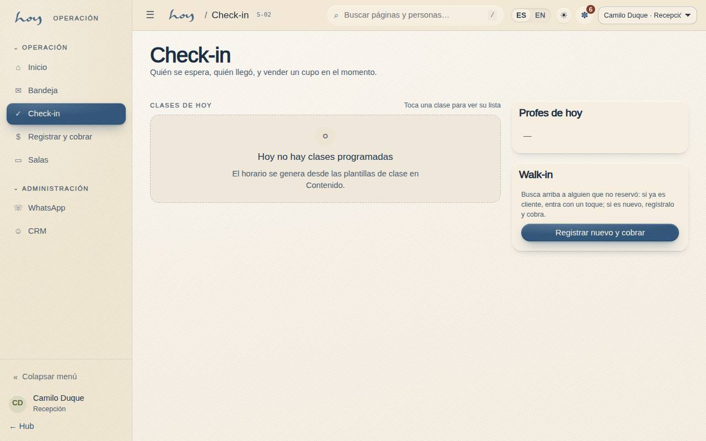
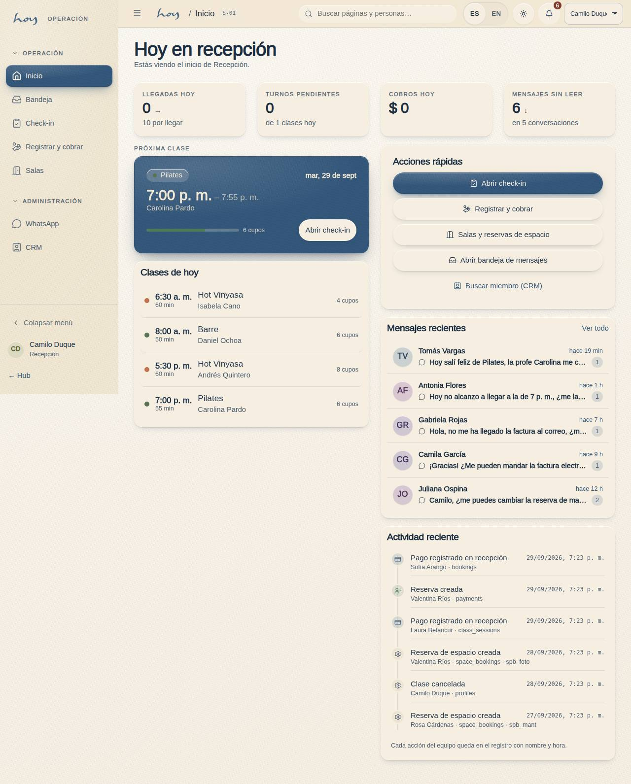
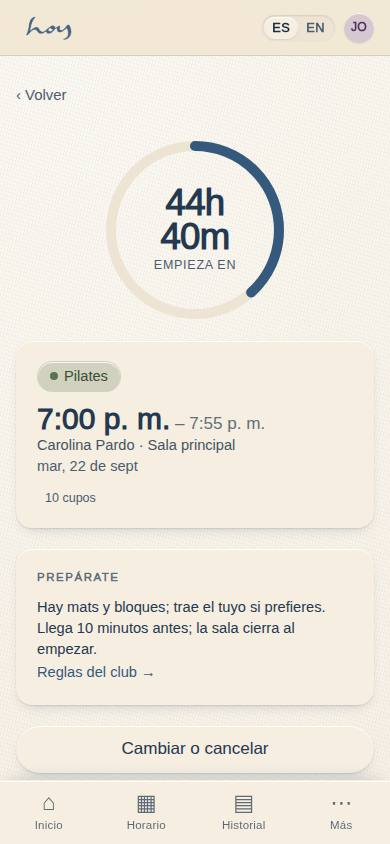
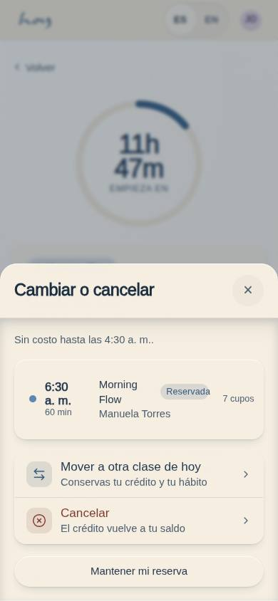
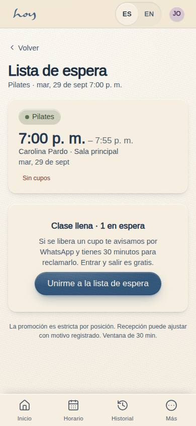

# Recepción y check-in

Tu pantalla de trabajo es **Check-in**: desde ahí buscas socios, ves qué clase está pasando, cuál sigue y qué
maestros llegaron. Todo lo que haces queda registrado con tu nombre.

{{audience:04-recepcion-y-check-in}}

## 1. Apertura
{{editable:coordinator}}

Llega antes de la primera clase, con este margen:

{{studio:opening_lead_minutes}}

1. Enciende luces, clima y música de recepción. Revisa que la sala esté montada (ver
   [Sala, calor y mantenimiento](07-sala-calor-y-mantenimiento.md)).
2. Entra a HoyOS con tu propio usuario.
3. En Check-in, revisa las clases del día, los cupos y que cada maestro aparezca como "Esperado".
4. Revisa la lista de espera de cada clase y los pagos de ayer que siguen pendientes (transferencias sin
   confirmar).
5. Abre la Bandeja y responde lo que llegó en la noche. Los mensajes sin leer van primero. Cómo responder:
   [CRM, WhatsApp y correo](13-crm-y-whatsapp.md).
6. Cuenta la base de caja y anótala en la planilla de cierre.

> EN HOYOS: S-01 Inicio → S-02 Check-in (clases y maestros) → S-06 Bandeja.

## 2. Saludo
{{editable:owner}}

1. Mira a la persona, sonríe y di su nombre si lo sabes: "Hola, Camila. ¿Vienes a la de las 7?"
2. Si es nueva, usa el saludo de la casa (abajo) y regístrala.
3. Antes de la clase, una sola pregunta útil: "¿Necesitas tapete o trajiste el tuyo?"

El saludo para alguien que viene por primera vez:

{{studio:greeting_line}}

Qué decimos y qué no: [Voz y tono](20-voz-y-tono.md).

## 3. Registrar la llegada (check-in)
1. Elige la clase. Verás tres grupos: Esperados, Registrados y Lista de espera.
2. Busca a la persona por nombre, teléfono, correo o documento. Tócala y marca **Registrado**.
3. Si dice "ya registrado", no lo repitas: es la misma persona, o el maestro ya marcó su asistencia.
4. Si ves una marca de salud, no la comentes en voz alta. El maestro también la ve en su lista.
5. Cuando pasa la tolerancia de llegada, quien no vino es un no-show. Confírmalo para que el cupo pase a la
   lista de espera.

Si la persona quiere cancelar o cambiar de clase, usa "Cancelar o mover reserva": haces el cambio por ella,
igual que lo haría en su app.

> EN HOYOS: S-02 Check-in → selector de clase → Buscar socio → Registrado. Cambios: "Cancelar o mover reserva" (abre C-08b).

## 4. Walk-ins (llega sin reserva)
1. Si hay cupo, regístrala y cobra (ver [Ventas y planes](10-ventas-y-planes.md)).
2. Si no hay cupo, ofrece la siguiente clase del día o la lista de espera.
3. Recuerda la regla: una persona, una clase al día.
4. Los precios no se escriben ni se negocian: se eligen en Registrar y cobrar.

**Qué decir:** "Esa ya está llena. Hay cupo a las 9:30, ¿te la guardo? O te dejo en lista de espera."

## 5. Cancelaciones, llegadas tarde y no-show
Las reglas son las de Ajustes, no las que recordamos. Esta es la ventana de cancelación vigente:

{{policy:cancellation_window_hours}}

| Situación | Qué pasa | Qué dices |
|---|---|---|
| Cancela dentro de la ventana | El crédito vuelve de inmediato | "Listo, tu crédito ya está de vuelta." |
| Cancela fuera de la ventana | El crédito se usa | "Como faltan menos horas que la ventana, esta clase cuenta. ¿Te muevo a otra del día?" |
| Quiere moverse de clase | Se cancela y se reserva en un paso; sin costo dentro de la ventana | "Te paso a la de las 9:30, con el mismo crédito." |
| Llega tarde | Entra si está dentro de la tolerancia | "Entra con cuidado; el maestro ya empezó." |
| No vino | Se confirma el no-show y el crédito se usa | Se le escribe por WhatsApp con la plantilla, sin reproches |

> DECISIÓN PENDIENTE: los minutos de tolerancia para llegar tarde y si faltar sin avisar tiene un cargo en dinero.

> EN HOYOS: M-08a Ajustes → "Tolerancia de llegada" y "Cargo por inasistencia".

## 6. Lista de espera
1. El cupo que se libera se ofrece en orden. La persona recibe un WhatsApp y tiene un tiempo para tomarlo;
   si no lo toma, pasa a la siguiente.
2. Solo puedes saltar el orden con una razón escrita (por ejemplo, la persona ya está en la puerta).

Este es el tiempo que tiene cada persona para tomar el cupo:

{{policy:waitlist_claim_minutes}}

> EN HOYOS: S-02 → sección Lista de espera → Promover (con razón). El socio lo ve en C-20.

## 7. Objetos perdidos
{{editable:coordinator}}

1. Ponle una etiqueta con la fecha, la clase y qué es.
2. Guárdalo en la caja de objetos perdidos.
3. Si sabes de quién es, escríbele y deja una nota en su ficha.

Cuánto tiempo los guardamos:

{{studio:lost_items_days}}

## 8. Si pasa algo
Primero la persona, después el registro. Qué hacer en cada caso:
[Incidencias y emergencias](08-incidencias-y-emergencias.md). Después, deja una nota en la ficha del socio
con qué pasó, a qué hora y qué hiciste, y avisa a coordinación el mismo día.

## 9. A quién le pasas qué
| A quién | Qué |
|---|---|
| Coordinación | incidentes, quejas, pedidos de pausa fuera de la regla, no-shows repetidos |
| Finanzas | el cierre de caja del día, las transferencias pendientes, los pedidos de reembolso |
| Admin | accesos, permisos, algo que HoyOS no te deja hacer |

Deja siempre una nota en la ficha y avisa por el grupo interno.

> EN HOYOS: M-06 CRM → ficha del socio → Nota.

## 10. Cierre
El conteo de efectivo y la planilla de cierre: [Pagos y caja](14-pagos-y-caja.md). El cierre físico del
espacio: [Sala, calor y mantenimiento](07-sala-calor-y-mantenimiento.md).
