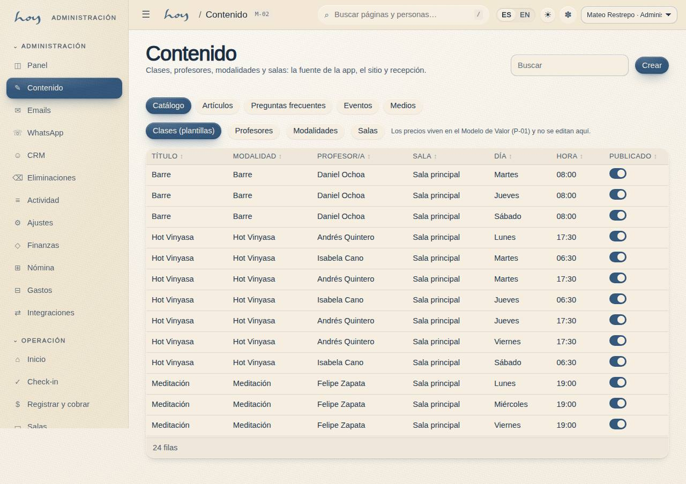
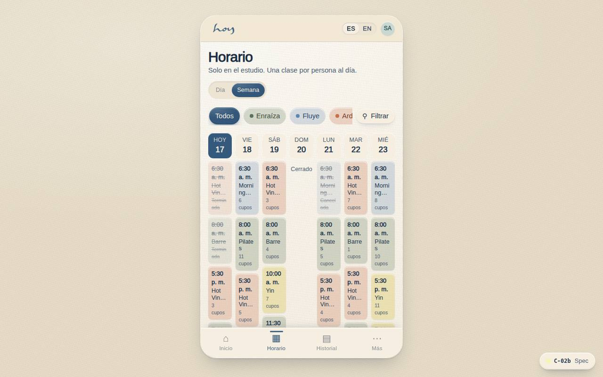
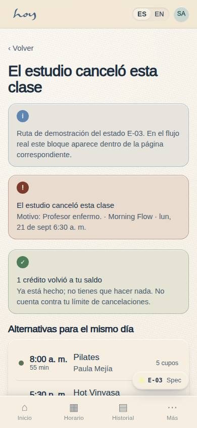
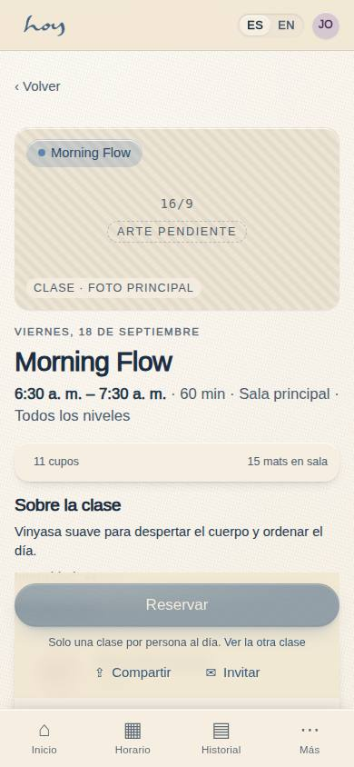
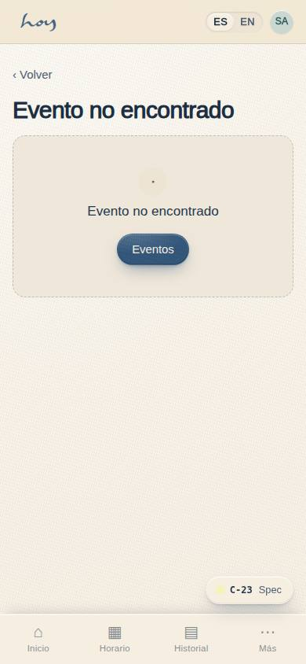

# Clases y horarios

Tu centro es **M-02 Contenido (CMS)**: clases, maestros, horario y contenido, todo con campos ES/EN y
flujo borrador → revisión → publicado.

## 1. Construir el horario
1. Regla fija, la misma todos los días:

{{tenant:capacity}}

2. Reparte los cuatro movimientos (Enraíza, Fluye, Arde, Libera) a lo largo del día para que la
   pregunta "¿Cómo quieres sentirte hoy?" siempre tenga respuesta. Qué es cada movimiento: capítulo `02`.
3. Crea la clase como recurrente en **M-02 → Horario** (tipo de clase, maestro, sala, hora,
   recurrencia). Aparece en C-02, S-02 y S-03 al publicar.
4. Publica siempre en español; el inglés cae al español si falta.
5. Cambios de horario con al menos 7 días de aviso; los cambios de política no afectan reservas ya hechas.

**Pasos en HoyOS:** M-02 → pestaña Horario → Nueva clase recurrente → Publicar. Verifica en C-02
Horario (vista día y semana).

> DECISIÓN PENDIENTE: horas exactas de las 4 clases y días de operación (¿6 o 7 días?).

## 2. Programar maestros
1. Cada maestro tiene disponibilidad registrada en su perfil (M-02 → Maestros). Asigna sin superponer
   clases del mismo maestro.
2. Sustituciones: confirma el cambio en M-02 → Horario el mismo día en que se acuerda; el alumno ve el
   nombre correcto en C-02 y C-18.
3. Asistencia fuera de ventana: la editas tú en S-03 con razón. La ventana del maestro está en `06`.

## 3. Cancelar una clase del estudio
1. M-02 → Horario → ocurrencia → Cancelar (razón). El sistema devuelve los créditos, envía WhatsApp y
   correo de inmediato (ignora horas silenciosas) y propone alternativas del mismo día (E-03).
2. Avisa al owner en el grupo interno. No cuenta contra ninguna persona.

**Pasos en HoyOS:** M-02 Horario → Cancelar ocurrencia → confirmar. Revisar envío en M-05 → Registro.

## 4. La clase, en la pantalla del socio
Lo que el cliente ve antes de reservar sale de M-02: nombre, descripción, maestro, intensidad,
duración y si la sala es caliente.

La tabla que guarda cada sesión del horario:

{{table:class_sessions}}

## 5. Eventos y talleres
1. Se crean como eventos con precio, cupo y regla de invitados propios (C-23). Los precios de Espacio
   (talleres, sesiones privadas, foto/video, rodajes, pop-ups) son "desde" y terminan en conversación
   por WhatsApp, no en checkout: capítulo `12`.
2. Un evento no reemplaza las clases del día salvo aprobación del owner.

**Pasos en HoyOS:** M-02 → Contenido → Evento → publicar; ver C-23 Evento y RSVP.

## 6. Semana de coordinación
| Día | Tarea |
|---|---|
| Lunes | Ocupación de la semana pasada (M-01), sustituciones pendientes |
| Miércoles | Revisión de contenido en cola, CRM segmento "En riesgo" (M-06) |
| Viernes | Horario de la semana siguiente confirmado con maestros; automatizaciones sin errores en M-05 |
