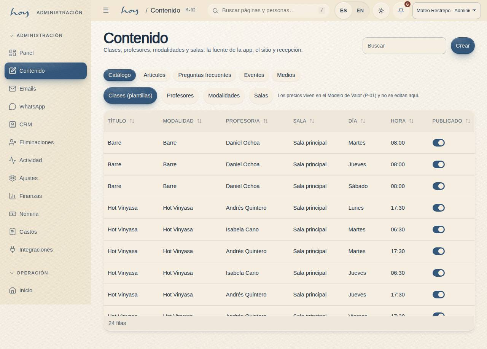
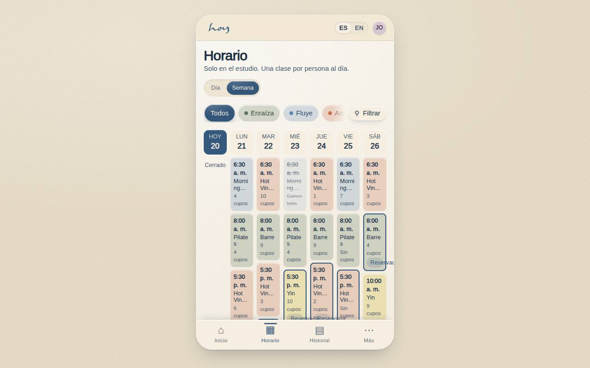
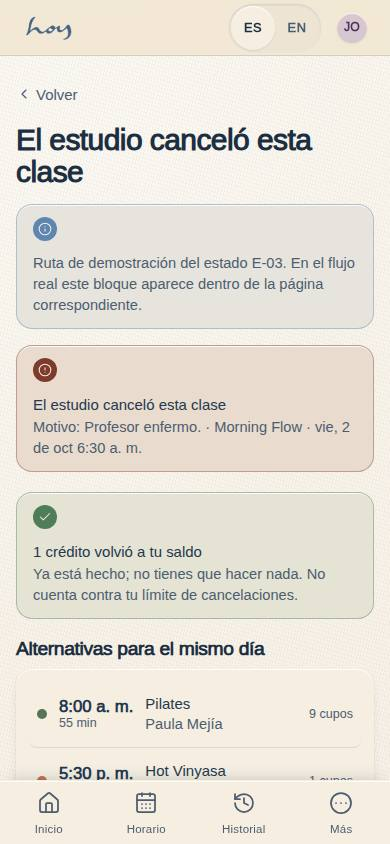
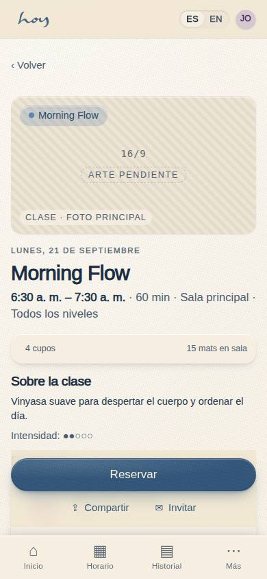

# Clases y horarios

Coordinación arma el horario, asigna a los maestros y publica las clases. Todo se hace desde Contenido: cada
texto en español y en inglés, y cada cambio pasa por borrador, revisión y publicado.

{{audience:05-clases-y-horarios}}

## 1. Armar el horario
1. La regla es la misma todos los días:

{{tenant:capacity}}

2. Reparte las intensidades a lo largo del día, para que siempre haya algo intenso y algo tranquilo. Qué es
   cada clase: [Nuestras clases](02-nuestras-clases.md).
3. Crea la clase como recurrente: disciplina, maestro, sala, hora y cada cuánto se repite.
4. Publica siempre en español. Si falta el inglés, la app muestra el español.
5. Avisa los cambios de horario con anticipación (ver abajo). Un cambio no afecta las reservas que ya existen.
6. Revisa el resultado en el horario de la app, en vista de día y de semana.

Con cuánta anticipación se avisa un cambio de horario:

{{studio:schedule_change_notice_days}}

> DECISIÓN PENDIENTE: las horas exactas de las cuatro clases del día y cuántos días a la semana abre el estudio (seis o siete).

> EN HOYOS: M-02 → Horario → Nueva clase recurrente → Publicar. Revisar en C-02 Horario.

## 2. Asignar maestros
1. Cada maestro tiene su disponibilidad en su perfil. No le pongas dos clases a la misma hora.
2. Si hay un reemplazo, cámbialo en el horario el mismo día que se acuerda. Así el socio ve el nombre
   correcto.
3. Si un maestro no alcanzó a marcar la asistencia a tiempo, la corriges tú, con una razón. Cómo trabaja el
   maestro: [Maestros](06-maestros.md).

> EN HOYOS: M-02 → Maestros (disponibilidad) · M-02 → Horario → ocurrencia → cambiar maestro.

## 3. Cancelar una clase del estudio
1. Abre la clase en el horario y elige **Cancelar**, con la razón.
2. El sistema devuelve los créditos, avisa por WhatsApp y correo de inmediato (aunque sea de noche) y propone
   otras clases del mismo día.
3. Avisa al owner en el grupo interno.
4. Una clase cancelada por el estudio no cuenta en contra de nadie.

> EN HOYOS: M-02 Horario → Cancelar ocurrencia → confirmar. Revisar el envío en M-05 → Registro.

## 4. Lo que ve el socio
Lo que el cliente lee antes de reservar sale de lo que publicas: nombre, descripción, maestro, intensidad,
duración y si la sala es caliente. Si algo está mal escrito ahí, se corrige en Contenido.

Así guarda el sistema cada clase del horario:

{{table:class_sessions}}

## 5. Eventos y talleres
1. Un evento tiene su propio precio, su cupo y su regla de invitados.
2. Los alquileres del espacio (talleres externos, sesiones privadas, foto y video, rodajes, pop-ups) no se
   venden en línea: terminan en una conversación. Ver [Espacio — alquiler B2B](12-espacio-b2b.md).
3. Un evento no reemplaza las clases del día sin la aprobación del owner.

> EN HOYOS: M-02 → Contenido → Evento → Publicar. El socio lo ve en C-23.

## 6. La semana de coordinación
{{editable:coordinator}}

| Día | Qué revisas |
|---|---|
| Lunes | Cómo se llenaron las clases la semana pasada y los reemplazos pendientes |
| Miércoles | Contenido esperando revisión y los socios "En riesgo" |
| Viernes | Horario de la semana siguiente confirmado con los maestros; mensajes automáticos sin errores |
