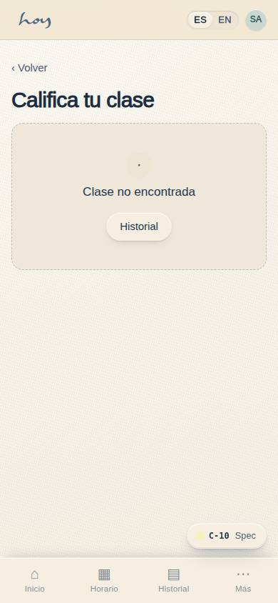

# Maestros

Tu herramienta es **S-03 App de maestros**: próxima clase, lista de asistencia, horario,
descripciones, reseñas y nómina.

## 1. Antes de la clase
1. Llega mínimo 15 minutos antes. Recepción te marca "Llegó" en S-02; sin maestro en sala no entran alumnos.
2. Abre **S-03 → Próxima clase → Lista**: revisa cuántas personas vienen, quiénes son nuevas y los
   marcadores de salud. No comentes el marcador en voz alta; adapta.
3. Revisa la sala con la checklist de `07`: temperatura, mats, props, música, luz.
4. Saluda por nombre a quien puedas; pregunta a las personas nuevas si hay algo que debas saber.

{{tenant:capacity}}

## 2. Durante la clase
1. Empieza a la hora. Una clase por persona al día significa que esta es "su" clase de hoy: hazla completa.
2. Marca la asistencia desde el mat: **S-03 → Lista → marcas**. La ventana es de T−15 min a T+2 h;
   después solo coordinación puede editarla.
3. Quien llega tarde entra según la tolerancia definida en M-08; recíbelo en silencio y con un gesto.
4. Sin teléfono para nada que no sea la lista o la música.

## 3. Después de la clase
1. Cierra la asistencia antes de salir de la sala; es la fuente de la lista de espera, la nómina y el CRM.
2. Deja la sala como la encontraste (props en su lugar, mats del estudio limpios).
3. Reseñas: las ves en **S-03 → Reseñas** (agregado y las nombradas que el alumno no marcó como
   anónimas). Se leen, no se responden desde la app.

**Pasos en HoyOS:** S-03 → Próxima clase → Lista → marcar asistencia → cerrar. Horario: S-03 → Mi
horario. Perfil: S-03 → Perfil (entra a revisión de coordinación antes de publicarse).

## 4. Sustituciones
1. Consigue tú el reemplazo entre el equipo y avisa a coordinación con al menos 24 h; coordinación
   confirma el cambio en **M-02 Horario** y el alumno ve el nombre correcto en C-02.
2. Menos de 24 h o sin reemplazo: llama a coordinación de inmediato. Si la clase se cancela, el
   sistema devuelve créditos y avisa (E-03); tú no escribes a los alumnos por tu cuenta.

## 5. Cancelaciones
1. Nunca canceles una clase desde el grupo de WhatsApp; solo coordinación cancela en M-02.
2. Si hay menos alumnos de los esperados, la clase se da igual.

> DECISIÓN PENDIENTE: mínimo de alumnos para dictar una clase (si existe) y tarifa de sustitución.

## 6. Tu nómina
1. **S-03 → Historial de nómina** muestra clases dictadas, tarifa, sustituciones y ajustes. El monto
   es de solo lectura.
2. El corte cierra el 15 de cada mes; revisa antes y reporta diferencias a coordinación con la clase y
   fecha. El proceso completo del lado de finanzas está en `16`.

La tarifa por clase y la fecha de pago todavía no están definidas: la decisión está marcada en el
capítulo `16`, del lado de finanzas. Mientras no se defina, lo que ves en tu historial es un cálculo.

## 7. Código de conducta
1. Tuteamos, hablamos con calma, sin comentarios sobre cuerpos o niveles.
2. Ajustes físicos solo con consentimiento explícito y anunciado al inicio.
3. Confidencialidad: lo que sabes de un alumno (salud, vida personal) se queda en el estudio; nunca en
   redes ni fuera. Las obligaciones legales están en `23`.
4. Puntualidad, presentación limpia, sin perfumes fuertes en sala caliente.
5. Cualquier incidente o lesión: primero la persona (`08`), luego aviso a coordinación y nota en M-06
   vía recepción.
