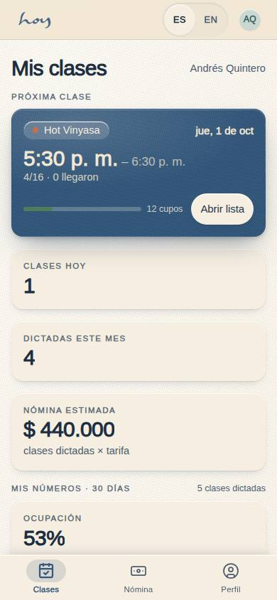
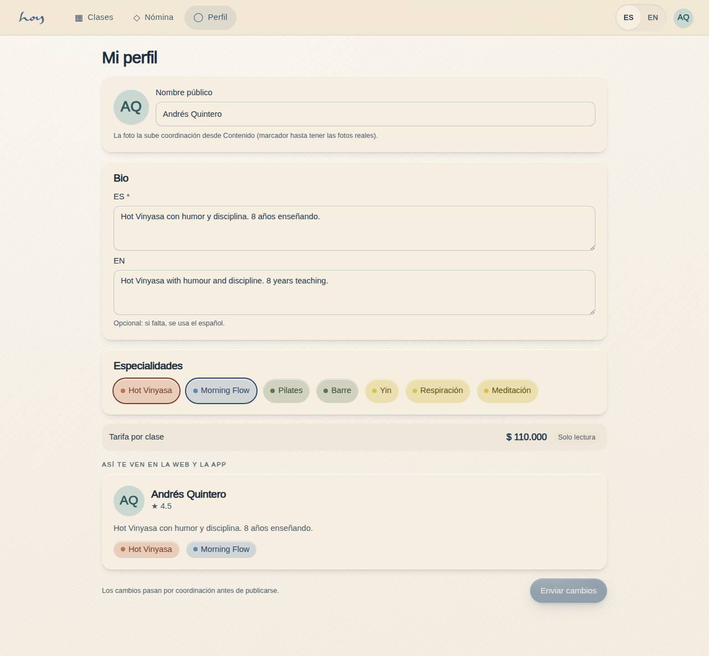
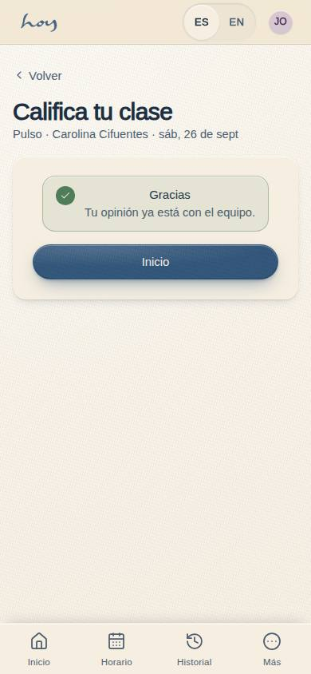
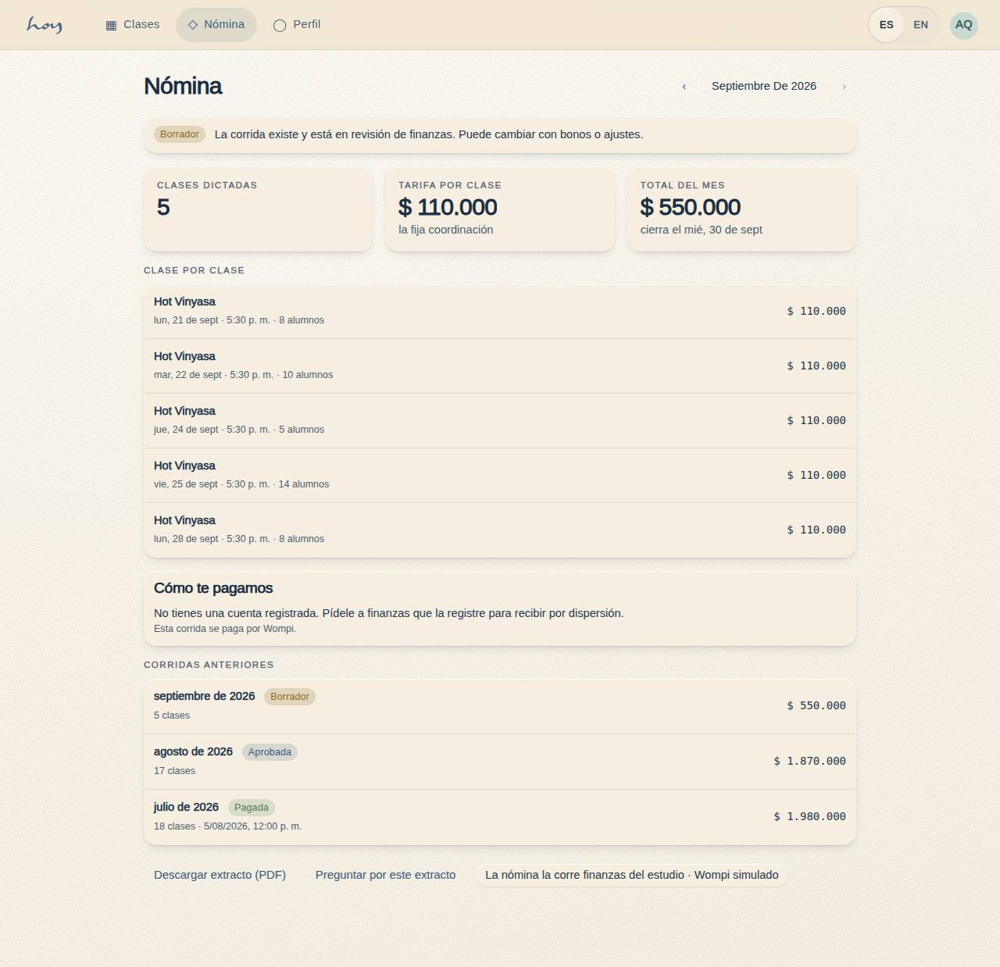

# Maestros

Tu herramienta es la **app de maestros**: tu próxima clase, la lista de quién viene, tu horario, tus reseñas y
tu pago.

{{audience:06-maestros}}

## 1. Antes de la clase
1. Llega con tiempo (ver abajo). Recepción te marca "Llegó". Sin maestro en la sala, no entran alumnos.
2. Abre tu próxima clase y mira la lista: cuántos vienen, quiénes son nuevos y si hay marcas de salud. No
   comentes una marca de salud en voz alta: adapta la clase.
3. Revisa la sala: temperatura, tapetes, accesorios, música y luz (ver
   [Sala, calor y mantenimiento](07-sala-calor-y-mantenimiento.md)).
4. Saluda por su nombre a quien puedas. A las personas nuevas pregúntales si hay algo que debas saber.

Cuánto antes de la clase llegas:

{{studio:teacher_arrival_minutes}}

Esta es la capacidad de la sala:

{{tenant:capacity}}

**Qué decir a una persona nueva:** "Bienvenida. ¿Hay alguna lesión o algo que deba saber? Si en algún momento
necesitas parar, para. Aquí no hay que demostrar nada."

## 2. Durante la clase
1. Empieza a la hora. Para esa persona, esta es su clase del día: dala completa.
2. Marca la asistencia desde el tapete. Puedes hacerlo desde 15 minutos antes hasta 2 horas después de
   empezar; después solo coordinación puede cambiarla.
3. Quien llega tarde entra si está dentro de la tolerancia. Recíbelo en silencio, con un gesto.
4. El teléfono es solo para la lista y la música.

## 3. Después de la clase
1. Cierra la asistencia antes de salir de la sala. De ella salen la lista de espera, tu pago y el historial
   del socio.
2. Deja la sala como la encontraste: accesorios en su lugar y tapetes del estudio limpios.
3. Tus reseñas las ves en la app: el promedio y los comentarios con nombre que el alumno no marcó como
   anónimos. Se leen; no se responden desde la app.

> EN HOYOS: S-03 → Próxima clase → Lista → marcar asistencia → Cerrar. Horario: S-03 → Mi horario. Perfil: S-03 → Perfil (coordinación lo revisa antes de publicarlo).

## 4. Reemplazos
1. Si no puedes dar una clase, busca tú el reemplazo en el equipo y avisa a coordinación con la anticipación
   de abajo.
2. Coordinación hace el cambio en el horario. El alumno ve el nombre correcto.
3. Con menos tiempo, o sin reemplazo, llama a coordinación de inmediato.
4. Si la clase se cancela, el sistema devuelve los créditos y avisa a los alumnos. Tú no les escribes por tu
   cuenta.

El aviso mínimo para pedir un reemplazo:

{{studio:substitution_notice_hours}}

## 5. Cancelaciones
1. Nunca canceles una clase por el grupo de WhatsApp. Solo coordinación cancela.
2. Si llegan menos alumnos de los esperados, la clase se da igual.

> DECISIÓN PENDIENTE: si hay un mínimo de alumnos para dar una clase y cuánto se paga un reemplazo.

## 6. Tu pago
1. En la app ves tu extracto: clases que diste, tarifa, reemplazos y ajustes. Es de solo lectura.
2. Revísalo antes de que cierre el periodo. Si algo no cuadra, avisa a coordinación con la clase y la fecha.
3. Mientras finanzas no genere el pago del periodo, lo que ves es un **estimado**.

Cómo funciona del lado de finanzas: [Nómina de maestros](16-nomina-y-payouts.md).

> EN HOYOS: S-03 → Nómina.

## 7. Código de conducta
{{editable:owner}}

1. Tuteamos y hablamos con calma. Sin comentarios sobre cuerpos ni niveles.
2. Ajustes físicos solo con permiso claro, que pides al empezar la clase.
3. Lo que sabes de un alumno (salud, vida personal) se queda en el estudio. Nunca en redes ni afuera. Ver
   [Datos personales](23-habeas-data.md).
4. Puntualidad, presentación limpia y sin perfumes fuertes en sala caliente.
5. Si hay una lesión o un incidente: primero la persona (ver
   [Incidencias y emergencias](08-incidencias-y-emergencias.md)), después avisas a coordinación y recepción
   deja la nota.
