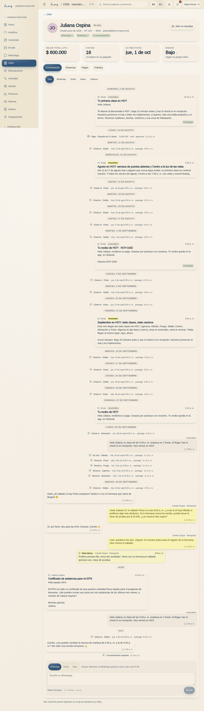
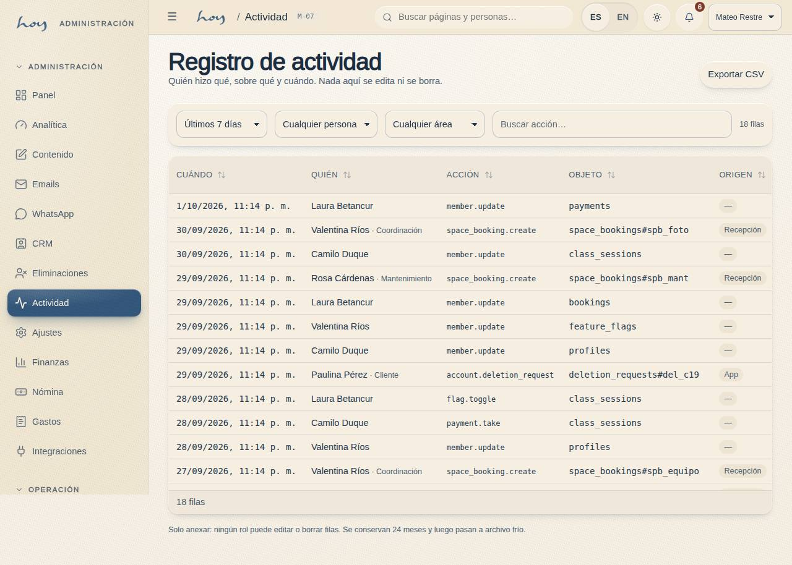

# Incidencias y emergencias

La regla es siempre la misma: **primero la persona, después el registro**. Nunca al revés.

{{audience:08-incidencias-y-emergencias}}

## 1. Emergencia médica
1. Si pasa en la sala, detén la clase. Quien esté más cerca se queda con la persona.
2. Recepción llama a la línea de emergencias y avisa a coordinación.
3. Busca en la ficha del socio su contacto de emergencia y si tiene una marca de salud.
4. Llama al contacto de emergencia solo si la persona no puede hacerlo.
5. Usa el botiquín. No des medicamentos.
6. Después, deja una nota en la ficha con la categoría "Lesión / salud": hora, qué pasó y qué se hizo.
   Coordinación le cuenta al owner el mismo día.

**Qué decir a la persona:** "Estoy contigo. Ya llamamos. Respira despacio."

> EN HOYOS: S-02 → Perfil del socio (abre M-06) → contacto de emergencia. Nota: M-06 → Notas → Añadir nota.

## 2. Calor: mareo, náusea, golpe de calor
En las clases intensas (Fuego, Sólido) es lo que más puede pasar. Casi siempre se resuelve si se actúa
temprano.

1. Señales: palidez, mareo, náusea, deja de sudar, habla raro. El maestro lo ve desde el frente.
2. Saca a la persona de la sala y siéntala. No la acuestes de golpe.
3. Dale agua a sorbos, no de un trago.
4. Si no mejora en pocos minutos, o si hay confusión o vómito, es una emergencia médica: sigue la sección 1.
5. La persona no vuelve a la sala esa clase, aunque diga que ya está bien.
6. Déjalo registrado siempre, aunque se haya resuelto solo: nota en la ficha con la hora y la clase.

Tres casos de calor en la misma franja son un problema de la sala, no de las personas: avisa a coordinación
(ver [Sala, calor y mantenimiento](07-sala-calor-y-mantenimiento.md)).

## 3. Evacuación
1. La señal la da la voz del maestro o de recepción.
2. Todos salen por la ruta de evacuación hasta el punto de encuentro (ver la sección 4).
3. Recepción sale con la lista del día en el teléfono y confirma que todos los registrados están afuera.
4. Nadie vuelve por sus cosas. Recepción llama a emergencias y a coordinación.

{{for:front_desk}}
Tú eres quien lleva la lista. Antes de salir, abre Check-in en tu teléfono con la clase que está en curso.
{{/for}}

## 4. A quién llamar
{{editable:owner}}

| Contacto | Dónde está |
|---|---|
| Emergencias | ver abajo |
| Coordinación | en el grupo interno del equipo |
| Owner | en el grupo interno del equipo |
| Contacto de emergencia del socio | en su ficha, arriba |
| Clínica de referencia | ver abajo |
| Ruta de evacuación y punto de encuentro | ver abajo |

El número de emergencias:

{{studio:emergency_number}}

La clínica a la que llevamos a alguien:

{{studio:reference_clinic}}

Por dónde salimos y dónde nos reunimos:

{{studio:evacuation_route}}

Estos son los datos de contacto del estudio:

{{tenant:contact}}

> DECISIÓN PENDIENTE: el número de emergencias que usamos, la ruta de evacuación, el punto de encuentro y la clínica de referencia.

## 5. Incidentes que no son médicos
Un robo, un daño, un conflicto entre personas, alguien que no respeta un límite, un maestro que no llega.

1. Corta la situación. Si hay riesgo, saca a la persona del espacio.
2. Deja una nota en la ficha: categoría, hora, quiénes estaban y qué se hizo.
3. Avisa a coordinación el mismo día. Al owner, si hubo daño, dinero o alguien de afuera involucrado.
4. Nunca se publica nada ni se comenta con otros socios.

## 6. Qué queda registrado
Todo lo que haces en HoyOS —incluso abrir la ficha de un socio— queda registrado con tu nombre y la hora. Eso
protege a la persona y también te protege a ti.

Así se ve ese registro:

{{table:audit_log}}

> EN HOYOS: M-07 Registro de actividad → filtrar por fecha, persona o acción.
