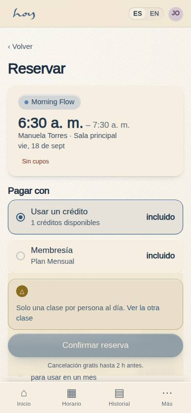
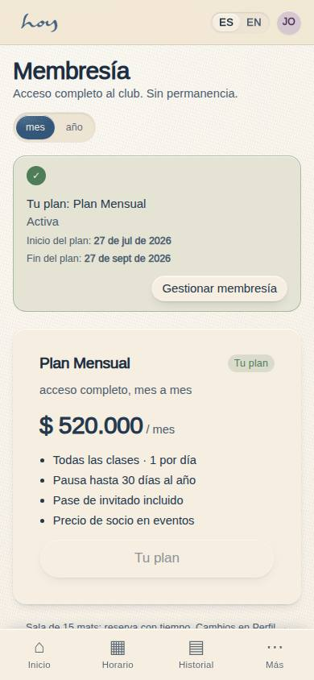

# Ventas y planes

Todo lo que se vende sale del modelo de valor (`03`). En el mostrador no se inventan precios ni
vigencias: se eligen.

## 1. Registrar y cobrar (S-04)
1. **S-04 Registrar y cobrar**, sección **Quién**: Nuevo / Existente. Nuevo: nombre, WhatsApp, correo,
   contacto de emergencia, cumpleaños y consentimiento (la persona acepta verbalmente; tú lo
   registras: queda con hora, tu nombre y versión de la política — ver `23`).
2. Sección **Qué**: elige el pase Bienvenida o el plan.
3. Sección **Cómo paga**:
   - **Wompi (link)**: envía el link por WhatsApp; la orden queda pendiente hasta que la pasarela confirme.
   - **Datáfono**: cobra; la orden queda pendiente hasta la confirmación.
   - **Efectivo**: liquida de inmediato; guarda el dinero en caja y entrega recibo.
   - **Transferencia / Nequi**: pide comprobante en pantalla, deja la orden pendiente y anótala para finanzas.
4. **Completar y registrar**: la venta hace el check-in automático en la clase comprada. Recibo por
   WhatsApp y correo.
5. Pago rechazado: la orden queda pendiente con la razón; ofrece otro medio, no repitas el cobro a ciegas.

**Pasos en HoyOS:** S-04 → Quién → Qué → Cómo paga → Completar y registrar. Consultar después: M-06
CRM → pestaña Pagos.

> DECISIÓN PENDIENTE: si los precios publicados incluyen IVA o el riel de S-04 lo suma aparte.

El IVA que aplica hoy el riel:

{{policy:iva_pct}}

## 2. Qué ofrecer a quién
| Quien tienes enfrente | Qué se ofrece | Por qué |
|---|---|---|
| Primera vez, no sabe si le gusta | Clase de Prueba | decide con el cuerpo, no con la cabeza |
| Volvió y preguntó por precios | Paquete de 3 | compromiso corto, sin mensualidad |
| Viene 2–3 veces por semana | Membresía mensual | le sale mejor y a nosotros nos estabiliza |
| Ya sabe que se queda el año | Membresía anual | mejor precio por mes |
| Viene entre reuniones, 20 minutos | Pausas | no ocupa un mat de clase |
| Quiere regalar | Bono de regalo | es nuestro canal de referidos |
| Quiere el espacio para su evento | Espacio, "desde" + conversación | no es checkout (`12`) |

Precios vigentes, leídos del sistema:

{{pricing:bienvenida}}

{{pricing:membresia}}

## 3. Lo que el socio puede hacer solo
Casi todo. No hace falta que recepción lo haga por él, y es mejor que no lo haga:

| Quiere | Pantalla |
|---|---|
| Ver y reservar clases | C-02 Horario |
| Ver sus pases y créditos | C-07 / C-07b |
| Comprar un plan | C-06 Planes → C-04 Checkout |
| Cambiar o cancelar una reserva | C-08 / C-08b |
| Pausar o cancelar la membresía | C-22 Gestionar membresía |
| Ver sus pagos y recibos | C-11 Historial |
| Cambiar sus datos y su idioma | C-19 Perfil |
| Guardar un medio de pago | C-05 Medios de pago |

## 4. Créditos y vigencias
1. Un pase Bienvenida da créditos con fecha de caducidad; la Membresía no da créditos, da acceso.
2. Un crédito devuelto por cancelación dentro de la ventana vuelve con su vigencia original, no se extiende.
3. Cortesías: se devuelve **crédito, no dinero**, y lo aprueba coordinación (`14`).

{{table:credits}}

## 5. Recibos
Cada venta liquidada genera recibo por WhatsApp y correo, con la referencia de la factura electrónica
cuando la facturación está encendida (`15`).

