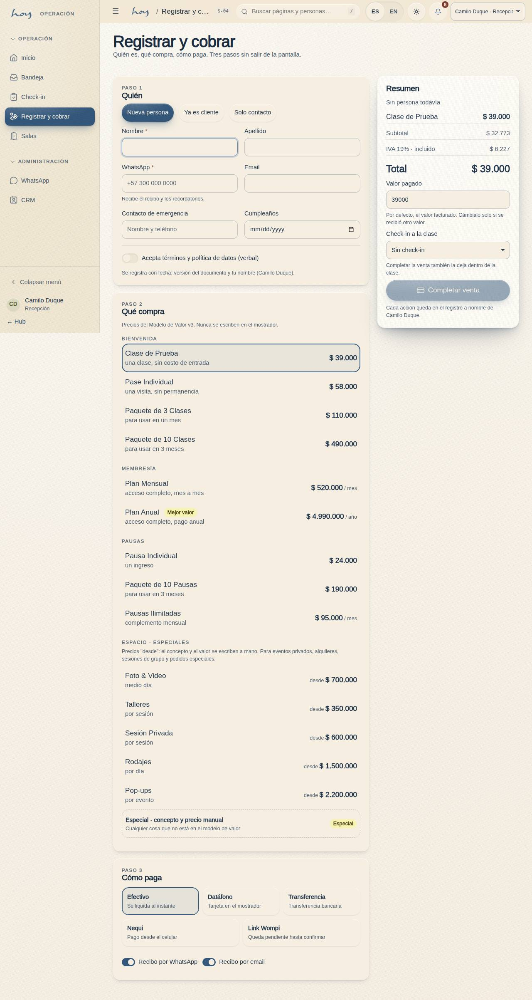
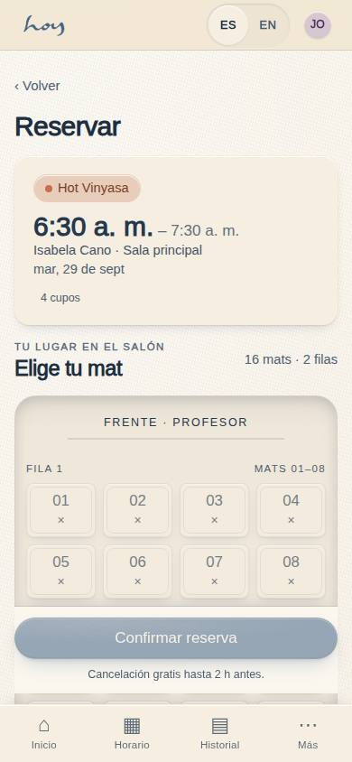
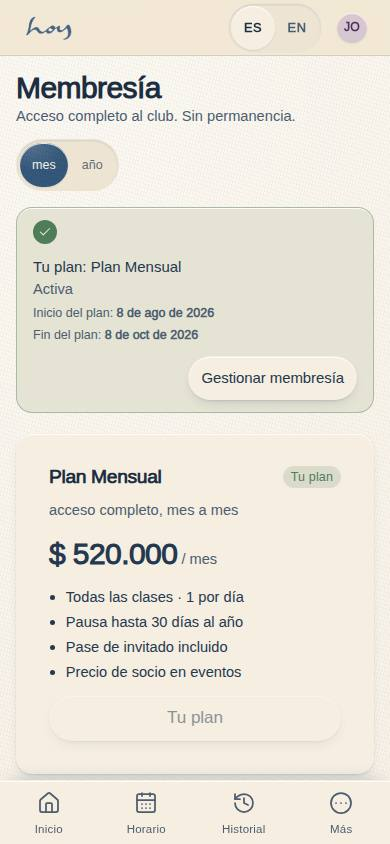
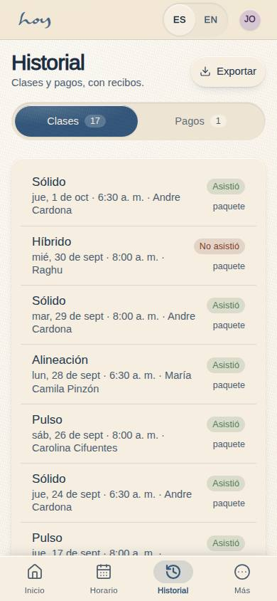

# Ventas y planes

Todo lo que se vende sale del [modelo de valor](03-modelo-de-valor.md). En el mostrador no se inventan precios
ni vigencias: se eligen.

{{audience:10-ventas-y-planes}}

## 1. Registrar y cobrar
1. **Quién.** Elige si es una persona nueva o un socio que ya existe. Si es nueva, pide nombre, WhatsApp,
   correo, contacto de emergencia y cumpleaños.
2. **El permiso de datos.** Pregúntale si acepta el tratamiento de sus datos. Ella dice que sí en voz alta y
   tú lo marcas. Queda guardado con la hora, tu nombre y la versión de la política (ver
   [Datos personales](23-habeas-data.md)).
3. **Qué compra.** Elige el pase o el plan. Para lo que no tiene botón (un cumpleaños, una sesión para un
   equipo, un alquiler con extras) está **Espacio · Especiales**: concepto y precio a mano (ver
   [Espacio — alquiler B2B](12-espacio-b2b.md)).
4. **Cómo paga:**
   - **Link de Wompi:** envíale el link por WhatsApp. La venta queda pendiente hasta que el pago se confirme.
   - **Datáfono:** cobra. La venta queda pendiente hasta la confirmación.
   - **Efectivo:** queda pagada de inmediato. Guarda el dinero en la caja y entrega el recibo.
   - **Transferencia o Nequi:** pide ver el comprobante, deja la venta pendiente y anótala para finanzas.
5. **Completar.** Al completar la venta, la persona queda registrada en la clase que compró. El recibo le
   llega por WhatsApp y correo.
6. **Si el pago falla:** la venta queda pendiente con la razón. Ofrece otro medio. No repitas el cobro a
   ciegas.

**Qué decir al cobrar:** "Listo, ya quedaste en la de las 7. El recibo te llega al WhatsApp."

Este es el IVA que se aplica hoy:

{{policy:iva_pct}}

> DECISIÓN PENDIENTE: si los precios publicados ya incluyen el IVA o si se suma aparte al cobrar. Esto también decide cómo se escriben los precios en el sitio.

> EN HOYOS: S-04 Registrar y cobrar → Quién → Qué → Cómo paga → Completar y registrar. Después: M-06 CRM → pestaña Pagos.

## 2. Qué ofrecer a cada persona
| Quién tienes enfrente | Qué le ofreces | Por qué |
|---|---|---|
| Viene por primera vez y no sabe si le va a gustar | Clase de Prueba | decide con el cuerpo, no con la cabeza |
| Volvió y pregunta precios | Paquete de 3 | compromiso corto, sin mensualidad |
| Viene 2 o 3 veces por semana | Membresía mensual | le sale mejor y a nosotros nos da estabilidad |
| Sabe que se queda todo el año | Membresía anual | el mejor precio por mes |
| Viene entre reuniones, 20 minutos | Pausas | no ocupa un tapete de clase |
| Quiere regalar | Bono de Regalo | es como llega gente nueva |
| Quiere el espacio para un evento, un cumpleaños o su equipo | Especial, con el precio "desde" como referencia | se conversa y se cobra en el mostrador |

Estos son los precios vigentes:

{{pricing:bienvenida}}

{{pricing:membresia}}

## 3. Lo que el socio puede hacer solo
Casi todo. Es mejor que lo haga desde su app: así aprende y no depende del mostrador.

| Quiere | Dónde, en su app |
|---|---|
| Ver y reservar clases | Horario |
| Ver sus pases y créditos | Mis pases |
| Comprar un plan | Planes → pagar |
| Cambiar o cancelar una reserva | Mis reservas |
| Pausar o cancelar la membresía | Gestionar membresía |
| Ver sus pagos y recibos | Historial |
| Cambiar sus datos o su idioma | Perfil |
| Guardar un medio de pago | Medios de pago |

**Qué decir:** "Eso lo puedes hacer tú desde la app, en Mis reservas. Si quieres, te muestro."

> EN HOYOS: C-02 Horario · C-07 Pases · C-06 Planes → C-04 Pago · C-08 Reservas · C-22 Membresía · C-11 Historial · C-19 Perfil · C-05 Medios de pago.

## 4. Créditos y vigencias
1. Un pase de Bienvenida da **créditos** con fecha de vencimiento. La Membresía no da créditos: da acceso.
2. Si la persona cancela dentro de la ventana, el crédito vuelve con su fecha original. No se alarga.
3. Una cortesía se da en **crédito, no en dinero**, y la aprueba coordinación (ver
   [Pagos y caja](14-pagos-y-caja.md)).

Así guarda el sistema los créditos:

{{table:credits}}

## 5. Recibos
Cada venta pagada genera un recibo por WhatsApp y correo. Cuando la facturación electrónica esté encendida,
el recibo llevará también la referencia de la factura (ver [Facturación](15-facturacion-y-dian.md)).

