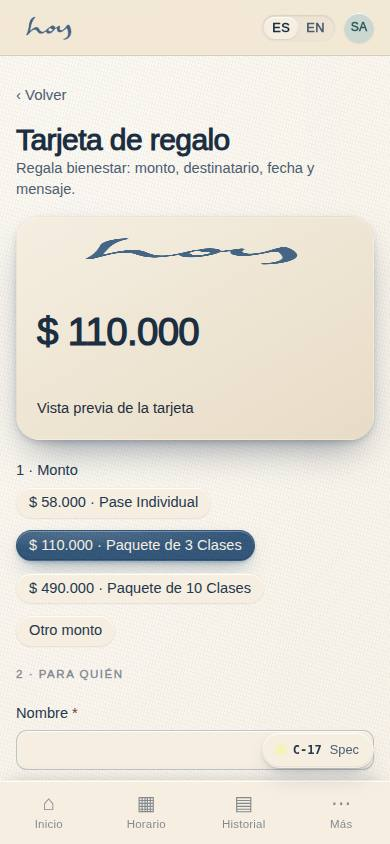

# Pausas y regalos

Dos líneas distintas con un nombre parecido. **Pausas** son micro-sesiones que se venden; **pausar**
es congelar una membresía. Este capítulo cubre las dos, más los regalos.

## 1. Pausar una membresía
1. La persona puede congelar su membresía desde **C-22 Gestionar membresía**, sin llamar a nadie. Si
   te lo pide en mostrador, lo haces desde M-06 y dejas nota.
2. Los límites son política, no criterio:

{{policy:pause_days_per_year}}

3. Siempre recibe aviso antes de cada cobro. Si pregunta "¿cuándo me cobran?", la fecha está en M-06
   → pestaña Pagos y en C-22.
4. Cancelar: mantiene acceso hasta el fin del período pagado. Sin laberintos: no insistas, registra el motivo.

> DECISIÓN PENDIENTE: días de aviso para pausar (C-22 propone 15 días de preaviso; el brief no lo fija).

## 2. Pausas (el producto)
Micro-sesiones de 15 a 30 minutos: respiración, meditación, una pausa entre reuniones. Su trabajo en
el negocio es la **frecuencia** (`03`): que la persona venga más veces, no que pague más por vez.

{{pricing:pausas}}

En la puerta: una Pausa no necesita mat de clase ni preparación de sala completa; entra y sale. Si la
persona ya tomó su clase del día, una Pausa no es "otra clase" —pero eso todavía hay que decidirlo—.

> DECISIÓN PENDIENTE: si "Pausas Ilimitadas" se puede sumar a la Membresía o la reemplaza, y si una Pausa consume el límite de una clase por persona por día.

## 3. Bonos de regalo
1. Se compran en **C-17 Regalar**, con diseño y mensaje; se entregan por WhatsApp o correo.
2. Un bono es dinero prepagado con código: se redime en S-04 eligiendo "bono" como medio, y el sistema
   descuenta el saldo.
3. El bono no caduca por capricho de mostrador: su vigencia es la que muestra el sistema.

{{pricing:regalos}}

## 4. Invitados
1. Un socio de Membresía puede traer un invitado; el invitado ocupa un lugar real en la sala, así que
   se reserva como cualquier otra persona.
2. El invitado se registra: nombre, WhatsApp, consentimiento. No entra "como acompañante" sin registro,
   porque en una emergencia no sabríamos a quién llamar (`08`).
3. El invitado que vuelve es el mejor cliente que existe: si pregunta precios, se le ofrece la Clase de
   Prueba, no un descuento inventado.

> DECISIÓN PENDIENTE: cuántos invitados puede traer un socio de Membresía por mes y si el invitado ocupa uno de los 15 mats o entra sobre el cupo.

## 5. Referidos
1. Cada socio tiene su código de referido en **C-16 Invitar**. Cuando alguien entra con ese código, el
   socio recibe un crédito.
2. La recompensa la otorga el sistema, no el mostrador: si un socio reclama una recompensa que no
   llegó, se revisa en M-06 y se escala a admin.

{{table:invites}}
