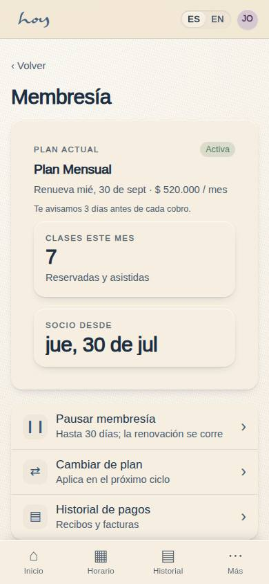
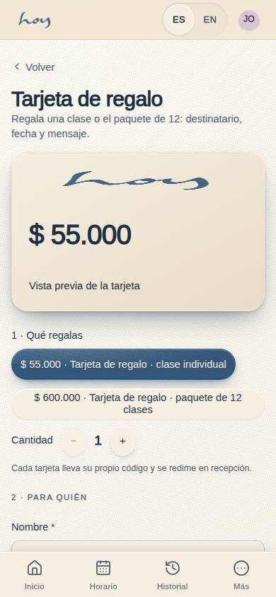
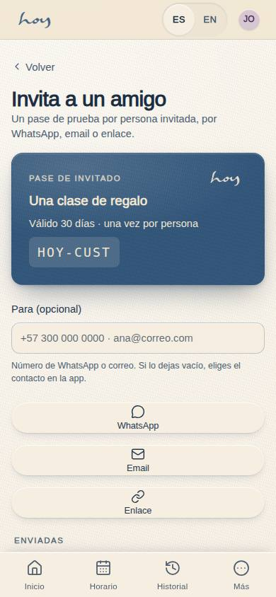

# Pausas y regalos

Dos cosas con nombre parecido. **Las Pausas** son sesiones cortas que se venden. **Pausar** es congelar una
membresía. Este capítulo explica las dos, y también los regalos.

{{audience:11-pausas-y-regalos}}

## 1. Pausar una membresía
1. El socio puede congelar su membresía desde su app, sin llamar a nadie.
2. Si te lo pide en el mostrador, lo haces tú desde su ficha y dejas una nota.
3. Los límites los pone la política, no el criterio de quien atiende:

{{policy:pause_days_per_year}}

4. Siempre recibe un aviso antes de cada cobro. Si pregunta "¿cuándo me cobran?", la fecha está en su ficha,
   en Pagos, y en su app.
5. Si quiere cancelar, mantiene el acceso hasta el final de lo que pagó. No insistas. Anota el motivo.

**Qué decir si quiere cancelar:** "Claro. Tienes acceso hasta el [fecha]. ¿Me cuentas por qué, para
mejorar?"

> DECISIÓN PENDIENTE: con cuántos días de anticipación hay que pedir la pausa (la app propone 15 días).

> EN HOYOS: C-22 Gestionar membresía (el socio) · M-06 CRM → ficha → Membresía (el mostrador).

## 2. Pausas (el producto)
Sesiones de 15 a 30 minutos: respiración, meditación, una pausa entre reuniones. Sirven para que la persona
venga más seguido (ver [Modelo de valor](03-modelo-de-valor.md)).

{{pricing:pausas}}

1. Una Pausa no necesita tapete de clase ni montaje completo: la persona entra y sale.
2. **Pausas Ilimitadas** es un complemento mensual: se suma a la Membresía, no la reemplaza.

**Qué decir:** "Es una sesión corta, de 15 a 30 minutos. Si ya tienes membresía, las ilimitadas se suman a tu
plan."

> DECISIÓN PENDIENTE: si una Pausa cuenta como la clase del día (el límite de una clase por persona al día) o va aparte.

## 3. Bonos de regalo
1. Se compran en la app, en Regalar, con un diseño y un mensaje. Se entregan por WhatsApp o correo.
2. Un bono es dinero prepagado con un código. Se usa al cobrar, eligiendo "bono" como medio de pago, y el
   sistema descuenta el saldo.
3. La vigencia del bono es la que muestra el sistema. No se cambia en el mostrador.

{{pricing:regalos}}

> EN HOYOS: C-17 Regalar (compra) · S-04 → Cómo paga → Bono (uso).

## 4. Invitados
{{editable:owner}}

1. El invitado está **incluido** para los socios de Membresía: no se cobra.
2. El invitado ocupa un lugar real en la sala, así que se reserva como cualquier otra persona.
3. El invitado se registra: nombre, WhatsApp y permiso de datos. No entra "de acompañante" sin registro: en
   una emergencia no sabríamos a quién llamar.
4. Si el invitado pregunta precios, ofrécele la Clase de Prueba. Nunca un descuento inventado.

La regla de invitados que rige hoy en el estudio:

{{studio:guest_allowance_note}}

**Qué decir al invitado:** "Bienvenida. Te registro en un minuto: nombre y WhatsApp, para tenerte en la lista
de la clase."

> DECISIÓN PENDIENTE: cuántos invitados puede traer un socio de Membresía al mes y si el invitado ocupa uno de los tapetes de la clase o entra por encima del cupo. Mientras el owner lo confirma, rige la regla del estudio de arriba.

## 5. Referidos
1. Cada socio tiene su código en la app, en Invitar. Cuando alguien entra con ese código, el socio recibe un
   crédito.
2. La recompensa la da el sistema, no el mostrador. Si un socio dice que no le llegó, revísalo en su ficha y
   pásalo a admin.

Así guarda el sistema las invitaciones:

{{table:invites}}
